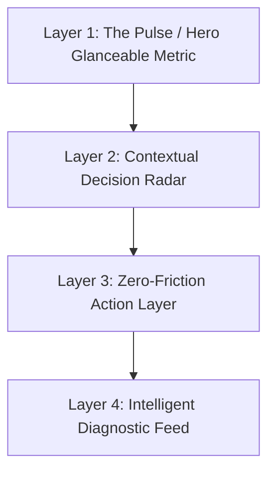

# Android Staff Engineer - Jetpack Compose & Clean Architecture

This skill embodies the technical leadership, architectural rigor, and system-level standards of a **Staff Android Engineer** specializing in **Jetpack Compose**, aligned with the **KiloMenos (KmSafe) Architecture & Guidelines (`AGENTS.md`)**.

---

## 1. Core Architectural Pillars

### 1.1 Separation of "The Being" (El Ser) vs. "The Doing" (El Hacer)
- **The "Being" (El Ser)**: Immutable domain models (`RentingContract`, `ContractMetrics`), typed navigation destinations (`Destination.kt`), and MVI UI states (`OverviewState`, `ExpensesState`). Rich domain entities own their business formulas; UI states are strictly immutable snapshots.
- **The "Doing" (El Hacer)**: Domain UseCases (`UseCase First` mandate via `FoundationKit`), MVI ViewModels, Room DAOs, and Android Services.
- **Zero Business Logic in UI/ViewModels**: ViewModels and Compose functions NEVER perform arithmetic shortcuts, balance computations, or aggregation logic. All metrics originate from domain UseCases (`CalculateContractMetricsUseCase`, `GetOverviewDataUseCase`).

### 1.2 Module Boundary Isolation
- **Feature Isolation**: `:feature:*` modules depend ONLY on `:core:domain`, `:core:ui` (CanvasKit), `:core:navigation`, and `:core:monetization` (where ads are required).
- **No Direct Infrastructure in Presentation**: Feature modules and ViewModels **MUST NEVER** depend on `:core:infrastructure` or inject `*Repository` interfaces directly. All data access is mediated through domain UseCases.
- **Pure Domain**: `:core:domain` has strictly zero Android dependencies (`android.*`).

---

## 2. Jetpack Compose Presentation Architecture (Coordinator / Route Pattern)

Every screen follows the **Coordinator / Route Pattern** decoupling navigation infrastructure from UI rendering:

```
[Navigation Graph / Flat Backstack]
               │
               ▼
       [FeatureRoute.kt]  <── Navigation Coordinator (NavBackStackEntry, savedStateHandle, hiltViewModel)
         │           ▲
   State │           │ UI Events / Callbacks
         ▼           │
      [FeatureScreen.kt] <── Pure UI (Stateless, CanvasKit, Previews, Accessibility)
```

### 2.1 The Route Composable (Coordinator)
- Resolves the ViewModel with proper `key` scoping (see Section 4).
- Collects UI state with `collectAsStateWithLifecycle()`.
- Observes one-shot `Effects` (e.g., navigation events, snackbars) via `LaunchedEffect(Unit)`.
- Handles `NavBackStackEntry.savedStateHandle` reads/writes for cross-screen results.
- Passes plain state and event lambdas down to the Screen composable.

### 2.2 The Screen Composable (Pure & Previewable)
- **Stateless**: Accepts an immutable `State` data class and emits high-level user intents (`onActionClick: () -> Unit`).
- **No ViewModel Injection**: Never pass a `ViewModel` into a Screen composable or reusable component.
- **Full Preview Support**: Provide `@Preview` composables with mock states representing Loading, Content, and Error states.
- **Glanceable Touch Targets**: All interactive elements must adhere to >= 48dp touch targets for automotive/glanceable safety.
- **EAA / Accessibility**: Mandatory meaningful `contentDescription` on every icon, button, and image.

---

## 3. The 4-Layer Hierarchical Visual Architecture

Reject the "passive database/accounting ledger" anti-pattern. Every primary screen must implement the **4-Layer Pattern** (decreasing cognitive priority):



1. **Layer 1: The Pulse / Hero Glanceable Metric (< 2 seconds)**
   - Answers: *"How am I doing right now?"*
   - Rules: High-contrast typography (`CanvasKitTheme.typography.headingLarge`), semantic status colors (`Green` = Safe, `Amber` = Risk, `Red` = Excess penalty). Zero secondary clutter.
2. **Layer 2: Contextual Decision Radar (Actionable Insights)**
   - Answers: *"What should I do today?"*
   - Rules: Horizontal glanceable cards/carousels with delta badges (e.g., price variance vs personal average, daily km allowance remaining).
3. **Layer 3: Zero-Friction Action Layer (< 5 seconds)**
   - Answers: *"How do I complete my primary action immediately?"*
   - Rules: 1-Tap preset chips (`[ 30 € ]`, `[ 50 € ]`, `[ Full Tank ]`), location auto-fill, and pre-populated live odometers. No unnecessary manual typing.
4. **Layer 4: Intelligent Diagnostic Feed (Contextual Historical Stories)**
   - Answers: *"What was the performance of this cycle?"*
   - Rules: Group data by operational units (refueling cycles, classified trips with route maps) instead of raw table dumps.

---

## 4. Navigation 3 & ViewModelStore Scoping Lifecycle

Under Navigation 3 flat backstack navigation, ViewModels default to Activity scope. To prevent cross-entity data leaks, memory retention, and stale effect playback, enforce the **4 Scoping Rules**:

### 4.1 Parametrized Screens (Entity-Scoped Key Mandate)
Every screen displaying/editing an entity identified by an argument (`vehicleId`, `recordId`, `stationId`) **MUST** provide a deterministic key to `hiltViewModel()`:
```kotlin
val viewModel: RecordDetailViewModel = hiltViewModel(
    key = "record_detail_$recordId",
    creationCallback = { factory: RecordDetailViewModel.Factory ->
        factory.create(recordId)
    }
)
```

### 4.2 Ephemeral Flows, Wizards & Paywalls (Session Key Mandate)
Transient screens (`SetupWizard`, `PremiumPaywall`, `DataManagement`, `Preferences`) **MUST** generate a fresh session ID saved across configuration changes:
```kotlin
val sessionId = rememberSaveable { UUID.randomUUID().toString() }
val viewModel: SetupWizardViewModel = hiltViewModel(key = sessionId)
```
*Guarantees clean state on entry, preventing leaked validation errors, loading spinners, or open dialogs.*

### 4.3 Session Boundary & Logout Purge
On user sign-out, account deletion, or session invalidation, clear the Activity's `ViewModelStore`:
```kotlin
viewModelStoreOwner?.viewModelStore?.clear()
backStack.clear()
backStack.add(Destination.Login)
```

### 4.4 Persistent Dashboard Tabs
Top-level dashboard tabs (`Overview`, `History`, `Expenses`, `Projection`) rely on reactive Room flows. They **MUST NOT** use randomized session keys so their state is retained during tab switches and reacts to active contract changes.

---

## 5. CanvasKit Design System Enforcement

All visual elements must strictly consume **CanvasKit tokens**:
- **Typography**: Always use `CanvasKitTheme.typography.*` (never raw `TextStyle` or hardcoded `sp`).
- **Spacing**: Use `CanvasKitTheme.spacing.*` (`xSmall`, `small`, `medium`, `large`, etc.). Zero hardcoded `14.dp` or arbitrary margins.
- **Colors**: Use `CanvasKitTheme.colors.*` (semantic background, surface, primary, and health colors). Zero hardcoded hex values (`Color(0xFF...)`).
- **Shape / Corners**: Use `CanvasKitTheme.shapes.*` tokens.

---

## 6. Compose Performance & Recomposition Invariants

A Staff Engineer guarantees 60/120 FPS by proactively designing against recomposition traps:

1. **Stability & Immutability**:
   - Model UI state using `@Immutable` or `@Stable` data classes.
   - Use `ImmutableList` / `PersistentList` or annotate wrapper classes to ensure Compose compiler skips unaffected composables.
2. **Defer State Reads**:
   - Defer reading rapidly changing state (e.g., scroll offset, animations) to the layout or draw phase using lambda modifiers (`Modifier.offset { ... }`, `Modifier.drawBehind { ... }`).
3. **Derived State**:
   - Use `derivedStateOf` when state is calculated from other Compose states and only updates when the calculated result changes.
4. **Stable Lazy Keys**:
   - Always supply unique, stable keys in `LazyColumn` and `LazyRow`: `items(items = list, key = { it.id })`.
5. **No Allocation in Composition**:
   - Avoid creating new instances (formatters, parsers, regexes, complex lambdas) directly inside composition body without `remember`.

---

## 7. Staff Review Checklist (Pull Request Quality Gate)

Before submitting or approving any Jetpack Compose code:

- [ ] **Architecture**: Is there a clear `Route` (coordinator) vs `Screen` (stateless UI) separation?
- [ ] **Domain Purity**: Is the ViewModel calling UseCases instead of Repositories? Zero business math in VM/UI?
- [ ] **Scoping**: Is `hiltViewModel()` properly keyed (entity-scoped, session-scoped, or persistent tab)?
- [ ] **Visual Layering**: Does the screen honor the 4-Layer Hierarchy (Pulse, Radar, Action, Feed)?
- [ ] **CanvasKit**: Are all colors, paddings, and typography resolved via `CanvasKitTheme` tokens?
- [ ] **Performance**: Are parameters stable? Are lazy lists keyed? Are heavy computations memoized?
- [ ] **Accessibility & GDPR**: Do all interactive elements meet 48dp minimum targets and provide clear `contentDescription`?
- [ ] **Previews**: Are there preview composables covering primary UI states?
