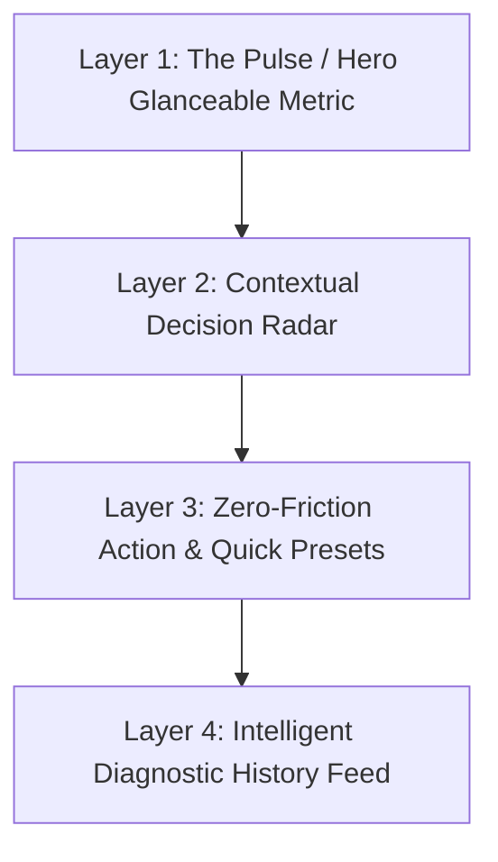

# AGENTS.md - KiloMenos Architecture & Guidelines 🚗

## 1. Objective & Scope
The goal of **KiloMenos** (KmSafe) is to provide a high-quality, comprehensive vehicle financial and mileage management platform for renting, leasing, and fleet drivers. The app:
1. Eliminates uncertainty regarding excess mileage penalties through a dynamic, additive "balance" calculation per vehicle.
2. Provides automated trip telemetry via Bluetooth and Activity Recognition.
3. Operates as an intelligent vehicle financial manager tracking fuel and electrical energy expenses, historical station price volatility ("My Stations"), and electrification savings.

## 2. Multi-Module Architecture
The project follows **Clean Architecture**, **SOLID**, and **Domain-Driven Design (DDD)** across a modular Gradle structure. Priority is given to readability, testability, high build performance, and strict isolation of business rules.

### Core Principle: Separating the "Being" from the "Doing" ("Separar el 'Hacer' del 'Ser'")
- **The "Being" (El Ser)**: Declarative, ontology, business invariants, and immutable state.
  - **Rich Domain Entities**: `RentingContract`, `ContractMetrics`, `MileageBudget`, `TripRoute`, `FuelExpense`, `ServiceStation`. Safeguard their own invariants and mathematical formulas (no anemic data classes).
  - **Public Contracts**: Repository interfaces, feature APIs, and typed navigation destinations (`Destination.kt`).
  - **Immutable UI State**: MVI State classes (`OverviewState`, `ExpensesState`, `ProfileState`).
- **The "Doing" (El Hacer)**: Imperative, behavior, orchestration, and I/O.
  - **UseCases ("UseCase First" Mandate)**: Standardized via `FlowUseCase` and `UseCase` from `FoundationKit`. Every single process, user action, query, or operation in the application MUST be modeled as a dedicated UseCase. Strictly limited to orchestration (calling repositories, dispatching coroutines, logging). ViewModels and services interact exclusively with UseCases, never directly with Repositories.
  - **ViewModels / MVI Reducers**: Process UI intents/events and map Domain models into immutable UI State. **Zero business calculations allowed inside ViewModels.**
  - **Infrastructure**: Room DAOs, Retrofit API services, background workers, and hardware sensor receivers.

### Module Topology:
- **`:app` (Shell)**: Application container (`KiloMenosApplication`), Android manifest, root navigation coordinator (`AppNavigation.kt`), and root Dagger Hilt DI bindings. Contains zero business screens or ViewModels.
- **`:core:domain`**: Pure Kotlin/JVM library (`pluginkit.jvm.library`). **Strict Rule: Zero Android dependencies (`android.*`).** Contains all domain entities, repository interfaces, and 60+ UseCases with 100% unit test coverage.
- **`:core:infrastructure`**: Room persistence (`AppDatabase`, DAOs, Entities), Retrofit networking, DataSources (`PreferencesDataSource`, `UserSessionDataSource`, `TrackingDataSource`), repository implementations (`*RepositoryImpl`), DI modules (`UseCaseModule`, `ValidatorModule`), and background sync (`SyncWorker`).
- **`:core:navigation`**: Global typed destinations (`Destination.kt`) for Compose Navigation.
- **`:core:ui`**: Centralized design system, typography, tokens, and reusable components via **CanvasKit**.
- **`:core:monetization`**: SDK isolation for Google AdMob and GDPR/UMP privacy consent management.
- **`:core:tracking`**: Android foreground services (`LocationTrackingService`), Activity Recognition transition receivers (`ActivityTransitionReceiver`), and vehicle Bluetooth listeners (`BluetoothConnectionReceiver`).
- **Feature Modules (`:feature:*`)**:
  - **`:feature:overview`**: Tab 1 - Real-time contract balance, daily budget, current odometer, and consumption graphs.
  - **`:feature:history`**: Tab 2 - Manual odometer increment logs, historical trip list, and GPS route visualizations.
  - **`:feature:expenses`**: Tab 3 - Fuel and EV charging expense logs, My Stations manager, price volatility histogram, and electrification savings KPI.
  - **`:feature:projection`**: Tab 4 - Contract pace simulator, trip planner, and projection risk gauge (`ProjectionGauge`).
  - **`:feature:profile`**: Tab 5 - User profile, application preferences, account deletion (GDPR), and full data import/export (`DataManagement`).
  - **`:feature:dashboard`**: Main shell container hosting the 5 tabs via `CanvasKitBottomBar` using the slot pattern.
  - **`:feature:fleet`**: Vehicle setup wizard (`SetupWizardRoute`), fleet listing, vehicle specifications, and contract parameters editor.
  - **`:feature:auth`**: Session lifecycle, splash launch coordinator (`LaunchRoute`), Login, and Signup.
  - **`:feature:premium`**: Subscription paywall, product offerings, and native Google Play Billing integration.

## 3. Business Logic & Domain Formulas
KiloMenos uses an **Additive Data Model**. Rather than storing arbitrary absolute odometer snapshots, each `OdometerRecord` represents a discrete increment (a trip or daily distance).

### 3.1 Mileage Balance Algorithm:
1. **Daily Base Budget (DBB):** `Total Contract Km / Total Contract Days`.
2. **Real Km Consumed (RKC):** Sum of all `odometerValue` increments in history (excluding initial setup record).
3. **Theoretical Km (TK):** `Days Elapsed * DBB`.
4. **Updated Balance (UB):** `TK - RKC` (Positive = Surplus, Negative = Excess penalty risk).
5. **Current Odometer:** `Initial Odometer + RKC`.
*Note: All balance calculations are encapsulated inside `CalculateContractMetricsUseCase` returning the rich `ContractMetrics` value object.*

### 3.2 Fuel & Energy Calculations:
- **Station Price Volatility**: Difference between current unit price (€/L or €/kWh) and the user's historical average at that specific `ServiceStation`.
- **Electrification Savings KPI**: Differential financial cost comparing EV/PHEV kWh consumption against the equivalent fuel cost for the same distance.

## 4. Tech Stack
- **UI Framework**: Jetpack Compose + Material 3 + CanvasKit Design System.
- **Architecture**: MVI (Model-View-Intent) + Coordinator (Route) pattern.
- **Dependency Injection**: Dagger Hilt (with convention plugins `pluginkit.android.hilt`).
- **Asynchrony**: Kotlin Coroutines & Flow (via `DispatcherProvider`).
- **Persistence**: Room (Relational schema, client-side UUID v4 IDs, 1:N relations for contracts/records and stations/expenses).
- **Background Sync**: WorkManager (`SyncWorker`) with resilient ID swap logic.
- **Telemetry & Location**: Fused Location Provider, Foreground Service (`location` type), Google Play Services Activity Recognition API, Bluetooth ACL hardware broadcasts.
- **Billing & Monetization**: Google Play Billing Library v7+, Google AdMob, Google User Messaging Platform (UMP/GDPR).
- **Unit Testing**: JUnit 4, MockK, Kotlin Coroutines Test (`runTest`, `StandardTestDispatcher`). 100% test coverage across all 60 Domain UseCases and 19 Feature ViewModels.

## 5. Coding Standards & Communication
- **KDoc**: Technical documentation is mandatory and exclusively in **English**.
- **Main-Safety**: Repositories must enforce main-safety using `dispatchers.io`. High-performance computations (sorting, filtering) must use `dispatchers.default`.
- **Domain Purity**: Zero platform types (e.g., `android.content.Context`, `android.os.Bundle`) allowed in `:core:domain`.
- **RGPD / EAA Compliance**: Explicit account deletion flows (Auth, Room, Preferences, Cloud). Mandatory `contentDescription` for all interactive Compose elements.

## 6. Product Strategy: Freemium Model 💎
Access tiers are strictly governed by Entitlements:

### Core Version (Free):
- **Local-First Persistence**: Data saved to Room; sync disabled with records tagged as `PENDING`.
- **Assisted GPS Tracking**: Manual trip start/stop with distance accumulation.
- **Single Vehicle**: Limited to one active renting contract.
- **Ad-Supported**: Non-intrusive AdMob banners initialized strictly post-UMP consent.
- **Fair-Use Export**: CSV export only.
- **Basic Projections**: Pacing simulations with standard metrics.

### Premium Version (Paid):
- **Native Billing**: Managed via Google Play Billing Library.
- **Remote Synchronization**: Real-time cloud sync and multi-device backup.
- **Data Promotion**: Automatic batch promotion of local pending records to cloud upon subscription upgrade.
- **Fleet Management**: Unlimited vehicles and active contract switcher.
- **Auto-Tracking**: Hands-free trip recording via Activity Recognition and Bluetooth pairing.
- **Advanced Financial Analytics**: Service station volatility histograms, refueling insights, and electrification savings KPIs.
- **Full Data Portability**: Complete JSON database backup and restoration.

## 7. Technical Roadmap 🚀
- ✅ **Offline Sync**: Reliable WorkManager integration with ID Swap logic.
- ✅ **Native Billing**: Fully integrated Google Play Billing flow.
- ✅ **Legibility & UX**: Chart legends and interactive info dialogs.
- ✅ **GDPR / EAA**: Full European regulation compliance & UMP consent.
- ✅ **GPS Tracking (Phase 1)**: Foreground Service for manual trip recording.
- ✅ **Resilient Tracking**: Disk-persisted tracking state (Stateless Repositories).
- ✅ **Smart Tracking (Phase 2 - Auto-Tracking)**: Activity Recognition + Bluetooth ACL Fast-Path + Triple Check validation.
- ✅ **Modular Architecture**: 5-phase modularization completed (`:core:*` and `:feature:*` modules decoupled from `:app` Shell).
- ✅ **Domain & MVI Unit Testing**: 100% coverage (60 UseCases, 19 ViewModels) with MockK & Coroutines Test.
- ✅ **Fuel & Energy Expenses**: Service stations management, price volatility histogram, and EV/PHEV mode.
- 📅 **Computer Vision (OCR)**: ML Kit for vehicle dashboard odometer scanning.
- 📅 **Proactive Geofencing & Smart Alerts**: Geofenced refueling price prompts and automated predictive price trends.

## 8. Stateless Repositories (Anti-Pattern Prevention)
All repositories MUST be **stateless**.
- **Forbidden**: Storing business state in `MutableStateFlow` or `var` properties inside a Repository.
- **Mandatory**: Delegate state persistence to a `DataSource` (Room, DataStore, or encrypted session). Repositories orchestrate reactive data streams only.

## 9. SSOT: Identity vs. Access (Entitlements)
- **Identity**: Managed by the `User` object (ID, Email, Display Name).
- **Access/Permissions**: Managed by the `Entitlements` object persisted in the **encrypted session**.
- **Rule**: Never check `User` object properties to evaluate subscription status. Always invoke `GetEntitlementsUseCase` or `CheckFeatureAccessUseCase`.

## 10. Critical Sequential Flows (Cold Start)
To prevent race conditions during app initialization:
- **Launch Sequence**: The app MUST synchronize `Entitlements` first. Only after an explicit outcome (Success or Failure) is vehicle/contract synchronization permitted to execute. This guarantees the sync engine knows user entitlements before evaluating cloud promotion.

## 11. Idempotency & Client-Side Identity
- **Client-Side IDs**: The Android client owns identity generation. Every entity (`RentingContract`, `OdometerRecord`, `TripRoute`, `FuelExpense`, `ServiceStation`) is instantiated with a device-generated UUID v4.
- **Idempotent Requests**: HTTP POST requests supply the client UUID in the request payload as an idempotency key.
- **Identity Resolution**: `SyncIdHandler` reconciles local and remote IDs, executing atomic "ID Swaps" when required.

## 12. Navigation & Result Handling (Coordinator Pattern)
- **Route Composables**: Act as navigation coordinators. Only Route composables may read `NavBackStackEntry.savedStateHandle` for navigation results (e.g., photo URIs, granted permissions).
- **ViewModels**: Completely decoupled from navigation infrastructure. ViewModels receive results through UI Events dispatched by the Route.
- **Input Arguments**: Parameters required to initialize a screen (e.g., `vehicleId`, `stationId`) must be read in the ViewModel via its `SavedStateHandle`.
- **Data Flow for Results**:
  1. `Screen A` navigates to `Screen B`.
  2. `Screen B` sets a result in `navController.previousBackStackEntry.savedStateHandle`.
  3. `Route A` observes that key in its own `NavBackStackEntry.savedStateHandle`.
  4. `Route A` sends an **Event** to `ViewModel A`.
  5. `ViewModel A` updates its state and clears the result key from the handle.

## 13. Session Integrity & Auto Backup
- **Encrypted Data Persistence**: Encrypted storage (AuthKit tokens, UserSessionModel) MUST be excluded from Android Auto Backup. Restoring encrypted files across device installations causes unrecoverable decryption failures due to Android Keystore key regeneration.
- **Integrity Validation**: `CheckSessionUseCase` must verify that an active session also has valid, readable `UserSessionModel` data.
- **Self-Healing Startup**: If `InconsistentSession` is detected, `LaunchViewModel` must force a clean `SignOut` and redirect to the Login screen.

## 14. SSOT: Single Source of Truth for Metrics
- **Detail over Summary**: Never read summary or cached fields from the backend (such as `rentingContract.currentOdometer`) for business logic or UI display when raw `OdometerRecord` items are available.
- **Aggregation as Truth**: Summing individual records is the sole source of truth for distances.
- **UseCase Centralization**: Always retrieve calculated metrics through `CalculateContractMetricsUseCase` or `GetOverviewDataUseCase`. ViewModels must NEVER perform arithmetic shortcuts on summary objects.

## 15. Multi-Module Boundary & Dependency Rules
To preserve architectural integrity and avoid cyclic dependencies:
1. **Feature Module Isolation**: Modules under `:feature:*` may depend ONLY on `:core:domain`, `:core:ui` (CanvasKit), `:core:navigation`, and `:core:monetization` (where ads are required).
2. **Strict Infrastructure Shielding**: **`:feature:*` modules MUST NEVER depend directly on `:core:infrastructure`**. All data access and business processes are mediated exclusively through domain UseCases (Repositories are never injected directly into ViewModels).
3. **Pure Kotlin Domain**: `:core:domain` must remain a Kotlin/JVM module (`pluginkit.jvm.library`). Any introduction of Android SDK dependencies (`android.*`) is strictly forbidden.
4. **Shell Responsibilities**: `:app` acts exclusively as the dependency injection root, navigation graph builder, and Android manifest host. No feature UI or business logic belongs in `:app`.

## 16. Auto-Tracking & Sensor Architecture
Automatic trip recording combines **Google Play Services Activity Recognition** (`IN_VEHICLE`) with **Bluetooth ACL Hardware Events** (`ACTION_ACL_CONNECTED` / `ACTION_ACL_DISCONNECTED`) located in `:core:tracking`:

### 16.1 "Foreground Service First" Pattern (Android 14+ Resilience):
- `ActivityTransitionReceiver` and `BluetoothConnectionReceiver` are synchronous `BroadcastReceiver` components.
- To prevent `ForegroundServiceStartNotAllowedException`, services must be initiated synchronously via `context.startForegroundService()` directly inside `onReceive()`, never inside deferred coroutines.

### 16.2 Immediate Feedback Loop:
- Car Bluetooth connects within 2–5 seconds of vehicle ignition.
- When an ACL connection matches the active vehicle's MAC address, `BluetoothConnectionReceiver` immediately displays a silent local notification (`NotificationManager.IMPORTANCE_LOW`) and activates the live connection pill in `OverviewScreen` without network roundtrips.

### 16.3 The "Triple Check" Validation:
Before recording any GPS coordinates, `LocationTrackingService` executes three mandatory validations:
1. **Premium Access**: Verifies the `AUTO_TRACKING` entitlement via `CheckFeatureAccessUseCase`.
2. **Contract SSOT**: Verifies the presence of an active `RentingContract` in the local Room database.
3. **Bluetooth Tethering**: If the contract specifies a `bluetoothDeviceAddress`, the service confirms that specific MAC address is actively connected to the phone's audio (`A2DP`) or hands-free (`HEADSET`) profiles.

### 16.4 Telemetry Filtering & Anti-Fraud:
- **Speed Filter**: Coordinates with calculated speed below `1.5 m/s` (~5.4 km/h) are ignored.
- **Accuracy Filter**: Points with GPS accuracy error exceeding `30 meters` are discarded.
- **Anti-Spoofing**: Locations marked with `location.isFromMockProvider` are rejected.

## 17. Fuel & Energy Expenses (Smart Management)
The expense management system in `:feature:expenses` coordinates vehicle energy tracking:
- **Relational Structure**: `ServiceStation` entities maintain a 1:N relationship with `FuelExpense` records in Room.
- **Price Volatility Tracking**: Histograms visualize historical price fluctuations per station, computing whether the current refuel/recharge rate is above or below the user's historical station average.
- **Mixed Energy Modes (ICE vs. PHEV/EV)**: Dynamic form handling and styling (Orange for fuel, Blue for electric). Electric tracking captures kWh consumed, connection duration, and computes the "Savings by Electrification" KPI against equivalent fossil fuel costs.
- **Privacy & API Hygiene**: Google Places station resolution must use aggressive local caching. The app never auto-generates ghost stations without explicit user confirmation.

## 18. The "UseCase First" Mandate (Operation & Process Encapsulation)
Every operation, user intent, domain query, mutation, or background process in the application MUST be encapsulated in a dedicated UseCase.

### 18.1 Universal Process Encapsulation:
- **One Operation = One UseCase**: Every discrete business action (e.g., fetching metrics, creating an odometer record, calculating projections, recording fuel expenses, validating telemetry conditions) is implemented as an individual UseCase (`FlowUseCase` for reactive streams or `UseCase` for one-shot execution from `FoundationKit`).
- **No Direct Repository Access in Presentation**: ViewModels, Workers (`SyncWorker`), and Services (`LocationTrackingService`) MUST NEVER inject or consume `*Repository` interfaces directly. All interactions are mediated through domain UseCases.
- **Semantic Domain Granularity**: Avoid monolithic or "God UseCases" (e.g., generic CRUD handlers). Every UseCase must represent a clear, intention-revealing domain operation (e.g., `RegisterFuelExpenseUseCase`, `CalculateContractMetricsUseCase`, `ObserveActiveContractUseCase`).

### 18.2 Orchestration vs. Domain Logic:
- **Pure Orchestrators**: UseCases do NOT own business math or entity invariants (which belong to rich domain entities like `ContractMetrics` or `RentingContract`). UseCases coordinate dependencies: fetching data from repositories, delegating calculations to rich domain entities, managing thread dispatchers (`dispatchers.io` / `dispatchers.default`), and exposing clean, immutable results (`Flow<T>` or `Result<T>`).
- **Zero Framework Contamination**: UseCases reside in `:core:domain` and remain pure Kotlin/JVM classes with strictly zero Android SDK imports (`android.*`).

### 18.3 Architectural Benefits & Guarantees:
- **Universal Test Isolation**: 100% of application processes can be tested in pure JVM unit tests in milliseconds without Android framework mocks.
- **Ultra-Lean ViewModels**: ViewModels only handle UI event mapping and state transitions, mocking solely the UseCases they invoke.
- **Cross-Cutting Reusability**: The same business process (e.g., `CheckFeatureAccessUseCase` or `GetOverviewDataUseCase`) can be reused consistently across ViewModels, background sync workers, or telemetry services without duplicating logic.

## 19. UX Architecture: Hierarchical Visual Layering (The 4-Layer Clean UI Pattern)
To maintain an executive, magnetic, and clutter-free user experience, all feature modules (`:feature:*`) MUST strictly reject the "passive database/accounting ledger" anti-pattern. Screens must never be designed as static multi-input forms or undifferentiated lists of database rows.

Instead, every primary feature screen must implement the **4-Layer Hierarchical Visual Architecture**, structured by decreasing cognitive priority:

### 19.1 The 4 Universal Visual Layers:
1. **Layer 1: The Pulse / Hero Glanceable Layer (Status & High-Stakes Metric)**
   - **Goal**: Answer the user's primary mental question in < 2 seconds (*"How am I doing right now?"*).
   - **Design Rule**: High-contrast typography (`CanvasKitTheme.typography.headingLarge`), semantic health colors (Green = Safe/Efficiency, Amber = Risk/Attention, Red = Contract Excess), and zero secondary clutter.
2. **Layer 2: Contextual Decision Radar (Actionable Insights & Comparison)**
   - **Goal**: Proactively surface decisions in the right place and time (*"What should I do today?"*).
   - **Design Rule**: Horizontal glanceable cards/carousels with delta badges (e.g., price variance vs. personal average, daily km allowance remaining).
3. **Layer 3: Zero-Friction Action Layer (Quick Capture & Presets)**
   - **Goal**: Enable data entry or task execution in < 5 seconds without manual typing.
   - **Design Rule**: 1-Tap preset chips (`[ 30 € ]`, `[ 50 € ]`, `[ Full Tank ]`), location auto-fill, and pre-populated live odometers.
4. **Layer 4: Intelligent Diagnostic Feed (Contextual Historical Stories)**
   - **Goal**: Transform raw logs into meaningful operational cycles (*"What was the performance of this cycle?"*).
   - **Design Rule**: Group data by meaningful units (refuel-to-refuel efficiency cycles, classified trips with route maps) rather than raw table dumps.

---

### 19.2 Cross-Module Implementation Guidelines:

| Feature Module | Layer 1: Hero Pulse | Layer 2: Decision Radar | Layer 3: Zero-Friction Action | Layer 4: Diagnostic Feed |
| :--- | :--- | :--- | :--- | :--- |
| **`:feature:overview`** *(Tab 1)* | Updated Balance (UB) in km & Daily Base Budget (DBB) with live status pill. | Remaining km quota for today + Live Bluetooth tethering pill. | Quick 1-Tap manual odometer increment pill. | 7-day consumption pace chart with "Zona Verde" indicator. |
| **`:feature:expenses`** *(Tab 3)* | Real Cost per 100 km (`€/100 km`) & Electrification Savings KPI. | "My Stations" Price Radar (horizontal cards with +/- price delta vs average). | Quick Refuel BottomSheet with 1-Tap preset amounts (30€, 50€, Full). | Refueling cycle feed showing consumption (`5.4 L/100 km`) and cycle km. |
| **`:feature:projection`** *(Tab 4)* | Contract Risk Sentinel: projected excess km and penalty cost in € at expiry. | Pace Simulator Sliders (adjust driving pace: -10%, normal, +10%). | "Plan Trip" simulator to test vacation routes against contract limit. | Monthly contract exhaustion forecast graph. |
| **`:feature:history`** *(Tab 2)* | Cumulative Audited Odometer & total verified trips count. | Filter pills (Automated Bluetooth vs Manual) + GPS telemetry validity pill. | 1-Tap "Export Certified Audit (CSV/PDF)" button. | Enriched trip cards with route badges, duration, speed, and accuracy level. |
| **`:feature:fleet`** | Fleet Health Score & Days remaining across all active contracts. | Vehicle selector chips with active MAC address tethering badge. | 1-Tap "Add Vehicle" guided wizard with Bluetooth auto-discovery. | Contract specifications and parameters editor. |
| **`:feature:profile`** | Smart Pilot Mastery Tier badge & Current Budget Streak counter. | Entitlements & Subscription Status (Core vs Premium). | Data Portability (JSON/CSV backup & GDPR erasure). | Application telemetry preferences & notification sensitivity. |

---

### 19.3 Visual Constraints & Invariants:
- **CanvasKit Exclusivity**: All components must use `CanvasKitTheme` tokens (spacing, typography, rounded corners, semantic colors). Never introduce hardcoded colors or ad-hoc margins.
- **Glanceable Safety**: Since drivers may glance at the app before or after operating a vehicle, interactive elements must adhere to minimum 48dp touch targets and high-contrast typography.
- **Strict Separation**: ViewModels must never calculate averages, percentages, or layout states internally. All metrics displayed in Layers 1–4 are delivered as immutable state via dedicated Domain UseCases.

