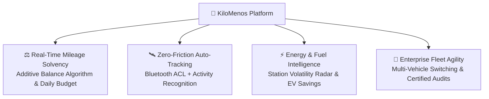
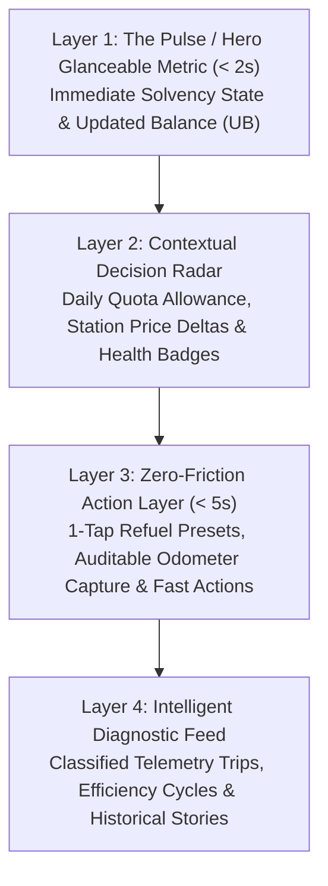

# KiloMenos 🚗💨
**"Intelligent Mileage & Vehicle Financial Management for Renting, Leasing, and Fleets"**

[](https://kotlinlang.org)
[](https://developer.android.com/jetpack/compose)
[]()
[]()
[]()

**KiloMenos (KmSafe)** transforms vehicle renting and leasing management from an anxious guessing game into an executive, real-time financial advantage. Designed specifically for leasing drivers, fleet operators, and private vehicle owners, KiloMenos eliminates unexpected end-of-contract penalties, automates trip telemetry without battery drain, and uncovers actionable energy savings across combustion, hybrid, and electric vehicles.

---

## 💡 Executive Value Proposition & Product Pillars

In modern vehicle leasing, **invisible excess mileage translates directly into financial penalties**. KiloMenos operates as an intelligent financial co-pilot across four core value pillars:



1. **Elimination of Penalty Surprises**: Replaces ambiguous odometer snapshots with a dynamic **Additive Data Model**. The app continuously reconciles real consumption against contract pacing, warning drivers of projected financial penalties months before expiration.
2. **Zero-Touch Automated Telemetry**: Car Bluetooth pairing detects vehicle ignition within 2–5 seconds, activating low-overhead GPS tracking without requiring the driver to take their phone out of their pocket.
3. **Smart Fuel & Energy Wealth Management**: Tracks historical station price volatility ("My Stations" radar) and computes the exact **Electrification Savings KPI** when driving in EV/PHEV mode against equivalent fossil fuel costs.
4. **Fleet & Multi-Contract Agility**: Switch between corporate leasing vehicles and private contracts seamlessly, complete with exportable certified mileage audit feeds.

---

## 🎨 Digital Experience: The 4-Layer Hierarchical Visual UI

To deliver an executive, clutter-free experience that feels more like an automotive cockpit than an accounting ledger, all primary screens follow the **4-Layer Hierarchical Visual Architecture**:



* **Layer 1: The Pulse (Hero Metric)**: Answers *"How am I doing right now?"* in under 2 seconds using high-contrast executive typography, semantic health indicators (Green = Zona Verde, Amber = Attention, Red = Penalty Risk), and zero secondary clutter.
* **Layer 2: Decision Radar**: Surfaces contextual guidance (*"What should I do today?"*), such as remaining kilometers for today or station price variances against personal historical averages.
* **Layer 3: Zero-Friction Action**: Enables critical actions in < 5 seconds with 1-tap presets (`[ 30 € ]`, `[ 50 € ]`, `[ Full Tank ]`) or live auditable odometers.
* **Layer 4: Intelligent Diagnostic Feed**: Groups raw telemetry into meaningful operational cycles (refuel-to-refuel efficiency stories, classified trips with speed/accuracy badges).

---

## 🔄 Core Functional Engines & Domain Mathematics

### 1. Dynamic Mileage Balance & Additive Data Model 📐
KiloMenos rejects disconnected absolute odometer snapshots in favor of discrete, auditable increments:

$$\text{Daily Base Budget (DBB)} = \frac{\text{Total Contract Km}}{\text{Total Contract Days}}$$

$$\text{Theoretical Km (TK)} = \text{Days Elapsed} \times \text{DBB}$$

$$\text{Real Km Consumed (RKC)} = \sum \text{OdometerRecord increments}$$

$$\text{Updated Balance (UB)} = \text{TK} - \text{RKC} \quad (\text{Positive} = \text{Surplus}, \text{Negative} = \text{Penalty Risk})$$

$$\text{Current Odometer} = \text{Initial Contract Odometer} + \text{RKC}$$

*Calculations are strictly centralized in `CalculateContractMetricsUseCase`, outputting immutable `ContractMetrics` domain value objects.*

### 2. Auto-Tracking & Sensor Telemetry 🛰️🔌
Located in `:core:tracking`:
* **Bluetooth ACL Fast-Path**: Vehicle Bluetooth connection triggers an immediate local notification (`NotificationManager.IMPORTANCE_LOW`) and activates the live connection badge in the UI within 2–5 seconds without waiting for network roundtrips.
* **Android 14+ Foreground Service**: Initiated synchronously inside `ActivityTransitionReceiver` upon `IN_VEHICLE` transitions to comply with modern Android background execution constraints.
* **The "Triple Check" Validation**: Prior to logging any GPS coordinates, the system verifies:
  1. Active `AUTO_TRACKING` entitlement.
  2. Active renting contract in Room database.
  3. Bluetooth MAC address match with phone's connected audio profile.
* **Anti-Spoofing & Filtering**: Rejects coordinates with calculated speed < `1.5 m/s` (~5.4 km/h), horizontal accuracy error > `30m`, or `location.isFromMockProvider`.

### 3. Fuel & Energy Wealth Management ("My Stations") ⛽⚡
Located in `:feature:expenses`:
* **Relational Schema**: 1:N relationship between `ServiceStation` entities and `FuelExpense` records.
* **Station Price Volatility**: Real-time variance comparison against the driver's historical average price at each specific station.
* **Mixed Powertrain Support**: Dynamic theme adaptation (Orange for combustion fuel, Blue for EV electric charging).
* **Electrification Savings KPI**: Computes the differential financial benefit of EV/PHEV kWh consumption versus equivalent fossil fuel expenses for identical distances.
* **API & Privacy Hygiene**: Aggressive local caching prevents redundant Google Places network consumption.

### 4. Interactive Contract Simulator & Risk Sentinel 📊🚦
Located in `:feature:projection`:
* **Pacing Pace Simulator**: Interactively adjusts future driving pace (-10%, normal, +10%) to project contract end-date mileage.
* **Trip Budget Planner**: Tests whether an upcoming vacation or long route will consume the driver's accumulated mileage surplus.
* **Visual Projection Gauge**: Real-time traffic light indicating contract financial risk at expiry.

---

## 💎 Product & Growth Strategy: Freemium Model

KiloMenos aligns feature access with driver lifecycle tiers, governed strictly by encrypted session **Entitlements**:

| Feature / Capability | Core Tier (Free) 🌟 | Premium Tier (Paid) 👑 |
| :--- | :---: | :---: |
| **Active Contracts / Vehicles** | Single Vehicle | **Unlimited Fleet Switcher** |
| **Data Persistence & Sync** | Local-First (Room, Offline) | **Real-Time Multi-Device Cloud Sync** |
| **Local Data Promotion** | Records tagged `PENDING` | **Automatic Cloud Promotion on Upgrade** |
| **GPS Trip Tracking** | Assisted Manual Start / Stop | **Hands-Free Auto-Tracking (Bluetooth + Activity)** |
| **Financial Analytics** | Basic Balance & Projections | **Station Volatility Histograms & EV Savings KPI** |
| **Data Portability** | Certified CSV Export | **Full JSON Database Backup & Migration** |
| **Monetization & Privacy** | GDPR-Compliant AdMob Banners | **100% Ad-Free Experience** |
| **Trial System** | Device-Fingerprinted Free Trial | **Native Google Play Billing v7+ Integration** |

---

## 🏗️ Multi-Module Clean Architecture

The codebase adheres strictly to **Clean Architecture**, **SOLID**, and **Domain-Driven Design (DDD)** across a high-performance Gradle modular topology.

### Core Separation: "The Being" (El Ser) vs. "The Doing" (El Hacer)
* **The "Being" (El Ser)**: Declarative, rich domain entities (`RentingContract`, `ContractMetrics`, `TripRoute`, `FuelExpense`), typed navigation destinations (`Destination.kt`), and immutable MVI UI states. Rich entities safeguard their own mathematical invariants.
* **The "Doing" (El Hacer)**: Standalone domain UseCases (`UseCase First` mandate via `FoundationKit`), MVI ViewModels (zero business math in presentation), Room DAOs, and Android hardware receivers.

### Module Topology:
```
├── :app                         # Shell: Manifest, Hilt DI Root, Predictive Navigation Coordinator
├── :core:domain                 # Pure Kotlin/JVM library (Zero Android dependencies, 60+ UseCases)
├── :core:infrastructure         # Room persistence, Retrofit, DataSources, SyncWorker, Repositories
├── :core:navigation             # Navigation 3 Destinations, DestinationListSaver, ResultStore
├── :core:ui                     # Design Tokens, CanvasKit Design System, Reusable UI Components
├── :core:monetization           # Google Play Billing, AdMob SDK, and GDPR/UMP Consent Manager
├── :core:tracking               # LocationTrackingService, Bluetooth and Activity Transition Receivers
└── :feature:*                   # Isolated Presentation Modules (MVI + Coordinator Route Pattern)
    ├── :feature:dashboard       # Tab host with CanvasKitBottomBar using slot pattern
    ├── :feature:overview        # Tab 1: Pacing runway, updated balance, live connection pill
    ├── :feature:history         # Tab 2: Audited odometer logs, GPS route maps, certified export
    ├── :feature:expenses        # Tab 3: Fuel/EV expenses, My Stations, price volatility histogram
    ├── :feature:projection      # Tab 4: Pace simulator, trip planner, projection risk gauge
    ├── :feature:profile         # Tab 5: User profile, preferences, UMP options, GDPR erasure
    ├── :feature:fleet           # Vehicle wizard, fleet switcher, contract parameters editor
    ├── :feature:auth            # Launch coordinator, Login, Signup, lifecycle session guards
    └── :feature:premium         # Paywall, trial offers, native Google Play subscription products
```

### Architectural Guardrails:
1. **Strict Infrastructure Shielding**: `:feature:*` modules depend ONLY on `:core:domain`, `:core:ui`, `:core:navigation`, and `:core:monetization`. **Presentation never accesses `:core:infrastructure` or repositories directly.**
2. **Pure Kotlin Domain**: `:core:domain` is a pure JVM module (`pluginkit.jvm.library`) with **zero** `android.*` imports.
3. **Stateless Repositories**: Repositories never hold in-memory mutable state (`MutableStateFlow`); all persistence is delegated to Room or encrypted DataStore.
4. **Navigation 3 & Backstack Resilience**: Flat backstack navigation with `NavDisplay` leverages `DestinationListSaver` via `rememberSaveable`. Navigation state survives orientation changes, theme toggles, and process recreation without returning to splash screens.

---

## 🛠️ Technology Stack

* **UI Framework**: Jetpack Compose + Material 3 + **CanvasKit Design System**.
* **Navigation**: Jetpack **Navigation 3** (`NavDisplay`, `NavEntry`) with predictive back animation and serialized backstack persistence.
* **Architecture**: MVI (Model-View-Intent) + Coordinator (Route) pattern + Multi-Module Clean Architecture.
* **Dependency Injection**: Dagger Hilt with custom Gradle convention plugins (`pluginkit.android.hilt`).
* **Concurrency**: Kotlin Coroutines & Flow (governed via `DispatcherProvider`).
* **Persistence**: Room v2.6+ (Relational schema, client-side UUID v4 identity, 1:N relations).
* **Background Sync**: WorkManager (`SyncWorker`) with resilient ID Swap logic and network auto-reconnect listeners.
* **Telemetry & Sensors**: Fused Location Provider, Google Play Activity Recognition API, Bluetooth ACL hardware broadcasts.
* **Monetization & Privacy**: Google Play Billing Library v7+, Google AdMob, Google User Messaging Platform (UMP / GDPR).
* **Build System**: Gradle Version Catalogs (`deps.versions.toml`) with custom convention plugins (`buildSrc`).

---

## ⚖️ Ethics, Privacy & European Regulations (EAA & GDPR)

KiloMenos is built to comply strictly with European digital standards:

* 🇪🇺 **European Accessibility Act (EAA)**: Mandatory `contentDescription` on all interactive Compose components, 48dp touch targets, and full TalkBack support.
* 🛡️ **GDPR / RGPD Article 17 ("Right to be Forgotten")**: Self-service account deletion permanently purges local Room data, AuthKit credentials, preferences, and remote cloud records.
* 📋 **Dynamic UMP Privacy Management**: On-demand access in *Preferences* enables European users to review and revoke advertising consents at any time via `ConsentManager.showPrivacyOptionsForm`.
* 🔒 **Encrypted Storage Hygiene**: Master session tokens are excluded from Android Auto Backup to prevent Keystore decryption failures upon app re-installation.

---

## 🧪 Testing & Quality Gate

* **100% Domain Coverage**: All 60+ Domain UseCases covered by unit tests using MockK and Kotlin Coroutines Test (`runTest`).
* **100% ViewModel Coverage**: All 19 Feature ViewModels validated with `StandardTestDispatcher` and `UnconfinedTestDispatcher`.
* **Fast JVM Execution**: Domain and business logic execute on pure JVM in seconds without Robolectric or emulator overhead.

To execute the test suite:
```bash
./gradlew testDebugUnitTest
```

---

## 🚀 Getting Started

### Prerequisites
* Android Studio Ladybug | 2024.2.1+ or newer.
* Android SDK 35 (compileSdk), minimum Android 8.0 (API 26).
* JDK 17 or JDK 21.

### Build & Run
```bash
# Clone the repository
git clone https://github.com/joshluq/kilomenos-android.git
cd kilomenos-android

# Build the development variant
./gradlew :app:assembleDevDebug

# Run unit tests across all modules
./gradlew testDebugUnitTest
```

---

## 📄 License
Copyright © 2026 KiloMenos. All rights reserved. Proprietary software.
