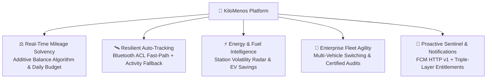
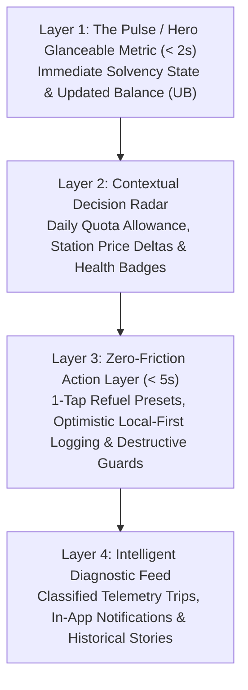

# KiloMenos 🚗💨
**"Intelligent Mileage & Vehicle Financial Management for Renting, Leasing, and Fleets"**

[-blue.svg?style=flat)](https://github.com/joshluq/kilomenos-android)
[](https://kotlinlang.org)
[](https://developer.android.com/jetpack/compose)
[]()
[](https://developer.android.com/google/play/billing)
[]()

**KiloMenos (KmSafe)** transforms vehicle renting and leasing management from an anxious guessing game into an executive, real-time financial advantage. Designed specifically for leasing drivers, fleet operators, and private vehicle owners, KiloMenos eliminates unexpected end-of-contract penalties, automates trip telemetry with zero battery drain, and uncovers actionable energy savings across combustion, hybrid, and electric vehicles.

---

## 💡 Executive Value Proposition & Product Pillars

In vehicle leasing and long-term renting, **unmonitored excess mileage translates directly into punitive financial penalties**. KiloMenos operates as an intelligent financial co-pilot across five core value pillars:


```mermaid
graph TD
    A["🚗 KiloMenos Platform"] --> B["⚖️ Real-Time Mileage Solvency<br/>Additive Balance Algorithm & Daily Budget"]
    A --> C["🛰️ Resilient Auto-Tracking<br/>Bluetooth ACL Fast-Path + Activity Fallback"]
    A --> D["⚡ Energy & Fuel Intelligence<br/>Station Volatility Radar & EV Savings"]
    A --> E["🏢 Enterprise Fleet Agility<br/>Multi-Vehicle Switching & Certified Audits"]
    A --> F["🔔 Proactive Sentinel & Notifications<br/>FCM HTTP v1 + Triple-Layer Entitlements"]
```

1. **Elimination of Penalty Surprises**: Replaces ambiguous odometer snapshots with a dynamic **Additive Data Model**. The app continuously reconciles real consumption against contract pacing, warning drivers of projected financial penalties months before contract maturity.
2. **Zero-Touch Automated Telemetry**: Car Bluetooth pairing detects vehicle ignition within 2–5 seconds, activating low-overhead GPS tracking without requiring the driver to interact with their device. Manual sessions are strictly protected via **Session Mode Isolation** (`TrackingMode.MANUAL` vs `TrackingMode.AUTOMATIC`).
3. **Smart Fuel & Energy Wealth Management**: Tracks historical station price volatility ("My Stations" radar) and computes the exact **Electrification Savings KPI** when driving in EV/PHEV mode against equivalent fossil fuel costs.
4. **Fleet & Multi-Contract Agility**: Switch between corporate leasing vehicles and private contracts seamlessly, complete with exportable certified mileage audit feeds (CSV / JSON).
5. **Proactive Financial & System Sentinel**: Real-time push alerts via FCM HTTP v1 and in-app Notification Center (`:feature:notifications`) keep drivers alerted on contract thresholds, subscription status, and telemetry status with destructive action confirmation guards (`CanvasKitConfirmDialog`).

---

## 🎨 Digital Experience: The 4-Layer Hierarchical Visual UI

To deliver an executive, clutter-free experience that feels more like an automotive cockpit than an accounting ledger, all primary screens follow the **4-Layer Hierarchical Visual Architecture**:


```mermaid
graph TD
    L1["Layer 1: The Pulse / Hero Glanceable Metric (< 2s)<br/>Immediate Solvency State & Updated Balance (UB)"] --> L2["Layer 2: Contextual Decision Radar<br/>Daily Quota Allowance, Station Price Deltas & Health Badges"]
    L2 --> L3["Layer 3: Zero-Friction Action Layer (< 5s)<br/>1-Tap Refuel Presets, Optimistic Local-First Logging & Destructive Guards"]
    L3 --> L4["Layer 4: Intelligent Diagnostic Feed<br/>Classified Telemetry Trips, In-App Notifications & Historical Stories"]
```

* **Layer 1: The Pulse (Hero Metric)**: Answers *"How am I doing right now?"* in under 2 seconds using high-contrast executive typography, semantic health indicators (Green = Zona Verde, Amber = Attention, Red = Penalty Risk), and zero secondary clutter.
* **Layer 2: Decision Radar**: Surfaces contextual guidance (*"What should I do today?"*), such as remaining kilometers for today, active telemetry state pills, or station price variances against personal historical averages.
* **Layer 3: Zero-Friction Action**: Enables critical actions in < 5 seconds with 1-tap presets (`[ 30 € ]`, `[ 50 € ]`, `[ Full Tank ]`), optimistic local-first odometer capture (< 30ms modal dismiss), and destructive confirmation guards (`CanvasKitConfirmDialog`).
* **Layer 4: Intelligent Diagnostic Feed**: Groups raw telemetry into meaningful operational cycles (refuel-to-refuel efficiency stories, classified trips with speed/accuracy badges, and dedicated notification item feeds with unread badge pills).

---

## 🔄 Core Functional Engines & Domain Mathematics

### 1. Dynamic Mileage Balance & Additive Data Model 📐
KiloMenos rejects disconnected absolute odometer snapshots in favor of discrete, auditable increments:

$$\text{Daily Base Budget (DBB)} = \frac{\text{Total Contract Km}}{\text{Total Contract Days}}$$

$$\text{Theoretical Km (TK)} = \text{Days Elapsed} \times \text{DBB}$$

$$\text{Real Km Consumed (RKC)} = \sum \text{OdometerRecord increments}$$

$$\text{Updated Balance (UB)} = \text{TK} - \text{RKC} \quad (\text{Positive} = \text{Surplus}, \text{Negative} = \text{Penalty Risk})$$

$$\text{Current Odometer} = \text{Initial Contract Odometer} + \text{RKC}$$

*Calculations are strictly centralized in `CalculateContractMetricsUseCase`, outputting immutable `ContractMetrics` domain value objects.*

---

### 2. Resilient Auto-Tracking & Sensor Telemetry 🛰️🔌
Located in `:core:tracking`:
* **Session Mode Isolation (`TrackingMode.MANUAL` vs `TrackingMode.AUTOMATIC`)**: Manual trips initiated by the user have absolute execution priority over background sensor triggers. Background stop commands (`ACTION_STOP_AUTOMATIC` from Activity Recognition or Bluetooth disconnect) strictly ignore manual trips, protecting the driver's intentional tracking session from premature termination.
* **Bluetooth ACL Fast-Path First**: Vehicle Bluetooth pairing broadcasts (`ACTION_ACL_CONNECTED`) trigger an immediate local notification and initialize `LocationTrackingService` within 2–5 seconds, leveraging Android hardware broadcast exemptions to bypass Android 14+ background launch constraints.
* **Secondary Activity Recognition Fallback**: `ActivityTransitionReceiver` listens for Google Play `IN_VEHICLE` transitions. Transition events are immediately guarded by user tier (`Feature.AUTO_TRACKING`), ensuring background battery consumption is strictly prevented for free-tier users.
* **Foreground Service Watchdog Timing**: Synchronous promotion to foreground on the Main Thread (`startForeground` with type `location`) ensures immediate OS compliance without ANRs or watchdog terminations.
* **Anti-Spoofing & Drift Filtering**: Rejects stationary coordinates with calculated speed < `1.5 m/s` (~5.4 km/h), horizontal accuracy error > `30m`, or `location.isFromMockProvider`.

---

### 3. Zero-Network Cold Start Architecture ⚡🏎️
Located in `:feature:auth` & `:core:infrastructure`:
* **Local-First Session Validation**: `LaunchViewModel` executes `CheckSessionUseCase` resolving credentials and cached subscription entitlements from encrypted local storage (Tink AEAD) in **< 150ms**.
* **Decoupled Asynchronous Sync**: Replaces legacy blocking network waterfalls with immediate navigation to `Dashboard` (reducing cold start Time-to-Interactive from **~12s to < 800ms**).
* **Background WorkManager Migration**: Deep synchronization of remote contracts, service stations, odometer logs, and expenses is dispatched asynchronously in `SyncWorker` or lazy-loaded on demand upon accessing secondary tabs (`History`, `Expenses`).

---

### 4. Optimistic Local-First Odometer Logging 💾⚡
Located in `:feature:overview` & `:core:infrastructure`:
* **Immediate Local Commit**: Inserting an odometer increment writes directly to Room DB in **< 5ms** and dismisses the bottom sheet modal in **< 30ms**.
* **Zero Offline Friction**: Drivers recording mileage in underground parking garages, basements, or rural areas with zero cellular reception experience instantaneous UI response with no blocking network spinners.
* **Reactive Metric Recalculation**: Room `Flow` streams immediately broadcast the updated balance, theoretical distance, and pacing runway to the presentation layer, while `SyncManager` queues background sync jobs with exponential backoff.

---

### 5. Fuel & Energy Wealth Management ("My Stations") ⛽⚡
Located in `:feature:expenses`:
* **Relational Schema**: 1:N relationship between `ServiceStation` entities and `FuelExpense` records.
* **Station Price Volatility**: Real-time variance comparison against the driver's personal historical average price at each specific station.
* **Mixed Powertrain Support**: Dynamic theme adaptation (Orange for combustion fuel, Blue for EV electric charging).
* **Electrification Savings KPI**: Computes the differential financial benefit of EV/PHEV kWh consumption versus equivalent fossil fuel expenses for identical distances.
* **API & Privacy Hygiene**: Aggressive local caching prevents redundant Google Places network consumption.

---

### 6. Interactive Contract Simulator & Risk Sentinel 📊🚦
Located in `:feature:projection`:
* **Pacing Simulator**: Interactively adjusts future driving pace (-10%, normal, +10%) to project contract end-date mileage.
* **Trip Budget Planner**: Tests whether an upcoming vacation or long route will consume the driver's accumulated mileage surplus.
* **Visual Projection Gauge**: Real-time traffic light indicating contract financial risk at expiry.

---

### 7. Push Notifications & Triple-Layer Entitlements Sentinel 🔔🛡️
Located in `:feature:notifications`, `:core:infrastructure` & `:core:monetization`:
* **FCM HTTP v1 Delivery**: Native handling of remote push payloads for contract risk alerts, weekly summaries, and subscription lifecycle events.
* **Dedicated System Notification Channel**: Centralized `subscription_alerts` notification channel configured with `IMPORTANCE_HIGH` to guarantee prompt alert rendering on Android 13+.
* **In-App Notification Center (`NotificationsListScreen`)**: Chronological audit feed of notifications, categorized by type, with read/unread statuses, badge counter pill (`NotificationPill`), and destructive delete protection via `CanvasKitConfirmDialog`.
* **Contextual Permission Primer**: Pre-permission rationale modal presented before requesting Android 13+ `POST_NOTIFICATIONS`, grounded in driver financial protection.
* **Triple-Layer Entitlement Defense**:
  1. *Reactive Push Ingestion*: Immediate local downgrade upon receiving FCM RTDN push events.
  2. *Periodic Cyclic Revalidation*: Automated `onResume` polling against Supabase (`GET /v1/user/entitlements`).
  3. *Zero-Trust Network Interceptor*: Automatic session downgrade when backend responds with `HTTP 403 PREMIUM_REQUIRED`, preventing offline privilege escalation.

---

## 💎 Product & Growth Strategy: Freemium Model

KiloMenos aligns feature access with driver lifecycle tiers, governed strictly by encrypted session **Entitlements**:

| Feature / Capability | Core Tier (Free) 🌟 | Premium Tier (Paid) 👑 |
| :--- | :---: | :---: |
| **Active Contracts / Vehicles** | Single Vehicle | **Unlimited Fleet Switcher** |
| **Data Persistence & Sync** | Local-First (Room, Offline) | **Real-Time Multi-Device Cloud Sync** |
| **Local Data Promotion** | Records tagged `PENDING` | **Automatic Cloud Promotion on Upgrade** |
| **Trip Tracking** | Manual In-App Session Tracking | **Hands-Free Auto-Tracking (Bluetooth + Activity)** |
| **Financial Analytics** | Basic Balance & Projections | **Station Volatility Histograms & EV Savings KPI** |
| **Push Notifications & History** | Basic Local Alerts | **FCM Push, System Channels & Centralized Inbox** |
| **Data Portability** | Certified CSV Export | **Full JSON Database Backup & Migration** |
| **Monetization & Privacy** | GDPR-Compliant AdMob Banners | **100% Ad-Free Experience** |
| **Billing System** | Device-Fingerprinted Free Trial | **Google Play Billing v9.1.0+ Subscriptions** |

---

## 🏗️ Multi-Module Clean Architecture

The codebase adheres strictly to **Clean Architecture**, **SOLID**, and **Domain-Driven Design (DDD)** across a high-performance Gradle modular topology.

### Core Separation: "The Being" (El Ser) vs. "The Doing" (El Hacer)
* **The "Being" (El Ser)**: Declarative, rich domain entities (`RentingContract`, `ContractMetrics`, `TripRoute`, `FuelExpense`, `NotificationItem`), typed navigation destinations (`Destination.kt`), and immutable MVI UI states. Rich entities safeguard their own mathematical invariants.
* **The "Doing" (El Hacer)**: Standalone domain UseCases (`UseCase First` mandate via `FoundationKit`), MVI ViewModels (zero business math in presentation), Room DAOs, and Android hardware receivers.

### Module Topology:
```
├── :app                         # Shell: Manifest, Hilt DI Root, Predictive Navigation Coordinator
├── :core:analytics              # Telemetry contracts (AnalyticsTracker), KmAnalyticsEvent & Providers
├── :core:domain                 # Pure Kotlin/JVM library (Zero Android dependencies, 60+ UseCases)
├── :core:infrastructure         # Room persistence, Retrofit, DataSources, SyncWorker, Repositories
├── :core:navigation             # Navigation 3 Destinations, DestinationListSaver, ResultStore
├── :core:ui                     # Design Tokens, CanvasKit Design System, Reusable UI Components
├── :core:monetization           # Google Play Billing v9.1, AdMob SDK, and GDPR/UMP Consent Manager
├── :core:tracking               # LocationTrackingService, Bluetooth and Activity Transition Receivers
└── :feature:*                   # Isolated Presentation Modules (MVI + Coordinator Route Pattern)
    ├── :feature:dashboard       # Tab host with CanvasKitBottomBar using slot pattern
    ├── :feature:overview        # Tab 1: Pacing runway, updated balance, live connection pill
    ├── :feature:history         # Tab 2: Audited odometer logs, GPS route maps, certified export
    ├── :feature:expenses        # Tab 3: Fuel/EV expenses, My Stations, price volatility histogram
    ├── :feature:projection      # Tab 4: Pace simulator, trip planner, projection risk gauge
    ├── :feature:profile         # Tab 5: User profile, preferences, UMP options, GDPR erasure
    ├── :feature:notifications   # Notification inbox, category filters, destructive delete dialogs
    ├── :feature:fleet           # Vehicle wizard, fleet switcher, contract parameters editor
    ├── :feature:auth            # Launch coordinator, Zero-Network Cold Start, Login, Signup
    └── :feature:premium         # Paywall, trial offers, native Google Play subscription products
```

### Architectural Guardrails:
1. **Strict Infrastructure Shielding**: `:feature:*` modules depend ONLY on `:core:domain`, `:core:ui`, `:core:navigation`, `:core:analytics`, and `:core:monetization`. **Presentation never accesses `:core:infrastructure` or repositories directly.**
2. **Pure Kotlin Domain**: `:core:domain` is a pure JVM module (`pluginkit.jvm.library`) with **zero** `android.*` imports.
3. **Stateless Repositories**: Repositories never hold in-memory mutable state (`MutableStateFlow`); all persistence is delegated to Room or encrypted DataStore.
4. **Navigation 3 & Backstack Resilience**: Flat backstack navigation with `NavDisplay` leverages `DestinationListSaver` via `rememberSaveable`. Navigation state survives orientation changes, theme toggles, and process recreation without returning to splash screens.

---

## 🛠️ Technology Stack

* **UI Framework**: Jetpack Compose + Material 3 + **CanvasKit Design System** (`canvaskit:1.1.0`).
* **Navigation**: Jetpack **Navigation 3** (`NavDisplay`, `NavEntry`) with predictive back animation and serialized backstack persistence.
* **Architecture**: MVI (Model-View-Intent) + Coordinator (Route) pattern + Multi-Module Clean Architecture.
* **Dependency Injection**: Dagger Hilt with custom Gradle convention plugins (`pluginkit.android.hilt`).
* **Concurrency**: Kotlin Coroutines & Flow (governed via `DispatcherProvider`).
* **Persistence**: Room v2.6+ (Relational schema, client-side UUID v4 identity, 1:N relations, DataStore Preferences 1.2.1).
* **Background Sync**: WorkManager (`SyncWorker`) with resilient ID Swap logic and network auto-reconnect listeners.
* **Telemetry & Sensors**: Fused Location Provider, Google Play Activity Recognition API, Bluetooth ACL hardware broadcasts.
* **Analytics & Observability**: `:core:analytics` contract abstraction, Firebase Analytics, Crashlytics, and Remote Config (`firebase-bom:34.19.0`).
* **Monetization & Privacy**: Google Play Billing Library **v9.1.0**, Google AdMob (`play-services-ads:25.5.0`), Google User Messaging Platform (UMP / GDPR **v4.0.0**).
* **Build System**: Gradle Version Catalogs (`deps.versions.toml`) with custom convention plugins (`buildSrc`), targetSdk 35, minSdk 26.

---

## ⚖️ Ethics, Privacy & European Regulations (EAA & GDPR)

KiloMenos is built to comply strictly with European digital standards:

* 🇪🇺 **European Accessibility Act (EAA)**: Mandatory `contentDescription` on all interactive Compose components, 48dp minimum touch targets, and full TalkBack support.
* 🛡️ **GDPR / RGPD Article 17 ("Right to be Forgotten")**: Self-service account deletion permanently purges local Room data, AuthKit credentials, preferences, and remote cloud records.
* 📋 **Dynamic UMP Privacy Management**: On-demand access in *Preferences* enables European users to review and revoke advertising consents at any time via `ConsentManager.showPrivacyOptionsForm`.
* 🔒 **Encrypted Storage Hygiene**: Master session tokens are encrypted with Tink AEAD and excluded from Android Auto Backup to prevent Keystore decryption failures upon app re-installation.

---

## 🧪 Testing & Quality Gate

* **100% Domain Coverage**: All 60+ Domain UseCases covered by unit tests using MockK and Kotlin Coroutines Test (`runTest`).
* **100% ViewModel Coverage**: All Feature ViewModels validated with `StandardTestDispatcher`, `UnconfinedTestDispatcher`, and Turbine for `StateFlow` streams.
* **Fast JVM Execution**: Domain and business logic execute on pure JVM in seconds without Robolectric or emulator overhead.

To execute the test suite:
```bash
./gradlew testDebugUnitTest
```

---

## 🚀 Getting Started

### Prerequisites
* Android Studio Ladybug | 2024.2.1+ or newer.
* Android SDK 35 (compileSdk), minimum Android 8.0 (API 26).
* JDK 17 or JDK 21.

### Build & Run
```bash
# Clone the repository
git clone https://github.com/joshluq/kilomenos-android.git
cd kilomenos-android

# Build the development variant
./gradlew :app:assembleDevDebug

# Run unit tests across all modules
./gradlew testDebugUnitTest
```

---

## 📄 License
Copyright © 2026 KiloMenos. All rights reserved. Proprietary software.
