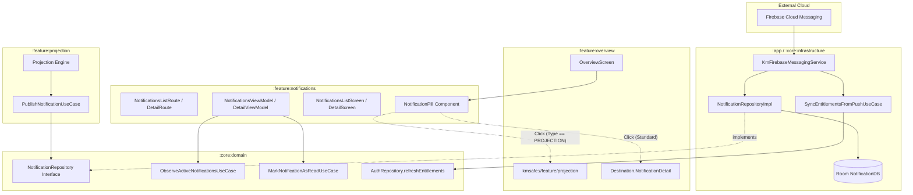

# ADR-FEAT-002: Arquitectura del Módulo de Notificaciones, Sincronización Reactiva de Entitlements y Routing por DeepLink

**Feature ID**: FEAT-002 (Jira: KILOMENOS-2)  
**Status**: ACCEPTED  
**Deciders**: Software Architect, Staff Android Engineer  
**Date**: 2026-09-22  
**Technical Stakeholders**: Senior Android Developer, QA/Testing Engineer, Product Owner  

---

## 1. Context and Problem Statement
El documento de requisitos [PRD-FEAT-002.md](file:///c:/Users/josh_/AndroidStudioProjects/KmSafe/docs/prd/PRD-FEAT-002.md) define tres retos arquitecturales críticos:
1. **Fuga de Monetización por Desfase de Entitlements**: La aplicación valida actualmente el nivel de suscripción exclusivamente en el arranque en frío (*cold start*). Si un usuario experimenta un downgrade (de `PREMIUM` a `FREE`) mientras la aplicación permanece en segundo plano (*background*), la app retiene indebidamente las capacidades Premium. Se requiere un canal reactivo activado por FCM push (*silent data messaging*) para refrescar entitlements en background y forzar la sincronización en la UI.
2. **Desacoplamiento y Principio de Responsabilidad Única (SRP)**: La pantalla `OverviewScreen` debe mostrar alertas críticas (proyecciones, suscripción, flota) en una píldora unificada (*monochannel status pill*). El nuevo módulo `:feature:notifications` debe limitarse a la persistencia, lectura y renderizado de notificaciones, **sin conocer** las fórmulas matemáticas de kilometraje ni las dependencias internas de `:feature:projection`.
3. **Navegación Dinámica y Deep Linking**: La interacción con la píldora no es homogénea:
   - Las notificaciones estándar navegan a la pantalla de detalle en `:feature:notifications` con marcado de lectura automático.
   - Las notificaciones de tipo `PROJECTION` deben enrutar por deep link (`kmsafe://feature/projection`) directamente a la pantalla de proyecciones de kilometraje.
4. **Exclusión de Alcance**: El componente `FloatingTelemetryPill` (odómetro/grabación activa de trayectos) mantiene su ciclo de vida y UI aislados.

---

## 2. Decision Drivers
- **UDF & Pure MVI**: Flujo unidireccional de datos con estados inmutables (`@Immutable data class`), eventos sellados (`sealed interface`) y efectos de un solo disparo vía `Channel<UiEffect>`.
- **Staff Compose 4-Layer Hierarchy**: Organización visual en 4 capas cognitivas decrecientes (Pulse, Radar, Action, Feed) para la bandeja de notificaciones.
- **Navigation 3 ViewModel Scoping**: Aislamiento estricto de instancias de ViewModel mediante claves deterministas (entity-scoped y session-scoped).
- **Agnostic Domain Ports**: Contrato en `:core:domain` (`NotificationRepository` y `ObserveActiveNotificationsUseCase`) que actúa como bus desacoplado entre emisores funcionales y la UI.
- **Zero Business Logic in Presentation**: Prohibición terminante de cálculos matemáticos o reglas de negocio dentro de Composables o ViewModels.
- **Performance Invariants**: Renderizado < 16ms (60 fps), recomposiciones acotadas mediante tipos estables y listas perezosas con `key`.

---

## 3. Considered Architectural Options

### Opción 1: Módulo Monolítico en `:feature:overview`
- *Descripción*: Añadir la lógica de notificaciones, base de datos y vistas directamente dentro del módulo `:feature:overview`.
- *Pros*: Cero overhead de configuración Gradle para nuevos módulos.
- *Cons*: Viola el Principio de Responsabilidad Única; mezcla telemetría con mensajería; dificulta la reutilización de la bandeja de notificaciones desde otros puntos de la app (menú lateral, barra global).

### Opción 2: EventBus Global con BroadcastReceivers clásicos de Android
- *Descripción*: Utilizar `LocalBroadcastManager` o intents implícitos para propagar notificaciones y eventos de sincronización.
- *Pros*: Familiar en código Android legado.
- *Cons*: Pérdida de tipado seguro; riesgo de memory leaks; difícil trazabilidad y testeo unitario; desaconsejado en arquitecturas modernas con Kotlin Coroutines.

### Opción 3 (Seleccionada): Clean Architecture Modular + MVI + Contrato Agnóstico en `:core:domain` + DeepLink Routing
- *Descripción*:
  - Creación del módulo aislado `:feature:notifications` (UI, Coordinator/Route pattern, MVI ViewModels).
  - Modelos y casos de uso en `:core:domain` (`Notification`, `NotificationTopic`, `ObserveNotificationsUseCase`, `SyncEntitlementsFromPushUseCase`).
  - Capa de datos en `:core:infrastructure` (Room `NotificationDao`, `KmFirebaseMessagingService`).
  - Componente `NotificationPill` reutilizable hospedado en `:feature:notifications:components` o `:core:ui`, integrado en la primera sección de `OverviewScreen`.
  - Enrutamiento por DeepLink en `:core:navigation` para canalizar notificaciones según su payload.
- *Pros*: 100% testeable sin mocks de Android; modularización escalable; desacoplamiento total entre proyecciones y notificaciones; soporte reactivo para FCM y WorkManager.
- *Cons*: Requiere definición formal de interfaces y mappers entre capas.

---

## 4. Decision Outcome
- **Chosen Option**: **Opción 3**
- **Architecture Pattern**: `MVI` + `CLEAN_ARCHITECTURE` + `COORDINATOR_ROUTE_PATTERN`

### Justificación Técnica:
Esta arquitectura garantiza que:
1. Las notificaciones puedan ser publicadas por cualquier módulo funcional (`:feature:projection`, `:feature:expenses`, `:feature:fleet`) invocando un UseCase en `:core:domain`, sin generar dependencias cruzadas entre features.
2. `KmFirebaseMessagingService` puede procesar silent pushes de suscripción, llamar a `SyncEntitlementsFromPushUseCase`, actualizar `DataStore` y emitir una notificación local en Room, garantizando que el downgrade se refleje en la UI inmediatamente.
3. Se respeta el estándar Staff Compose con la separación `Route` (coordinador de navegación y efectos) y `Screen` (UI pura y previewable con CanvasKit).

---

## 5. System Topology & Module Structure

### Module Boundaries:
- `:feature:notifications`: Depende de `:core:domain`, `:core:ui` (CanvasKit), `:core:navigation`. **PROHIBIDO** depender de `:core:infrastructure` o `:feature:projection`.
- `:core:domain`: Cero dependencias Android (`android.*`). Contiene entidades puras (`Notification`, `NotificationTopic`, `NotificationAction`) y casos de uso con operadores `invoke()`.
- `:core:infrastructure`: Implementa `NotificationRepositoryImpl`, Room DAOs, y el servicio de Firebase Messaging `KmFirebaseMessagingService`.
- `:core:navigation`: Expone destinos tipados `Destination.NotificationsList`, `Destination.NotificationDetail(notificationId)`, y maneja el intent-filter del deep link `kmsafe://feature/projection`.

---

## 6. Concurrency, Scoping & Lifecycle Rules

1. **Dispatcher Injection**: Todos los ViewModels y UseCases reciben `CoroutineDispatcherProvider` inyectado por Hilt (defaulting a `Dispatchers.IO`), garantizando pruebas unitarias deterministas con `StandardTestDispatcher`.
2. **Navigation 3 Scoping Keys**:
   - `NotificationDetailRoute`: Scoping por entidad `notification_detail_${notificationId}` para garantizar aislamiento de estado por notificación abierta.
   - `NotificationsListRoute`: Session scoping mediante `rememberSaveable { UUID.randomUUID().toString() }` para reiniciar estados de filtro y scroll en cada entrada.
   - `OverviewRoute`: Scoping persistente de pestaña para conservar reactividad con Room.
3. **DeepLink & Read Invariant**:
   - Cuando una notificación es pulsada, el ViewModel dispara `MarkNotificationAsReadUseCase(notificationId)`.
   - Si `destinationUri != null` (ej. `kmsafe://feature/projection`), emite `UiEffect.NavigateToDeepLink(uri)`.
   - Si es estándar, emite `UiEffect.NavigateToDetail(notificationId)`.

---

## 7. Consequences & Tradeoffs

- **Positive Consequences**:
  - Resuelve completamente el gap de monetización: downgrades en background actualizan entitlements al instante mediante FCM push.
  - Elimina el acoplamiento entre `:feature:notifications` y los módulos de cálculo (`:feature:projection`).
  - Total trazabilidad y cobertura de pruebas unitarias al 100% con Turbine y MockK.
  - Cumplimiento estricto de las directrices Staff Compose y tokens de CanvasKit.
- **Negative Consequences**:
  - Requiere registrar un nuevo módulo Gradle (`:feature:notifications`) y configurar dependencias en `settings.gradle.kts`.
  - Requiere migración incremental en `OverviewViewModel` para sustituir llamadas directas a status cápsulas por el caso de uso del dominio.

---

## 8. Guardrails & Compliance Rules

1. **No Direct Repository Calls in ViewModels**: ViewModels deben consumir exclusivamente UseCases de `:core:domain`.
2. **Zero Business Logic in Presentation**: La píldora y las pantallas solo formatean strings y emiten acciones de usuario.
3. **CanvasKit Tokens Mandatory**: Prohibido usar `Color(0xFF...)` o `dp` fijos; todas las dimensiones y colores deben referenciar `CanvasKitTheme.*`.
4. **Touch Target Standard**: Todos los elementos clickables de la píldora, botones de la bandeja y celdas deben tener un área mínima de **48x48dp**.
5. **No Mutation of Active Tracking**: El componente `FloatingTelemetryPill` en `OverviewScreen` no debe ser fusionado ni modificado en esta feature.
