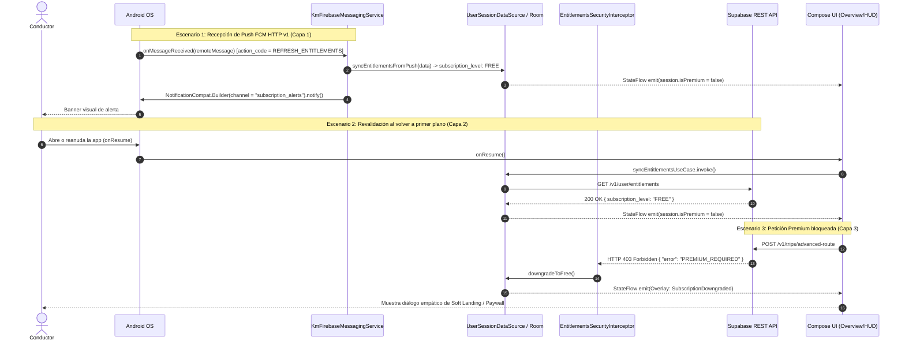

# ADR-KILOMENOS-17: Integración FCM HTTP v1, Canal de Suscripción y Estrategia de Seguridad en Entitlements (Triple Capa)

**Feature ID**: KILOMENOS-17  
**Status**: ACCEPTED  
**Deciders**: Mobile Software Architect (Android)  
**Date**: 2026-09-27  
**Technical Stakeholders**: Senior Android Developer, Backend / Systems Architecture Team, QA/Testing Engineer, Product Owner  

---

## 1. Context and Problem Statement

Tras la activación del webhook RTDN (Real-Time Developer Notifications) de Google Play y el despliegue del despachador FCM HTTP v1 en Supabase Edge Functions (versiones 15/50 en producción y desarrollo), el backend emite eventos en tiempo real ante la cancelación o expiración de planes de suscripción.

Sin embargo, el informe técnico identificó tres puntos críticos en el cliente KmSafe Android:
1. **Ausencia del Canal de Notificación del Sistema**: En Android 8.0+ (API 26+), el sistema operativo descarta silenciosamente cualquier notificación push entrante si el `channel_id` (`"subscription_alerts"`) no ha sido previamente registrado en el `NotificationManager`.
2. **Rechazo de Permisos en Android 13+ (`POST_NOTIFICATIONS`)**: Los usuarios que instalan la app rechazan frecuentemente el diálogo nativo del sistema si se les presenta de forma descontextualizada, perdiendo visibilidad de las alertas del estado de su vehículo y suscripción.
3. **Seguridad Local de Entitlements (Modelo Zero Trust)**: Si bien el backend invalida inmediatamente los permisos en la base de datos Supabase, un cliente desconectado o con notificaciones revocadas podría mantener un estado local desincronizado si la aplicación confía indefinidamente en la caché de Room/DataStore.

Se requiere establecer una arquitectura robusta que resuelva la entrega visual en primer y segundo plano, sensibilice al usuario sobre el permiso de notificación y blinde la coherencia de derechos mediante una **Estrategia de Seguridad de Triple Capa**.

---

## 2. Decision Drivers

- **Entrega Confiable de Notificaciones**: Garantizar que tanto en segundo plano (OS Direct) como en primer plano (In-App + Status Bar) las alertas de suscripción se presenten al usuario sin excepciones.
- **Modelo Zero-Trust en Cliente**: El cliente Android debe sincronizarse activamente con el estado autoritativo del servidor, garantizando que un usuario con plan expirado no pueda acceder a funciones de pago en local ni remoto.
- **Cero Fricción y Control de Ansiedad en Conducción**: La recepción de un push de degradación (`SUBSCRIPTION_DOWNGRADED`) no debe cerrar la app abruptamente ni destruir datos en curso; debe invalidar el estado en segundo plano y notificar a la interfaz de forma reactiva y elegante (*Soft Landing*).
- **Alineación con Clean Architecture y UDF**: Respetar los límites de módulos (`:core:infrastructure`, `:core:domain`, `:core:ui`, `:feature:notifications`).

---

## 3. Considered Architectural Options

1. **Opción 1: Confianza Exclusiva en FCM Push para Sincronizar Derechos**:
   - *Pros*: Fácil de implementar; reactivo cuando hay conexión y permisos.
   - *Cons*: Vulnerable ante usuarios sin red o con permisos desactivados. Una app offline podría retener estado `PREMIUM` indefinidamente. Rechazada.

2. **Opción 2: Polling Continuo en Segundo Plano mediante WorkManager**:
   - *Pros*: Actualiza periódicamente el estado.
   - *Cons*: Desperdicio de batería, retrasos de hasta 15-30 minutos y exceso de llamadas al backend. Rechazada.

3. **Opción 3: Estrategia de Seguridad de Triple Capa + Ingesta FCM HTTP v1 + Pre-Permission Primer (Elegida)**:
   - *Capa 1 (Push Reactivo)*: `KmFirebaseMessagingService` procesa `action_code == "REFRESH_ENTITLEMENTS"`, invalida la caché local en Room y despacha alerta visible en canal `subscription_alerts`.
   - *Capa 2 (Revalidación Activa en `onResume`)*: Al volver a primer plano, `MainViewModel` invoca `SyncEntitlementsUseCase` (`GET /v1/user/entitlements`) de forma asíncrona y no bloqueante.
   - *Capa 3 (Interceptor de Red OkHttp)*: Un interceptor de red captura respuestas `HTTP 403 Forbidden` con error `PREMIUM_REQUIRED`, forzando la degradación inmediata de la sesión a `FREE` y emitiendo el evento de Soft Landing.
   - *Canal del Sistema*: Registro centralizado en `NotificationChannelManager` en la inicialización de la app.
   - *Pre-Permission Primer*: Componente Compose contextual antes de lanzar el contrato de permisos nativo.

---

## 4. Decision Outcome

- **Chosen Option**: **Opción 3** — Estrategia de Seguridad de Triple Capa y Canal de Notificación Centralizado.
- **Architecture Pattern**: `CLEAN_ARCHITECTURE` + `UDF` + `OKHTTP_INTERCEPTOR_SECURITY`
- **Module Breakdown**:
  - `:core:infrastructure`: `NotificationChannelManager`, `KmFirebaseMessagingService`, `EntitlementsSecurityInterceptor`, `UserSessionDataSourceImpl`.
  - `:core:domain`: `SyncEntitlementsUseCase`, `ObserveUserSessionUseCase`.
  - `:core:ui`: `PermissionRationaleDialog` (tokens CanvasKit).
  - `:feature:notifications`: Recepción y renderizado de `NotificationPill` y navegación por deep link `kmsafe://notifications`.

---

## 5. System Topology & Sequence Diagram

---

## 6. Security & Architectural Invariants

1. **Canal Inmutable**: El ID del canal `"subscription_alerts"` no debe modificarse; debe coincidir estrictamente con el payload despachado por el backend en `android.notification.channel_id`.
2. **Cero Mutabilidad en Presentación**: La UI no puede mutar los derechos directamente. Todo cambio de plan proviene de `UserSessionDataSource` mediante flujos inmutables `StateFlow<UserSession>`.
3. **No-Blocking UI**: Ni el interceptor ni la revalidación en `onResume` deben bloquear el hilo principal (`Dispatchers.Main`); todas las llamadas de red e I/O se confinan a `Dispatchers.IO`.
4. **Idempotencia de Notificaciones**: Al persistir notificaciones remotas en Room DB, se utiliza el UUID canónico enviado en `data.id` para evitar duplicidad de alertas en la bandeja del usuario.
