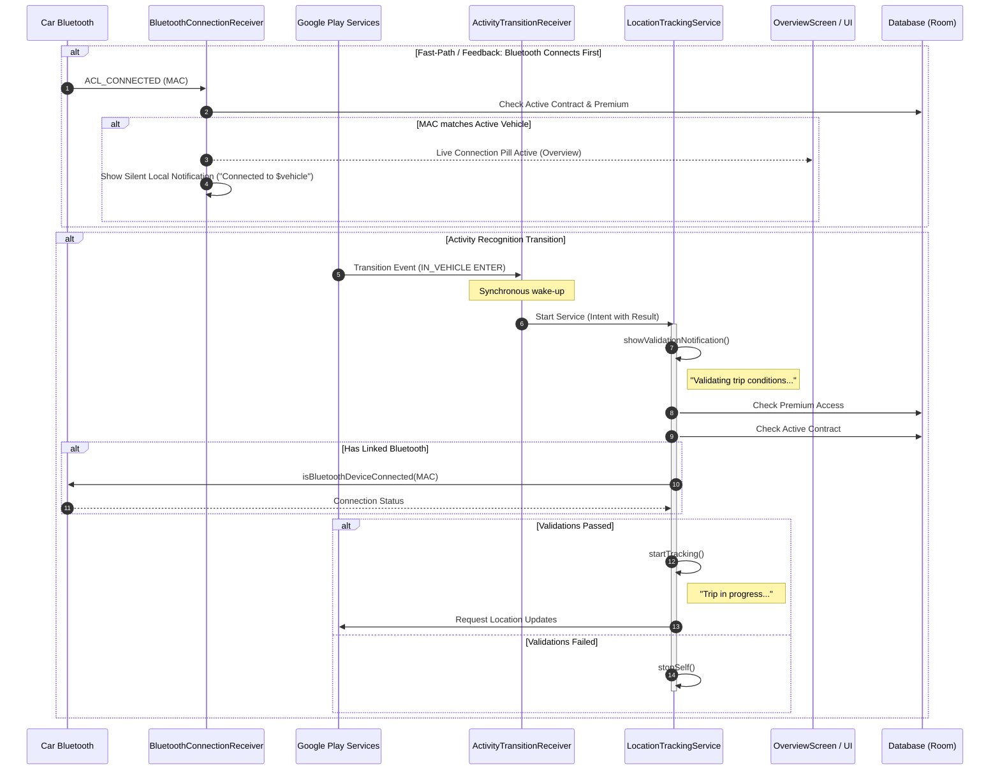

# Auto-Tracking Technical Specification 🚗

This document describes the architecture, data flow, Bluetooth feedback mechanisms, and troubleshooting details for the automatic trip tracking feature in KiloMenos.

## 1. Architecture Overview

The auto-tracking system combines **Google Play Services Activity Recognition API** and **Bluetooth ACL Hardware Events** to detect when a user enters or exits a vehicle and provide immediate user feedback. It is designed to be resilient on Android 14+ by adhering to the "Foreground Service First" pattern.

### Components:
- **`AutoTrackingManager`**: Registers and unregisters for Google Play Activity Recognition transitions (`IN_VEHICLE`).
- **`ActivityTransitionReceiver`**: Synchronous `BroadcastReceiver` that wakes up the app upon activity detection.
- **`BluetoothConnectionReceiver`**: Synchronous `BroadcastReceiver` listening to `BluetoothDevice.ACTION_ACL_CONNECTED` and `ACTION_ACL_DISCONNECTED` to manage immediate feedback and fast-path auto-tracking.
- **`LocationTrackingService`**: `Foreground Service` (type `location`) that validates contract entitlements and records GPS points.
- **`TrackingRepository`**: Manages the persistent state of the active trip and distance accumulation.
- **UI Indicators**: Live connection badges in `OverviewScreen` (vehicle header) and `BluetoothDevicePicker` (paired devices list).

---

## 2. Data Flow Diagram

---

## 3. Feedback Loop & UI/UX Strategy

### 3.1 Why Bluetooth Feedback Matters
Google Play Services Activity Recognition can take 1 to 3 minutes of continuous driving to detect `IN_VEHICLE ENTER`. Without feedback, users experience uncertainty ("Is KiloMenos tracking this trip?"). Bluetooth connects in 2–5 seconds upon ignition, providing the ideal event to establish user confidence.

### 3.2 Notification Strategy (Local vs. Remote)
- **Zero Network Dependency**: Feedback on Bluetooth connection uses local Android notifications (`NotificationManager`), never remote FCM pushes.
- **No Flicker**: The system avoids intermediate "Connecting..." notifications because Bluetooth ACL negotiation takes under 1 second. It notifies directly upon confirmed connection.
- **Alert Fatigue Prevention**: Notifications use `NotificationManager.IMPORTANCE_LOW` (silent, persistent in status bar, non-intrusive heads-up).

### 3.3 Visual Telemetry in UI (Phase 1)
1. **`OverviewScreen` (MainBalanceCard)**:
   - Displays a live status badge next to the vehicle name: `[ 󰂯 Conectado ]` in `CanvasKitTheme.colors.brandAccent`.
   - Listens to Bluetooth ACL connection broadcasts while in the foreground with zero background battery draw.
2. **`BluetoothDevicePicker` (Fleet Setup / Edit)**:
   - Queries `BluetoothProfile.A2DP` and `BluetoothProfile.HEADSET` to identify actively connected devices among paired devices.
   - Highlights the connected device with a distinct `"Conectado ahora"` badge.
   - Automatically sorts connected devices to the top of the list to eliminate configuration errors.

---

## 4. Validation Logic (The "Triple Check")

Before recording any GPS point, `LocationTrackingService` performs three validations:
1. **Premium Access**: Verifies via `CheckFeatureAccessUseCase` that the user has the `AUTO_TRACKING` entitlement.
2. **Contract SSOT**: Verifies there is an active `RentingContract` in the local database.
3. **Bluetooth Tethering (Optional but Recommended)**: If the active contract has a `bluetoothDeviceAddress`, the service will only start if that specific MAC is currently connected to the phone's audio (`A2DP`) or hands-free (`HEADSET`) profiles.

---

## 5. Implementation Phases

| Phase | Scope | Status |
| :--- | :--- | :--- |
| **Phase 1** | **UI Indicators & Setup Optimization**: Live Bluetooth connection badge in `OverviewScreen`; "Connected now" badge and auto-sorting in `BluetoothDevicePicker`. | 🚀 Active Implementation |
| **Phase 2** | **Background Fast-Path & Notifications**: Silent local notification upon car Bluetooth connection; pre-activating location validation before Activity Recognition fires. | 📅 Planned |

---

## 6. Troubleshooting & Known Errors

### Auto-Tracking doesn't start
- **Power Optimization**: If the user has "Battery Optimization" enabled for KiloMenos, Android may kill the process before the validations finish. 
  - *Solution*: Suggest the user to set battery to "Unrestricted".
- **Google Play Services Delay**: Activity Recognition can take 1-3 minutes of continuous driving to trigger an `ENTER` event.
- **Bluetooth MAC Drift**: Some cars rotate their MAC address for security. 
  - *Check*: Verify the linked MAC in the "Edit Vehicle" screen.

### False Positives (Tracking starts while walking/cycling)
- **Speed Filter**: `LocationTrackingService` ignores updates if speed is below `1.5 m/s` (~5.4 km/h).
- **Accuracy Filter**: GPS points with accuracy > `30m` are discarded to prevent "jumpy" routes in urban canyons.

### Error: `ForegroundServiceStartNotAllowedException`
- **Context**: This happens if the `Receiver` takes too long to start the service or if it's started from an asynchronous block (coroutine).
- **Fix**: The code currently uses an explicit, synchronous `context.startForegroundService()` call immediately in `onReceive`.

---

## 7. Security & Privacy
- **Mock Locations**: The service checks for `location.isFromMockProvider` to prevent mileage fraud.
- **Background Location**: Requires "Allow all the time" permission. The app provides a dedicated `AutoTrackingPermissionsScreen` to guide the user.
- **Bluetooth Permissions**: Android 12+ (API 31+) strictly requires `BLUETOOTH_CONNECT` to query device names and connection states.
