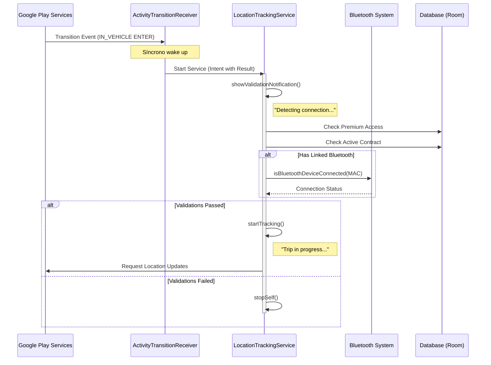

# Auto-Tracking Technical Specification 🚗

This document describes the architecture, data flow, and troubleshooting details for the automatic trip tracking feature in KiloMenos.

## 1. Architecture Overview

The auto-tracking system leverages **Google Play Services Activity Recognition API** to detect when a user enters or exits a vehicle. It is designed to be resilient on Android 14+ by following the "Foreground Service First" pattern.

### Components:
- **`AutoTrackingManager`**: Registers/unregisters for activity transition updates.
- **`ActivityTransitionReceiver`**: A síncrono `BroadcastReceiver` that wakes up the app process.
- **`LocationTrackingService`**: A `Foreground Service` that performs business validations and records GPS data.
- **`TrackingRepository`**: Manages the persistent state of the current trip.

---

## 2. Data Flow Diagram

---

## 3. Validation Logic (The "Triple Check")

Before recording any GPS point, the `LocationTrackingService` performs three checks:
1.  **Premium Access**: Verifies via `CheckFeatureAccessUseCase` that the user has the `AUTO_TRACKING` entitlement.
2.  **Contract SSOT**: Verifies there is an active `RentingContract` in the local database.
3.  **Bluetooth Tethering (Optional but Recommended)**: If the active contract has a `bluetoothDeviceAddress`, the service will only start if that specific MAC is currently connected to the phone's audio (`A2DP`) or hands-free (`HEADSET`) profiles.

---

## 4. Troubleshooting & Known Errors

### Auto-Tracking doesn't start
- **Power Optimization**: If the user has "Battery Optimization" enabled for KiloMenos, Android may kill the process before the validations finish. 
  - *Solution*: Suggest the user to set battery to "Unrestricted".
- **Google Play Services Delay**: Activity Recognition can take 1-3 minutes of continuous driving to trigger an `ENTER` event.
- **Bluetooth MAC Drift**: Some cars rotate their MAC address for security. 
  - *Check*: Verify the linked MAC in the "Edit Vehicle" screen.

### False Positives (Tracking starts while walking/cycling)
- **Speed Filter**: `LocationTrackingService` ignores updates if speed is below `1.5 m/s` (~5.4 km/h).
- **Accuracy Filter**: GPS points with accuracy > `30m` are discarded to prevent "jumpy" routes in urban canyons.

### Error: `ForegroundServiceStartNotAllowedException`
- **Context**: This happens if the `Receiver` takes too long to start the service or if it's started from an asynchronous block (coroutine).
- **Fix**: The code currently uses an explicit, síncrono `context.startForegroundService()` call immediately in `onReceive`.

---

## 5. Security & Privacy
- **Mock Locations**: The service checks for `location.isFromMockProvider` to prevent mileage fraud.
- **Background Location**: Requires "Allow all the time" permission. The app provides a dedicated `AutoTrackingPermissionsScreen` to guide the user.
