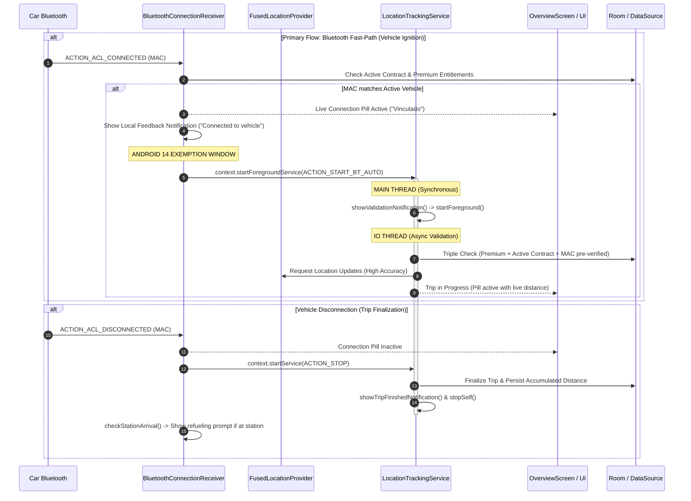

# Auto-Tracking Technical Specification 🚗

This document describes the architecture, data flow, Bluetooth feedback mechanisms, real-time field diagnostics, and troubleshooting details for the automatic trip tracking feature in KiloMenos.

---

## 1. Architecture Overview

The auto-tracking system is built on the **Bluetooth Fast-Path First** paradigm with **Google Play Services Activity Recognition** as a secondary fallback. It is designed to be 100% resilient on Android 14+ by adhering to the "Foreground Service First" pattern under hardware broadcast exemptions.

```
+─────────────────────────────────────────────────────────────────────────────+
|                         HARDWARE / TELEMETRY TRIGGERS                       |
|                                                                             |
|  [Primary: Fast-Path]                     [Secondary Fallback]             |
|  Bluetooth ACL Broadcast                  Google Play Services              |
|  (ACTION_ACL_CONNECTED)                   (IN_VEHICLE ENTER)                |
+───────────────────────┬─────────────────────────────────────┬───────────────+
                        │                                     │
                        ▼                                     ▼
      [BluetoothConnectionReceiver]              [ActivityTransitionReceiver]
      • Validates MAC with active vehicle        • Forwards transition event
      • Starts service under HW exemption        • Fallback if no BT linked
                        │                                     │
                        └──────────────────┬──────────────────┘
                                           │
                                           ▼
                            [LocationTrackingService]
                            • Immediate Main-Thread startForeground()
                            • Validates License & Active Contract
                            • Starts FusedLocationProviderClient updates
                            • Filters stationary drift (< 1.5 m/s)
                                           │
                                           ▼
                                 [TrackingRepository]
                                 • Reactive distance accumulation
                                 • Persisted in TrackingDataSource
```

### Components:
- **`BluetoothConnectionReceiver`** *(Primary Fast-Path)*: Synchronous `BroadcastReceiver` listening to `BluetoothDevice.ACTION_ACL_CONNECTED` and `ACTION_ACL_DISCONNECTED`. Leverages Android's hardware broadcast exemption to immediately initiate `LocationTrackingService` (`ACTION_START_BT_AUTO`) when the linked vehicle connects, bypassing Android 14 background restrictions.
- **`ActivityTransitionReceiver`** *(Secondary Fallback)*: Synchronous `BroadcastReceiver` that handles Google Play Activity Recognition transitions (`IN_VEHICLE ENTER / EXIT`) as a fallback when no vehicle Bluetooth MAC is registered.
- **`LocationTrackingService`**: `Foreground Service` (type `location`). Synchronously promotes itself to foreground on the Main Thread (`showValidationNotification()`) within seconds to satisfy OS watchdog timing, validates contract and entitlement invariants, and streams GPS updates.
- **`TrackingRepository`**: Manages the persistent state of the active trip, point counts, and distance accumulation (`TrackingDataSource`).
- **`TrackingDiagnostics`** *(Temporary Field-Testing Suite)*: Real-time status bar diagnostic notification engine providing immediate visual telemetry for road testers.
- **`LoggerKit` (`FoundationKit`)**: Centralized logging pipeline routing error logs and non-fatal exceptions to **Firebase Crashlytics** via `CrashlyticsLogProvider` without coupling `:core:tracking` to external SDKs.

---

## 2. Data Flow Diagram



---

## 3. Real-Time Field Observability (`TrackingDiagnostics`)

> [!IMPORTANT]
> **Temporary Diagnostic Component**: `TrackingDiagnostics` is an instrumentation helper designed exclusively for field testing on road conditions. It provides live visual telemetry in the device's status bar so testers can verify state transitions without needing ADB or Logcat cables. **Once field test stability is fully validated across all target devices, `TrackingDiagnostics` can be safely removed.**

### Diagnostic Capabilities:
1. **Live Sticky Status Bar Notification**:
   - Displays real-time state: `[HH:mm:ss] State: BT_CONNECTED -> VALIDATIONS_PASSED -> GPS_RECORDING (Speed: 52 km/h | Acc: 7m | +120m)`.
   - Low-priority channel (`tracking_diagnostic_channel`) with zero sound or vibration disturbance.
2. **Immediate Red Alert Heads-Up on Error**:
   - If an exception occurs (e.g. `ForegroundServiceStartNotAllowedException`, missing permissions, or validation timeout), an alert notification is displayed immediately.
3. **Decoupled Crashlytics Telemetry via `LoggerKit`**:
   - `:core:tracking` does **not** depend on Firebase SDK directly.
   - All errors are logged via `logger.e("LocationService", message, throwable)`.
   - `CrashlyticsLogProvider` in `:core:infrastructure` intercepts `LogLevel.ERROR` and records non-fatal exceptions to the Firebase Console automatically.

---

## 4. Feedback Loop & UI/UX Strategy

### 4.1 Why Bluetooth Fast-Path Matters
Google Play Services Activity Recognition requires 1 to 3 minutes of continuous driving movement before emitting `IN_VEHICLE ENTER`, and on Android 14 it cannot start a foreground service from background without an exemption. Car Bluetooth connects in **2–5 seconds** upon ignition, delivering the hardware interrupt `ACTION_ACL_CONNECTED` which Android explicitly exempts for starting foreground services.

### 4.2 SMART Copilot UI State Machine (`CopilotRadarSection`)

```mermaid
graph TD
    UserCheck{Is User Premium?}
    
    UserCheck -->|Free Tier: Copilot Asistido| FreeState[Manual Trip Control Card]
    FreeState --> FreeClick[User taps 'Iniciar Viaje']
    FreeClick --> PermCheck{Location & Notifications Granted?}
    PermCheck -->|Yes| StartTrip[Start Manual GPS Trip]
    PermCheck -->|No| NavAssisted[Navigate to AssistedTrackingPermissionsScreen]
    NavAssisted -->|Granted| StartTrip

    UserCheck -->|Premium Tier: SMART Copilot| PrefCheck{Auto-Tracking Enabled in Preferences?}
    PrefCheck -->|No| StateDisabled[State 1: 'Desactivado'<br/>Subtitle: 'Activar en Ajustes']
    StateDisabled -->|Tap Card| NavPrefs[Navigate to PreferencesScreen]

    PrefCheck -->|Yes| AllPermsCheck{All 5 Telemetry Permissions Granted?}
    AllPermsCheck -->|No| StateNoPerms[State 2: 'Sin permiso'<br/>Subtitle: 'Toca para activar']
    StateNoPerms -->|Tap Card| NavAutoPerms[Navigate to AutoTrackingPermissionsScreen]

    AllPermsCheck -->|Yes| BtCheck{Active Vehicle Bluetooth Connected?}
    BtCheck -->|Yes| StateConnected[State 3: 'Coche Enlazado'<br/>Subtitle: 'Listo para grabar' (Green)]
    BtCheck -->|No| StateStandby[State 4: 'En Espera'<br/>Subtitle: 'Listo para grabar' (Blue)]
```

---

## 5. Validation Logic (The "Triple Check")

Before recording GPS points, `LocationTrackingService` performs three validations:
1. **Premium Access**: Verifies via `CheckFeatureAccessUseCase` that the user has the `AUTO_TRACKING` entitlement.
2. **Contract SSOT**: Verifies the presence of an active `RentingContract` in the local Room database.
3. **Bluetooth Hardware Fast-Path**: If started via `ACTION_START_BT_AUTO` with matching pre-verified MAC, validation succeeds immediately. If started via Activity Recognition fallback, the service queries connected `A2DP` and `HEADSET` profile proxies with asynchronous completion protection.

---

## 6. Implementation Phases

| Phase | Scope | Status |
| :--- | :--- | :--- |
| **Phase 1** | **UI Indicators & Setup Optimization**: Live Bluetooth connection badge in `OverviewScreen`; "Connected now" badge and auto-sorting in `BluetoothDevicePicker`. | ✅ Implemented |
| **Phase 2** | **Background Fast-Path & Notifications**: Silent local notification upon car Bluetooth connection; pre-activating location validation before Activity Recognition fires; instant trip stop on vehicle disconnect. | ✅ Implemented |
| **Phase 3** | **Production Resiliency & Trip Continuity**: `BluetoothConnectionReceiver` exported in AndroidManifest; upgraded channel `location_tracking_channel_v3`; continuous cumulative tracking across stops (`TrackingDataSource`). | ✅ Implemented |
| **Phase 4** | **Bluetooth Fast-Path First & Real-Time Observability**: Synchronous service initiation under Bluetooth hardware broadcast exemption; robust A2DP/HEADSET proxy resolution; sticky diagnostic monitor (`TrackingDiagnostics`); decoupled logging via `LoggerKit` & Crashlytics. | ✅ Implemented |

---

## 7. Troubleshooting & Known Errors

### Error: `ForegroundServiceStartNotAllowedException`
- **Root Cause**: Attempting to start `LocationTrackingService` from background when Google Play Activity Recognition fired `IN_VEHICLE ENTER` minutes after the app was backgrounded. Android 14 blocks background service starts without explicit exemptions.
- **Architectural Solution**: **Bluetooth Fast-Path First**. `BluetoothConnectionReceiver` starts the service synchronously when `ACTION_ACL_CONNECTED` is received, which is an explicit Android exemption for starting foreground services.

### False Positives & Stationary Drift
- **Speed Filter**: Coordinates with speed below `1.5 m/s` (~5.4 km/h) are ignored for distance accumulation.
- **Accuracy Filter**: Points with accuracy error exceeding `30 meters` are discarded.
- **Anti-Spoofing**: Locations marked with `location.isMock` (or `isFromMockProvider`) are rejected.
