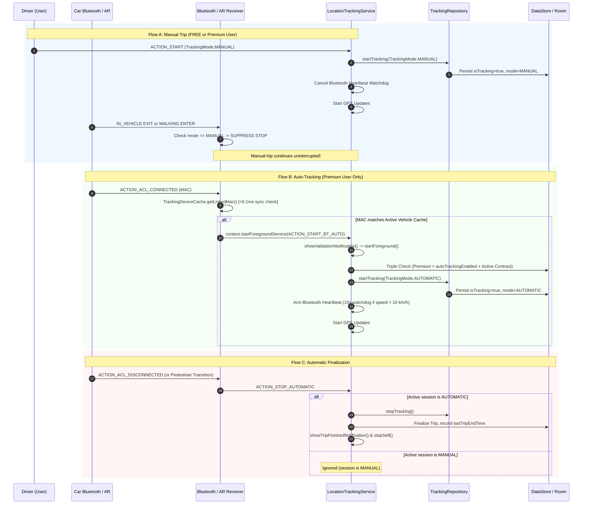
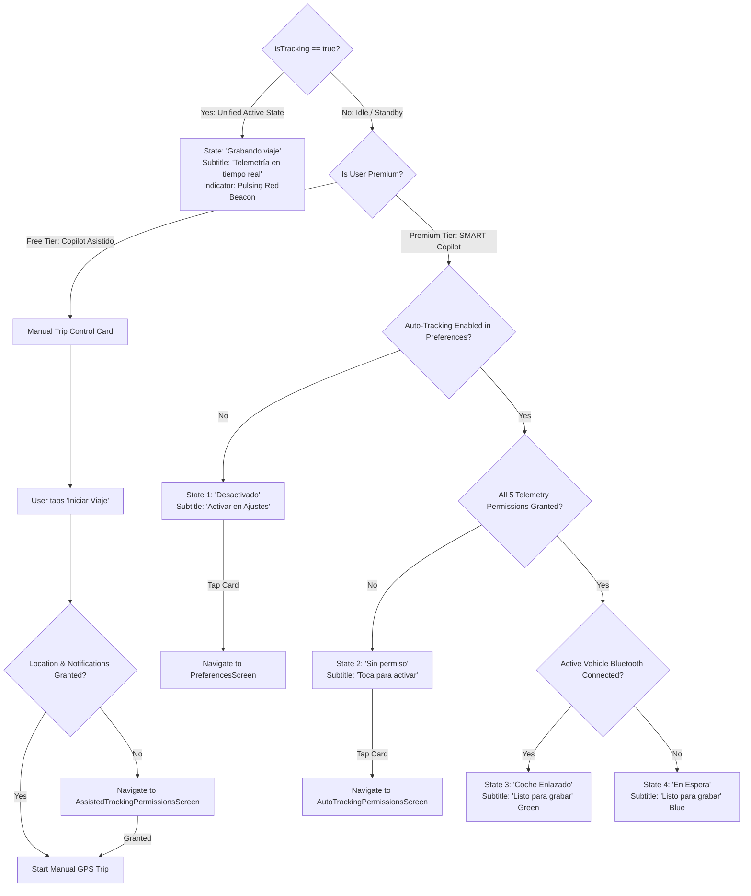

# Auto-Tracking Technical Specification 🚗

This document describes the architecture, data flow, Bluetooth feedback mechanisms, real-time field diagnostics, subscription guards, and troubleshooting details for the automatic trip tracking feature in KiloMenos.

---

## 1. Architecture Overview

The auto-tracking system is built on the **Bluetooth Fast-Path First** paradigm with **Google Play Services Activity Recognition** as a secondary fallback. It is designed to be 100% resilient on Android 14+ by adhering to the "Foreground Service First" pattern under hardware broadcast exemptions.

A fundamental architectural invariant is the **Session Mode Isolation (`TrackingMode.MANUAL` vs `TrackingMode.AUTOMATIC`)**: trips initiated manually by the user (Free or Premium) have absolute priority over background telemetry sensors and can never be terminated by background triggers.

```
+─────────────────────────────────────────────────────────────────────────────+
|                         HARDWARE / TELEMETRY TRIGGERS                       |
|                                                                             |
|  [Primary: Fast-Path]                     [Secondary Fallback]             |
|  Bluetooth ACL Broadcast                  Google Play Services              |
|  (ACTION_ACL_CONNECTED)                   (IN_VEHICLE ENTER)                |
+───────────────────────┬─────────────────────────────────────┬───────────────+
                        │                                     │
                        ▼                                     ▼
      [BluetoothConnectionReceiver]              [ActivityTransitionReceiver]
      • Validates MAC with active vehicle        • Discards if user is FREE
      • Starts service under HW exemption        • Forwards transition if Premium
      • Sends ACTION_STOP_AUTOMATIC on disc.     • Suppresses stop on MANUAL trips
                        │                                     │
                        └──────────────────┬──────────────────┘
                                           │
                                           ▼
                            [LocationTrackingService]
                            • Immediate Main-Thread startForeground()
                            • Validates License & Active Contract
                            • Dual Stop Routing (ACTION_STOP vs ACTION_STOP_AUTOMATIC)
                            • Protects ongoing MANUAL sessions from auto-kill
                            • Starts FusedLocationProviderClient updates
                            • Filters stationary drift (< 1.5 m/s)
                                           │
                                           ▼
                                 [TrackingRepository]
                                 • Reactive distance accumulation
                                 • Persisted in TrackingDataSource (Mode & Distance)
```

### Components:
- **`BluetoothConnectionReceiver`** *(Primary Fast-Path)*: Synchronous `BroadcastReceiver` listening to `BluetoothDevice.ACTION_ACL_CONNECTED` and `ACTION_ACL_DISCONNECTED`. Leverages Android's hardware broadcast exemption to immediately initiate `LocationTrackingService` (`ACTION_START_BT_AUTO`) when the linked vehicle connects, bypassing Android 14 background restrictions. On disconnection, dispatches `ACTION_STOP_AUTOMATIC` which only affects `AUTOMATIC` trips.
- **`ActivityTransitionReceiver`** *(Secondary Fallback)*: Synchronous `BroadcastReceiver` that handles Google Play Activity Recognition transitions (`IN_VEHICLE ENTER / EXIT`, `WALKING`, `ON_FOOT`):
  - **Entitlement Guard**: Immediately discards transition events for Free users (`Feature.AUTO_TRACKING` check).
  - **Manual Session Guard**: If a trip is active under `TrackingMode.MANUAL`, stop commands (`EXIT`, `WALKING`) are suppressed to protect human intent.
  - **Stop Dispatch**: Uses `ACTION_STOP_AUTOMATIC` instead of generic `ACTION_STOP`.
- **`LocationTrackingService`**: `Foreground Service` (type `location`). Synchronously promotes itself to foreground on the Main Thread (`showValidationNotification()`) within seconds to satisfy OS watchdog timing, validates contract and entitlement invariants, and streams GPS updates:
  - **`ACTION_START`**: Initiates a `TrackingMode.MANUAL` trip. Bypasses auto-validation, cancels Bluetooth heartbeat watchdog.
  - **`ACTION_START_BT_AUTO`**: Initiates a `TrackingMode.AUTOMATIC` trip after validating Bluetooth connection, contract, and entitlements.
  - **`ACTION_STOP`**: Unconditional stop (user tapped stop in UI or notification action).
  - **`ACTION_STOP_AUTOMATIC`**: Background sensor stop; executes termination **only** if the current session is `TrackingMode.AUTOMATIC`. Ignored if `MANUAL`.
- **`TrackingRepository` / `TrackingDataSource`**: Manages the persistent state of the active trip, point counts, distance accumulation, and session mode (`TrackingMode.MANUAL` | `TrackingMode.AUTOMATIC`) in DataStore.
- **`OverviewViewModel` & `KiloMenosApplication`**: Lifecycle controllers managing sensor registration:
  - Gated to Premium users with `preferences.autoTrackingEnabled == true`.
  - For Free profiles, `OverviewViewModel` actively calls `stopAutoTrackingUseCase` to tear down any residual system sensor listeners.
- **`LoggerKit` (`FoundationKit`)**: Centralized logging pipeline routing error logs and non-fatal exceptions to **Firebase Crashlytics** via `CrashlyticsLogProvider` without coupling `:core:tracking` to external SDKs.

---

## 2. Data Flow Diagram


```mermaid
sequenceDiagram
    autonumber
    participant User as Driver (User)
    participant Car as Car Bluetooth / AR
    participant BCR as Bluetooth / AR Receiver
    participant LTS as LocationTrackingService
    participant TR as TrackingRepository
    participant DB as DataStore / Room

    rect rgb(240, 248, 255)
        Note over User, LTS: Flow A: Manual Trip (FREE or Premium User)
        User->>LTS: ACTION_START (TrackingMode.MANUAL)
        LTS->>TR: startTracking(TrackingMode.MANUAL)
        TR->>DB: Persist isTracking=true, mode=MANUAL
        LTS->>LTS: Cancel Bluetooth Heartbeat Watchdog
        LTS->>LTS: Start GPS Updates
        Car->>BCR: IN_VEHICLE EXIT or WALKING ENTER
        BCR->>BCR: Check mode == MANUAL -> SUPPRESS STOP
        Note over BCR, LTS: Manual trip continues uninterrupted!
    end

    rect rgb(245, 255, 245)
        Note over Car, DB: Flow B: Auto-Tracking (Premium User Only)
        Car->>BCR: ACTION_ACL_CONNECTED (MAC)
        BCR->>BCR: TrackingDeviceCache.getLinkedMac() [<0.1ms sync check]
        alt MAC matches Active Vehicle Cache
            BCR->>LTS: context.startForegroundService(ACTION_START_BT_AUTO)
            LTS->>LTS: showValidationNotification() -> startForeground()
            LTS->>DB: Triple Check (Premium + autoTrackingEnabled + Active Contract)
            LTS->>TR: startTracking(TrackingMode.AUTOMATIC)
            TR->>DB: Persist isTracking=true, mode=AUTOMATIC
            LTS->>LTS: Arm Bluetooth Heartbeat (15s watchdog if speed < 10 km/h)
            LTS->>LTS: Start GPS Updates
        end
    end

    rect rgb(255, 245, 245)
        Note over Car, DB: Flow C: Automatic Finalization
        Car->>BCR: ACTION_ACL_DISCONNECTED (or Pedestrian Transition)
        BCR->>LTS: ACTION_STOP_AUTOMATIC
        alt Active session is AUTOMATIC
            LTS->>TR: stopTracking()
            LTS->>DB: Finalize Trip, record lastTripEndTime
            LTS->>LTS: showTripFinishedNotification() & stopSelf()
        else Active session is MANUAL
            Note over LTS: Ignored (session is MANUAL)
        end
    end
```

---

## 3. Real-Time Field Observability (`TrackingDiagnostics`)

> [!NOTE]
> **Field Testing Complete & Removed**: `TrackingDiagnostics` was an instrumentation helper designed exclusively for field testing on road conditions. Following successful stability validation of auto-tracking across all test scenarios, `TrackingDiagnostics` was safely removed from production code. Real-time observability and error tracking continue seamlessly via `LoggerKit` & Crashlytics.

### Observability Architecture:
1. **Decoupled Crashlytics Telemetry via `LoggerKit`**:
   - `:core:tracking` does **not** depend on Firebase SDK directly.
   - All errors and transitions are logged via `logger.e("LocationService", message, throwable)`.
   - `CrashlyticsLogProvider` in `:core:infrastructure` intercepts `LogLevel.ERROR` and records non-fatal exceptions to the Firebase Console automatically.
2. **Deterministic Lifecycle Events**:
   - State logging on every transition: `BT_CONNECTED`, `AR_ENTER`, `VALIDATIONS_PASSED`, `GPS_RECORDING`, `MANUAL_OVERRIDE`, `AUTO_STOP_IGNORED_FOR_MANUAL`.

---

## 4. Feedback Loop & UI/UX Strategy

### 4.1 Why Bluetooth Fast-Path Matters
Google Play Services Activity Recognition requires 1 to 3 minutes of continuous driving movement before emitting `IN_VEHICLE ENTER`, and on Android 14 it cannot start a foreground service from background without an exemption. Car Bluetooth connects in **2–5 seconds** upon ignition, delivering the hardware interrupt `ACTION_ACL_CONNECTED` which Android explicitly exempts for starting foreground services.

### 4.2 Separation of Tiers & Inviolability of Human Intent

| User Tier | Tracking Method | Inactivity / Exit Triggers | Human Stop Priority |
|---|---|---|---|
| **FREE** | **Manual Only** (`Copilot Asistido`) | Sensor stop triggers **completely suppressed** | Absolute (`ACTION_STOP`) |
| **PREMIUM** | **Auto-Tracking** (`SMART Copilot`) | Bluetooth disconnect, `WALKING`, `IN_VEHICLE EXIT` auto-stop | Absolute (`ACTION_STOP`) |
| **PREMIUM** | **Manual Trip** (Button tap) | Sensor stop triggers **suppressed** | Absolute (`ACTION_STOP`) |

### 4.3 SMART Copilot UI State Machine (`CopilotRadarSection`)

Card 2 in `CopilotRadarSection` dynamically reflects telemetry status across Free and Premium tiers. When an active recording session is running (`isTracking == true`), both tiers transition into a unified high-visibility active tracking state:


```mermaid
graph TD
    TrackingCheck{isTracking == true?}
    TrackingCheck -->|Yes: Unified Active State| StateRecording[State: 'Grabando viaje'<br/>Subtitle: 'Telemetría en tiempo real'<br/>Indicator: Pulsing Red Beacon]
    
    TrackingCheck -->|No: Idle / Standby| UserCheck{Is User Premium?}
    
    UserCheck -->|Free Tier: Copilot Asistido| FreeState[Manual Trip Control Card]
    FreeState --> FreeClick[User taps 'Iniciar Viaje']
    FreeClick --> PermCheck{Location & Notifications Granted?}
    PermCheck -->|Yes| StartTrip[Start Manual GPS Trip]
    PermCheck -->|No| NavAssisted[Navigate to AssistedTrackingPermissionsScreen]
    NavAssisted -->|Granted| StartTrip

    UserCheck -->|Premium Tier: SMART Copilot| PrefCheck{Auto-Tracking Enabled in Preferences?}
    PrefCheck -->|No| StateDisabled[State 1: 'Desactivado'<br/>Subtitle: 'Activar en Ajustes']
    StateDisabled -->|Tap Card| NavPrefs[Navigate to PreferencesScreen]

    PrefCheck -->|Yes| AllPermsCheck{All 5 Telemetry Permissions Granted?}
    AllPermsCheck -->|No| StateNoPerms[State 2: 'Sin permiso'<br/>Subtitle: 'Toca para activar']
    StateNoPerms -->|Tap Card| NavAutoPerms[Navigate to AutoTrackingPermissionsScreen]

    AllPermsCheck -->|Yes| BtCheck{Active Vehicle Bluetooth Connected?}
    BtCheck -->|Yes| StateConnected[State 3: 'Coche Enlazado'<br/>Subtitle: 'Listo para grabar' Green]
    BtCheck -->|No| StateStandby[State 4: 'En Espera'<br/>Subtitle: 'Listo para grabar' Blue]
```

#### Active Tracking Design Guidelines:
- **Pulsing Beacon Indicator**: Features an animated pulsing red dot (`CanvasKitTheme.colors.red`) with infinite transition breathing effect (alpha `1.0f` to `0.3f`).
- **Telemetry Separation of Concerns**: `CopilotRadarSection` deliberately **omits** live kilometer numbers during tracking (which prevents high-frequency UI recomposition on every GPS fix) and **omits** a duplicate Stop button (delegated exclusively to the floating `FloatingTelemetryPill`).

---

## 5. Validation Logic (The "Triple Check" + Preferences Guard + Anti-Flap Cooldown)

Before recording GPS points, `LocationTrackingService` executes comprehensive domain validations in foreground:
1. **Existing Manual Trip Protection**:
   - `startAutoValidationAndTracking()` evaluates `trackingRepository.isTracking.first()`.
   - If a trip is already actively recording, auto-validation aborts without calling `stopTrackingGracefully()`, ensuring that spurious background AR triggers do not terminate an in-progress manual trip.
2. **Premium Access**: Verifies via `CheckFeatureAccessUseCase` that the user has the `AUTO_TRACKING` entitlement.
3. **Preferences Guard**: Verifies via `GetPreferencesUseCase` that `preferences.autoTrackingEnabled` is `true`. If disabled, stops gracefully immediately.
4. **Anti-Flap Cooldown Window (`AUTO_TRACKING_COOLDOWN_MS = 60_000L`)**:
   - Verifies that at least 60 seconds have elapsed since the **cancellation** of the last trip (`trackingRepository.lastTripEndTime`).
   - **Cancellation-Only Arming**: The cooldown timestamp is written exclusively by `TrackingDataSource.clear()` (trip cancellation). `TrackingDataSource.stopTracking()` (trip confirmation/save, natural BT disconnect, AR EXIT) does **not** arm the cooldown, allowing legitimate consecutive trips to auto-start immediately.
   - **Clock Monotonicity Guard**: Uses `elapsed in 0 until COOLDOWN_MS` to prevent permanent lockout from negative clock deltas caused by NTP correction or manual time adjustment.
   - *Note: Manual user-initiated trips (`ACTION_START`) deliberately bypass this cooldown entirely.*
5. **Contract SSOT**: Verifies the presence of an active `RentingContract` in the local Room database and updates `TrackingDeviceCache`.
6. **Bluetooth Hardware Fast-Path**: If started via `ACTION_START_BT_AUTO` with matching pre-verified MAC, validation succeeds immediately. If started via Activity Recognition fallback, the service queries connected `A2DP` and `HEADSET` profile proxies with thread-safe `AtomicBoolean` flags and cancellation cleanup.
7. **Bluetooth Heartbeat Watchdog**:
   - Only armed when `trackingMode == TrackingMode.AUTOMATIC`.
   - Cancelled immediately for `TrackingMode.MANUAL` to prevent aborting trips when stopping at traffic lights or driving without a registered Bluetooth car device.

---

## 6. Implementation Phases

| Phase | Scope | Status |
| :--- | :--- | :--- |
| **Phase 1** | **UI Indicators & Setup Optimization**: Live Bluetooth connection badge in `OverviewScreen`; "Connected now" badge and auto-sorting in `BluetoothDevicePicker`. | ✅ Implemented |
| **Phase 2** | **Background Fast-Path & Notifications**: Silent local notification upon car Bluetooth connection; pre-activating location validation before Activity Recognition fires; instant trip stop on vehicle disconnect. | ✅ Implemented |
| **Phase 3** | **Production Resiliency & Trip Continuity**: `BluetoothConnectionReceiver` exported in AndroidManifest; upgraded channel `location_tracking_channel_v3`; continuous cumulative tracking across stops (`TrackingDataSource`). | ✅ Implemented |
| **Phase 4** | **Bluetooth Fast-Path First & Real-Time Observability**: Synchronous service initiation under Bluetooth hardware broadcast exemption; robust A2DP/HEADSET proxy resolution; sticky diagnostic monitor (`TrackingDiagnostics`); decoupled logging via `LoggerKit` & Crashlytics. | ✅ Implemented |
| **Phase 5** | **Active Telemetry State & Lifecycle Resiliency**: Active recording state in `CopilotRadarSection` with animated pulsing beacon; explicit foreground service teardown on trip cancellation/confirmation (`OverviewViewModel`); 60s anti-flap cooldown window preventing ghost re-tracking outside vehicle. | ✅ Implemented |
| **Phase 6** | **Subscription Gating, Manual Trip Inviolability & TrackingMode Isolation**: Clean separation between `TrackingMode.MANUAL` and `TrackingMode.AUTOMATIC`; `ACTION_STOP_AUTOMATIC` command decoupling; manual trip immunity against AR/Bluetooth stop events; active sensor teardown (`stopAutoTrackingUseCase`) for Free profiles. | ✅ Implemented |

---

## 7. Troubleshooting & Known Errors

### Premature Termination of Manual Trips on FREE Profiles (Resolved in Phase 6)
- **Root Cause**:
  1. The tracking repository lacked a session mode enum (`TrackingMode`), treating manual and automated trips identically.
  2. `OverviewViewModel` and `KiloMenosApplication` registered Activity Recognition and Bluetooth broadcast listeners on Free profiles without verifying `Feature.AUTO_TRACKING`.
  3. When an `IN_VEHICLE ENTER` transition fired on a Free user with an active manual trip, `LocationTrackingService.startAutoValidationAndTracking()` checked Premium entitlements. Upon discovering the user was Free, it invoked `stopTrackingGracefully()`, prematurely killing the manual trip.
  4. The 15-second `startBluetoothHeartbeat()` watchdog terminated trips when velocity dropped below 10 km/h without a connected car Bluetooth device.
- **Architectural Solution**:
  1. **Domain Session Model**: Created `TrackingMode` (`MANUAL`, `AUTOMATIC`) persisted in `TrackingDataSource`.
  2. **Manual Trip Inviolability**: `startAutoValidationAndTracking()` checks `isTracking.first()` upfront and exits without killing ongoing trips.
  3. **Dual Stop Commands**: Created `ACTION_STOP_AUTOMATIC` for background events (`ActivityTransitionReceiver`, `BluetoothConnectionReceiver`), which only terminates `AUTOMATIC` trips and is suppressed for `MANUAL` sessions.
  4. **Entitlement Guards & Sensor Cleanup**: Free users discard activity events immediately, and `OverviewViewModel` invokes `stopAutoTrackingUseCase` to tear down OS sensor listeners.
  5. **Watchdog Scoping**: `startBluetoothHeartbeat()` is armed exclusively for `TrackingMode.AUTOMATIC`.

### Error: `ForegroundServiceStartNotAllowedException`
- **Root Cause**: Attempting to start `LocationTrackingService` from background when Google Play Activity Recognition fired `IN_VEHICLE ENTER` minutes after the app was backgrounded. Android 14 blocks background service starts without explicit exemptions.
- **Architectural Solution**: **Bluetooth Fast-Path First**. `BluetoothConnectionReceiver` starts the service synchronously when `ACTION_ACL_CONNECTED` is received, which is an explicit Android exemption for starting foreground services.

### Ghost Tracking Re-Trigger After Trip Cancellation
- **Root Cause**: Cancelling or completing a trip in `TripCompletedCard` previously only cleared local Room data via `ClearTrackingUseCase` without signaling `LocationTrackingService`. The foreground service remained alive in background, and the subsequent GPS update restarted distance accumulation from 0 m outside the vehicle. Furthermore, residual Bluetooth connectivity or Activity Recognition re-triggered auto-validation.
- **Architectural Solution**: 
  1. `OverviewViewModel` explicitly stops `LocationTrackingService` (`StopTripTrackingUseCase`) on both trip cancellation and confirmation.
  2. `TrackingDataSource` persists a timestamp (`lastTripEndTime`).
  3. `LocationTrackingService` enforces a 60-second anti-flap cooldown window for automated triggers.

### False Positives & Stationary Drift
- **Speed Filter**: Coordinates with speed below `1.5 m/s` (~5.4 km/h) are ignored for distance accumulation.
- **Accuracy Filter**: Points with accuracy error exceeding `30 meters` are discarded.
- **Anti-Spoofing**: Locations marked with `location.isMock` (or `isFromMockProvider`) are rejected.
