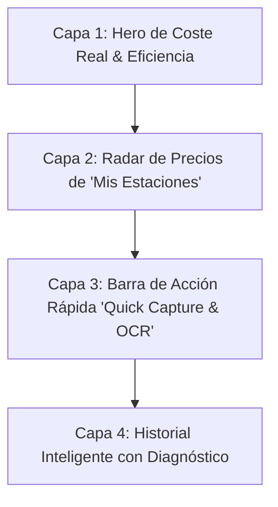
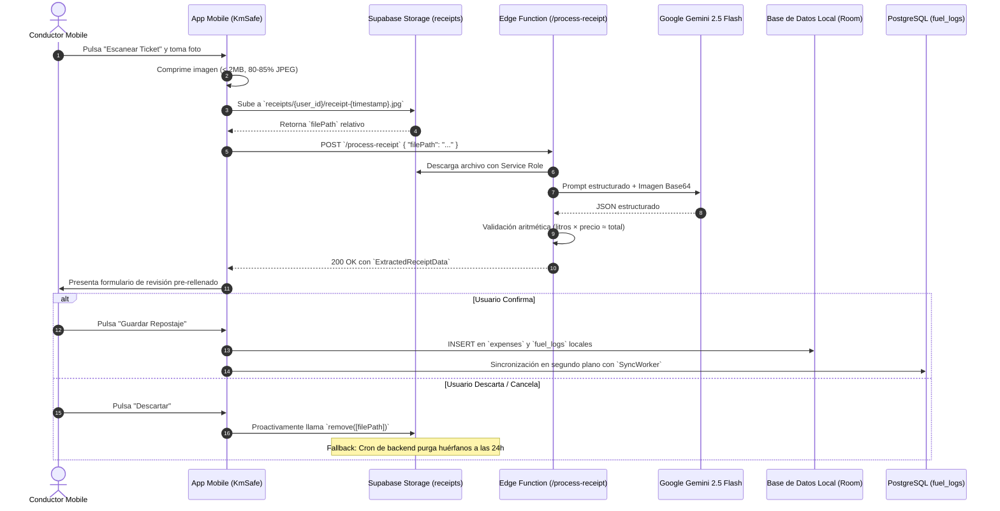
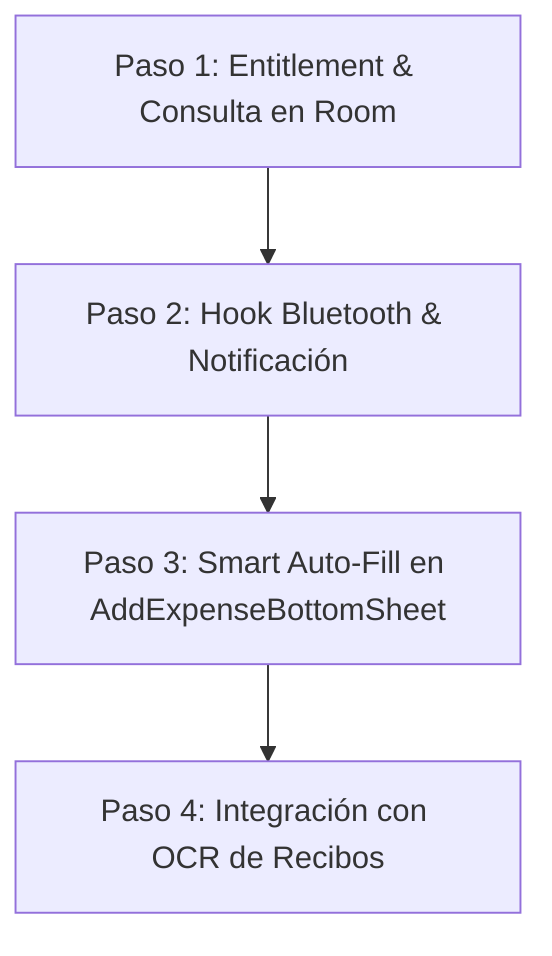

# Estrategia: Copiloto de Energía y Gastos Inteligentes (Smart Fuel & Energy Cockpit)

## 1. Visión de Producto: De Registro Pasivo a Copiloto Energético

La mayoría de las aplicaciones de automoción tratan el combustible y la recarga como un **libro mayor contable aburrido**: formularios interminables donde el usuario debe introducir litros, precio, fecha, estación y kilometraje tras pagar. Esta fricción provoca el abandono prematuro del registro tras las primeras 3 semanas.

**KiloMenos redefine la experiencia:** La pestaña de Gastos deja de ser una hoja de cálculo para convertirse en un **Copiloto Energético Proactivo**. Su misión no es recopilar recibos pasados, sino **guiar al conductor para gastar menos en cada kilómetro recorrido**, mostrándole información accionable y de un vistazo (*Glanceable UX*) en el **momento y lugar indicados**.

---

## 2. Los Jobs-To-Be-Done (JTBD) y Mental Model del Conductor

Para que la experiencia sea magnética, cada elemento visual responde a una pregunta real en la mente del conductor:

| Momento / Contexto | Pregunta del Usuario (Mental Model) | Solución en KiloMenos |
| :--- | :--- | :--- |
| **Antes de salir / Planificación** | *"¿Me compensa repostar hoy o espero? ¿Cuál de mis gasolineras habituales está más barata?"* | **Radar de Precios & Volatilidad:** Semáforo comparativo de sus estaciones habituales frente a la media. |
| **En la estación (30 segundos)** | *"Tengo prisa y las manos ocupadas: quiero anotar esto en 5 segundos sin pensar."* | **Quick Capture Híbrido:** Presets de 1-Tap (30€ / 50€ / Lleno) o **Escaneo Inteligente con IA (OCR)** del ticket. |
| **Al volante / Tras repostar** | *"¿Cuánto me está costando realmente mover este coche frente a lo que pago de renting?"* | **Métrica Reina: Coste por 100 km (€/100 km)** y consumo real obtenido en el último ciclo. |
| **Conductores PHEV / EV** | *"¿Cuánto dinero me estoy ahorrando de verdad por cargar en casa o en la oficina?"* | **KPI de Electrificación Neto:** Ahorro mensual en euros (€) contrastado con el coste fósil equivalente. |

---

## 3. Arquitectura de Información (UX Hierarchy en `:feature:expenses`)

La pantalla principal se estructura en **4 capas verticales**, ordenadas por relevancia cognitiva decreciente según el estándar de `AGENTS.md`:



### 3.1 Capa 1: El Pulso Energético (Hero Insight Card)
Sustituye la suma estática de euros por métricas de rendimiento dinámico:
- **Coste Real por 100 km (€/100 km):** Calculado a partir de los repostajes a depósito lleno y los odómetros acumulados. Es la métrica que realmente impacta al conductor de renting/flota.
- **Consumo Medio del Último Ciclo:** Ej. `5.6 L/100 km` con etiqueta de eficiencia (*"🟢 -0.4 L mejor que tu media"*).
- **Ahorro por Electrificación (en vehículos PHEV/EV):** Visualizado en verde esmeralda con icono de ahorro directo: *"Has ahorrado 48,20 € este mes conduciendo en modo eléctrico"*.

### 3.2 Capa 2: Radar de Precios de "Mis Estaciones" (Horizontal Glanceable Carousel)
Un carrusel horizontal con las 2 o 3 estaciones habituales del usuario:
- **Badge de Estado de Precio:**
  - `🟢 Oportunidad (-4 cént/L vs media)`: Sugiere repostar hoy.
  - `🔴 Precio Elevado (+3 cént/L vs media)`: Sugiere esperar o ir a una alternativa.
- **Acción Contextual Directa:** Botón *"Estoy aquí"* que pre-selecciona la estación y su último precio conocido para abrir el formulario al instante.

### 3.3 Capa 3: Entrada Rápida "Zero-Friction" (Dual Quick Capture & Smart Auto-Fill)
La captura de gastos ofrece dos vías sin tecleo manual, potenciadas por la detección automática de estación:
1. **Ruta A: Presets de 1-Tap (`[ 20 € ]`, `[ 30 € ]`, `[ 50 € ]`, `[ Depósito Lleno ]`):** Con la estación pre-seleccionada automáticamente por el sistema (en Premium), el usuario no tiene que buscar ni seleccionar la gasolinera; el sistema calcula los litros al instante con cálculo bidireccional y odómetro telemático pre-rellenado.
2. **Ruta B: Escáner Inteligente con IA (OCR Gemini 2.5 Flash):** Un botón prominente de cámara `[ 📷 Escanear Ticket ]` que procesa la foto del recibo en < 3 segundos, extrayendo estación, litros, precio unitario e importe total con validación matemática automática.

> [!TIP]
> **Cero Fricción en Selección de Estación (Exclusivo Premium):**  
> Gracias a la detección por geofence y desconexión de Bluetooth, los usuarios Premium disfrutan de **Smart Station Auto-Fill**: al abrir el formulario (o tocar la notificación de llegada), la estación física ya está **identificada, fijada y bloqueada** (`[ 📍 Repsol M-40 · Auto-detectada ]`) junto con su último precio unitario registrado. El usuario no tiene que realizar ninguna búsqueda ni selección manual. En la versión Free (Core), el usuario debe seleccionar manualmente la estación desde el buscador.

### 3.4 Capa 4: Historial Inteligente con Diagnóstico
El listado no es una tabla fría de importes, sino un **feed de ciclos de conducción**:
- Cada tarjeta de gasto agrupa los kilómetros recorridos desde el repostaje anterior.
- Incluye el **diagnóstico de consumo**: *"Depósito de 820 km recorridos a 5.4 L/100 km"*.
- Distinción visual inmediata: Naranja cálido para combustible fósil y Azul eléctrico para recargas de batería (con kWh y tiempo de carga).

---

## 4. Micro-Momentos y Flujos Contextuales

### 4.1 Detección, Notificación y Auto-Fill de Estación (Smart Station Arrival & Auto-Fill - Exclusivo Premium)
Esta funcionalidad elimina por completo la fricción de tener que buscar o elegir la estación de servicio en el momento del repostaje:
1. **Disparador Físico (Hardware Trigger):** Cuando el vehículo apaga el motor (evento `ACTION_ACL_DISCONNECTED` de Bluetooth capturado por `BluetoothConnectionReceiver` en `:core:tracking`) o el dispositivo permanece detenido más de 2 minutos en coordenadas de una estación registrada.
2. **Validación de Entitlement:** El sistema verifica que el usuario disponga del entitlement activo mediante `CheckFeatureAccessUseCase(Feature.STATION_AUTO_DETECTION)`.
3. **Resolución de Proximidad:** Se consulta la base de datos local Room (`ServiceStationDao.findNearestStation(lat, lng, radiusMeters = 120)`).
4. **Notificación Silenciosa:** Si hay coincidencia, se emite una notificación local de baja prioridad (`IMPORTANCE_LOW`):  
   *"¿Has repostado en [Nombre de Estación]? Toca para registrar en 1 tap sin buscar estación"*.
5. **Auto-Fill en el Formulario (Cero Clics de Selección):**  
   - Si el usuario pulsa la notificación (o abre manualmente el `AddExpenseBottomSheet` mientras se encuentra físicamente en la estación), los campos `stationId` y `stationName` se inyectan automáticamente en `ExpensesState`.
   - La interfaz sustituye el selector de búsqueda por una píldora visual confirmada: `[ 📍 Repsol M-40 · Auto-detectada ]` y precarga el último precio unitario conocido de esa estación.
   - El conductor solo tiene que pulsar un preset de importe (ej. `[ 50 € ]`) y confirmar. Tiempo total: **menos de 4 segundos**.
6. **Modo Free (Fallback Core):** Para usuarios sin suscripción activa, la detección en segundo plano permanece inactiva; el usuario debe buscar y seleccionar su estación manualmente en el formulario desplegable.

### 4.2 Captura de Recibo con IA (Gemini 2.5 Flash OCR - Exclusivo Premium / Trial)
1. **Gating de Acceso:** Funcionalidad exclusiva para usuarios con suscripción **PREMIUM o TRIAL activo**. En usuarios FREE, pulsar la acción abre el Paywall/conversión.
2. **Captura:** El usuario toma una foto del ticket desde la app o la selecciona de la galería.
3. **Pre-procesamiento en Dispositivo:** Compresión local a JPEG (calidad ~82%, max 1920px, payload ~200-450 KB).
4. **Procesamiento Efímero en Nube (Zero-Retention):** Subida transitoria a Supabase Storage (`receipts/{user_id}/...`) e invocación de la Edge Function `/process-receipt`.
5. **Inferencia y Destrucción Inmediata:** La Edge Function descarga el archivo en memoria, invoca Gemini 2.5 Flash y en su bloque `finally` **elimina inmediatamente la imagen de Storage**.
6. **Revisión "Human-in-the-Loop":** La app abre el formulario con los datos pre-rellenados y el odómetro actual.
   - Si `confidence_score < 0.75` o `arithmetic_check.valid == false`, los campos dudosos se resaltan en ámbar para atención del usuario.
7. **Confirmación o Descarte:**
   - **Guardar:** Persistencia en Room con referencia a la URI de imagen local en el dispositivo. En backend, no se almacena imagen remota (0 MB permanentes).
   - **Descartar:** El archivo remoto ya fue destruido por la Edge Function; el cliente limpia su estado y referencias temporales locales. Fallback de recolección de basura purga cualquier archivo con más de 1 hora en `receipts`.

### 4.3 Actualización Rápida de Precio "Estilo Waze" (Quick Price Check)
- Si el usuario pasa por delante de su gasolinera habitual pero no reposta:
  - Puede actualizar únicamente el precio unitario del tótem con un toque desde la ficha de la estación, manteniendo vivo su histograma de volatilidad sin crear un gasto ficticio.

### 4.4 Recomendación Predictiva del Mejor Día
- Mediante el histórico de la estación, la app identifica el patrón semanal de precios (ej. las gasolineras suelen bajar precios los lunes y subirlos los jueves/viernes de cara al fin de semana).
- Muestra un insight sutil: *"Consejo: Repsol M-40 suele alcanzar su precio más bajo los martes"*.

---

## 5. Contrato Técnico de Integración: Backend OCR (Supabase + Gemini 2.5 Flash)

### 5.1 Especificación del Flujo de Red



### 5.2 Políticas de Supabase Storage (Bucket `receipts`)
- **Visibilidad:** Privado (`public: false`).
- **Límite de Tamaño:** `2.097.152 bytes` (2 MB).
- **Formatos:** `image/jpeg`, `image/png`, `image/webp`.
- **Regla RLS Obligatoria:** La ruta debe iniciar con `auth.uid()`:
  - Patrón: `{user_id}/receipt-{timestamp}.{ext}`
  - Ejemplo: `4f5b2c7e-990a-42a1-a7b3-8a301a91d51c/receipt-1725482938102.jpg`

### 5.3 Contrato de Endpoint y Esquema de Datos

* **Endpoint:** `POST https://<PROJECT_REF>.supabase.co/functions/v1/process-receipt`
* **Cabeceras:**
  - `Authorization: Bearer <USER_ACCESS_TOKEN>`
  - `apikey: <SUPABASE_ANON_KEY>`
  - `Content-Type: application/json`

#### Request Payload:
```json
{
  "filePath": "4f5b2c7e-990a-42a1-a7b3-8a301a91d51c/receipt-1725482938102.jpg"
}
```

#### Response 200 OK (Éxito):
```json
{
  "success": true,
  "data": {
    "station_name": "Repsol",
    "purchase_date": "2026-08-25T14:30:00Z",
    "fuel_type": "DIESEL",
    "liters": 45.50,
    "price_per_liter": 1.589,
    "total_amount": 72.30,
    "currency": "EUR",
    "confidence_score": 0.96,
    "is_fuel_receipt": true,
    "arithmetic_check": {
      "valid": true,
      "calculated_amount": 72.30,
      "discrepancy": 0.000
    }
  }
}
```

#### Response 400 Bad Request (Documento no válido):
```json
{
  "success": false,
  "error": "El documento escaneado no es un recibo de combustible válido.",
  "data": {
    "station_name": "Mercadona",
    "is_fuel_receipt": false
  }
}
```

### 5.4 Mapeo de Tipos y Enums en Android (`:core:infrastructure`)

```kotlin
@Serializable
enum class RemoteFuelType {
    @SerialName("GASOLINE_95") GASOLINE_95,
    @SerialName("GASOLINE_98") GASOLINE_98,
    @SerialName("DIESEL") DIESEL,
    @SerialName("DIESEL_PLUS") DIESEL_PLUS,
    @SerialName("LPG") LPG,
    @SerialName("CNG") CNG,
    @SerialName("ELECTRIC_KWH") ELECTRIC_KWH,
    @SerialName("HYBRID_PHEV") HYBRID_PHEV,
    @SerialName("HYDROGEN") HYDROGEN,
    @SerialName("BIODIESEL") BIODIESEL,
    @SerialName("ETHANOL_E85") ETHANOL_E85,
    @SerialName("ADBLUE") ADBLUE,
    @SerialName("OTHER") OTHER
}

@Serializable
data class ProcessReceiptRequest(
    @SerialName("filePath") val filePath: String
)

@Serializable
data class ArithmeticCheck(
    @SerialName("valid") val valid: Boolean,
    @SerialName("calculated_amount") val calculatedAmount: Double,
    @SerialName("discrepancy") val discrepancy: Double
)

@Serializable
data class ExtractedReceiptData(
    @SerialName("station_name") val stationName: String,
    @SerialName("purchase_date") val purchaseDate: String,
    @SerialName("fuel_type") val fuelType: RemoteFuelType,
    @SerialName("liters") val liters: Double,
    @SerialName("price_per_liter") val pricePerLiter: Double,
    @SerialName("total_amount") val totalAmount: Double,
    @SerialName("currency") val currency: String = "EUR",
    @SerialName("confidence_score") val confidenceScore: Double,
    @SerialName("is_fuel_receipt") val isFuelReceipt: Boolean,
    @SerialName("arithmetic_check") val arithmeticCheck: ArithmeticCheck
)

@Serializable
data class ProcessReceiptResponse(
    @SerialName("success") val success: Boolean,
    @SerialName("data") val data: ExtractedReceiptData? = null,
    @SerialName("error") val error: String? = null
)
```

---

## 6. Diseño Visual y Tokens CanvasKit

- **Paleta Temática Energética:**
  - **Fósil (Gasolina/Diésel):** Naranja ámbar suave (`amberAccent`) para contrastar con la seriedad del cuadro.
  - **Eléctrico (EV/PHEV):** Azul eléctrico luminoso (`cyanAccent`), reforzando la sensación de tecnología limpia.
  - **Eficiencia & Ahorro:** Verde esmeralda (`success`), exclusivo para diferenciales de ahorro y precios ventajosos.
- **Estados del Escáner OCR:**
  - **Cámara Activa:** Visor con guía de esquinas redondeadas (`CanvasKitTheme.shapes.medium`) que indica centrar el total y los litros.
  - **Procesando IA:** Indicador de pulso de escaneo con gradiente sutil y micro-texto explicativo (*"Extrayendo litros y precio con Gemini..."*).
  - **Revisión con Alerta:** Borde ámbar en inputs si `confidence_score < 0.75` o `!arithmeticCheck.valid`.

---

## 7. Plan de Evolución Técnica sobre `:feature:expenses` (Roadmap)

### 7.1 Nuevos UseCases en `:core:domain`:
1. `DetectNearestStationUseCase`: Consulta la estación más cercana a unas coordenadas dadas dentro de un radio configurable (120m) validando el entitlement de pago.
2. `ProcessFuelReceiptUseCase`: Coordina el flujo de pre-procesamiento, subida y llamada al servicio de extracción de IA devolviendo un modelo de dominio puro `ReceiptScanResult`.
3. `DiscardReceiptScanUseCase`: Proactivamente cancela y purga la imagen de Storage si el usuario descarta la operación.
4. `CalculateCostPerHundredKmUseCase`: Computa el ratio dinámico €/100 km cruzando los gastos de combustible a depósito lleno con el delta de odómetros.
5. `ObserveStationRadarUseCase`: Expone un stream reactivo con las estaciones favoritas del conductor, el precio más reciente y su delta porcentual frente al histórico.
6. `PredictBestRefuelDayUseCase`: Analiza la serie temporal de precios para sugerir el día de menor coste semanal.

### 7.2 Entregables en `:core:infrastructure`:
- **Consulta de Proximidad en Room:** Método `@Query` en `ServiceStationDao` para calcular la distancia euclidiana o haversine local y retornar la estación más próxima dentro de un umbral.
- **Hook en `BluetoothConnectionReceiver`:** Al recibir `ACTION_ACL_DISCONNECTED`, si el usuario tiene `Feature.STATION_AUTO_DETECTION`, invoca `DetectNearestStationUseCase` y emite la notificación local con el `stationId` empaquetado.
- **`ReceiptsRemoteDataSource`:** Cliente de Supabase Storage para upload y delete en el bucket `receipts`.
- **`ReceiptsApiService`:** Invocación segura de la Edge Function `/process-receipt` con el token JWT del usuario.
- **Columna `receipt_image_path`:** Migración de esquema en Room en la tabla `fuel_expenses` para vincular el recibo auditado.

### 7.3 Mejoras en `:feature:expenses`:
- **Soporte de Smart Auto-Fill en `ExpensesState`:** Propiedades `isStationAutoDetected: Boolean` y `initialStationId: String?` para bloquear la estación detectada.
- **Refactorización de `AddExpenseBottomSheet`:**
  - Componente de cabecera que muestra la píldora `[ 📍 Estación Auto-detectada ]` sin necesidad de abrir el selector desplegable.
  - Botón de cambio manual opcional (*"¿No es tu estación? Cambiar"*).
  - Pestaña / Botón de escaneo rápido con IA.
  - Fila de chips de importe rápido (`20€`, `30€`, `50€`, `Lleno`) para captura manual exprés.
- **Componente `StationRadarCarousel`:** Carrusel horizontal de acceso rápido a precios antes del listado histórico.

---

## 8. Estrategia de Negocio y Monetización (Freemium Entitlement)

La automatización mediante sensores y el procesamiento inteligente en la nube constituyen las palancas principales de conversión a suscripción:

| Funcionalidad | Core (Free) | Premium (Paid) | Justificación de Negocio |
| :--- | :--- | :--- | :--- |
| **Detección y Notificación de Estación** | **Desactivada** (sin monitorización de fondo). | **Automática en segundo plano** al apagar motor por Bluetooth o geofence. | Ahorro masivo de tiempo y fricción contextual en el momento del repostaje. |
| **Selección de Estación en Registro** | **Manual obligatoria** (búsqueda en desplegable). | **100% Automática (Smart Auto-Fill)**: estación fijada y bloqueada sin tocar nada. | Cero esfuerzo cognitivo para el usuario de pago; registro en < 4 segundos. |
| **Radar de Precios & Volatilidad** | **Desactivado** (solo lista plana de gastos). | **Radar completo**, semáforo de volatilidad y predicción de mejor día semanal. | Inteligencia de decisión previa para ahorrar en cada llenado de depósito. |
| **Escaneo de Recibos con IA (Gemini 2.5)** | **Bloqueado (0 escaneos)**. Conversión directa a Paywall con presets manuales rápidos como alternativa. | **Escaneos ilimitados** (en Premium o Trial) con comprobación aritmética automática. | Financia el coste marginal de inferencia de la API de IA, garantizando coste $0 en Free. |
| **Almacenamiento de Recibos Auditados** | **Sin escaneo**. | **Procesamiento efímero (Zero-Retention)** en la nube con respaldo visual exclusivo en almacenamiento local del móvil. | Almacenamiento ocupado en Supabase Storage = 0 MB permanentes, cumplimiento GDPR y coste de Storage nulo. |

---

## 9. Viabilidad Técnica y Salvaguardas

- **Batería e Higiene de Sensores:** No se ejecuta GPS continuo en segundo plano. La detección se dispara exclusivamente ante el evento del hardware Bluetooth (`ACTION_ACL_DISCONNECTED`), consultando una única ubicación *fused location*.
- **Local-First & Offline:** Si el usuario no tiene conexión de red al intentar escanear o registrar, la app opera al 100% con Room (`expenses` y `service_stations`), garantizando cero bloqueos.
- **Higiene de Almacenamiento:** Política de borrado proactivo en cliente respaldada por el cron de backend de 24h para garantizar cero archivos huérfanos.
- **Privacidad y Cumplimiento (RGPD):** La llamada a la IA está blindada para no extraer nombres, datos de tarjetas de crédito ni matrículas; solo procesa datos mercantiles del combustible.

---

## 10. Siguientes Pasos (Next Steps & Implementation Backlog)

Para ejecutar esta estrategia de forma incremental sin comprometer la estabilidad del producto, se establece el siguiente orden de implementación:



### 📋 Backlog de Implementación Priorizado:

#### 🔹 Fase 1: Dominio, Entitlements y Persistencia Local
1. **Definir Entitlement en `:core:domain`:** Añadir `Feature.STATION_AUTO_DETECTION` al catálogo de entitlements para gobernarlo mediante `CheckFeatureAccessUseCase`.
2. **Consulta Espacial en Room (`:core:infrastructure`):** Implementar en `ServiceStationDao` el método `@Query` para localizar estaciones en un radio de 120 metros a partir de latitud y longitud.
3. **Crear `DetectNearestStationUseCase` en `:core:domain`:** UseCase puro que orquesta la verificación del entitlement y la consulta al repositorio de estaciones.

#### 🔹 Fase 2: Telemetría en Segundo Plano y Notificaciones Contextuales
4. **Hook en `BluetoothConnectionReceiver` (`:core:tracking`):** Al detectar la desconexión del vehículo (`ACTION_ACL_DISCONNECTED`), capturar la última coordenada conocida y disparar `DetectNearestStationUseCase`.
5. **Canal de Notificación Local:** Crear canal de notificaciones silenciosas (`IMPORTANCE_LOW`) con acción directa que abre la pantalla de gastos inyectando el `stationId` detectado como argumento de navegación.

#### 🔹 Fase 3: Experiencia de Usuario y Formulario sin Fricción (`:feature:expenses`)
6. **Adaptar `ExpensesState` y ViewModel:** Incorporar las propiedades `isStationAutoDetected: Boolean` y el manejo del evento `OnStationAutoDetected`.
7. **Píldora Visual de Estación en `AddExpenseBottomSheet`:**
   - Si `isStationAutoDetected == true`: renderizar el badge fijado `[ 📍 Repsol M-40 · Auto-detectada ]` con botón discreto para cambiar manualmente si fuera necesario.
   - Si es usuario Free o no hay coincidencia cercana: renderizar el selector desplegable tradicional.
8. **Fila de Presets Rápidos (`[ 20 € ]`, `[ 30 € ]`, `[ 50 € ]`, `[ Lleno ]`):** Añadir cálculo bidireccional automático con el precio unitario precargado de la estación detectada.

#### 🔹 Fase 4: Integración del Escaneo IA (Gemini 2.5 Flash OCR)
9. **Implementar `ReceiptsRemoteDataSource` y `ProcessFuelReceiptUseCase`:** Integrar la subida al bucket `receipts` de Supabase Storage y la llamada a la Edge Function `/process-receipt`.
10. **Cruce Inteligente OCR + Auto-Detección:** Si el ticket extraído indica "Repsol" y la estación auto-detectada es "Repsol M-40", vincular automáticamente el registro a la entidad `ServiceStation` existente sin requerir confirmación extra del usuario.

