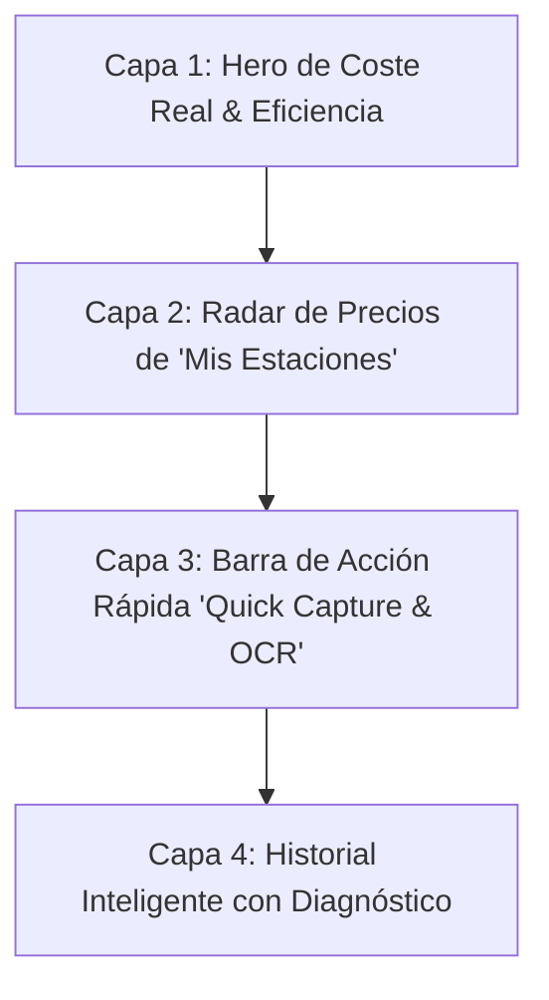
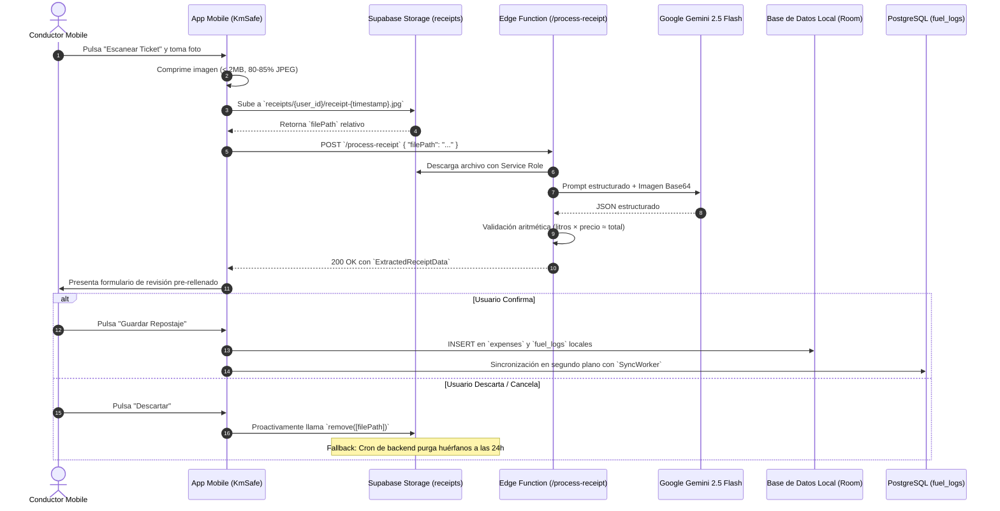

# Estrategia: Copiloto de Energía y Gastos Inteligentes (Smart Fuel & Energy Cockpit)

## 1. Visión de Producto: De Registro Pasivo a Copiloto Energético

La mayoría de las aplicaciones de automoción tratan el combustible y la recarga como un **libro mayor contable aburrido**: formularios interminables donde el usuario debe introducir litros, precio, fecha, estación y kilometraje tras pagar. Esta fricción provoca el abandono prematuro del registro tras las primeras 3 semanas.

**KiloMenos redefine la experiencia:** La pestaña de Gastos deja de ser una hoja de cálculo para convertirse en un **Copiloto Energético Proactivo**. Su misión no es recopilar recibos pasados, sino **guiar al conductor para gastar menos en cada kilómetro recorrido**, mostrándole información accionable y de un vistazo (*Glanceable UX*) en el **momento y lugar indicados**.

---

## 2. Los Jobs-To-Be-Done (JTBD) y Mental Model del Conductor

Para que la experiencia sea magnética, cada elemento visual responde a una pregunta real en la mente del conductor:

| Momento / Contexto | Pregunta del Usuario (Mental Model) | Solución en KiloMenos |
| :--- | :--- | :--- |
| **Antes de salir / Planificación** | *"¿Me compensa repostar hoy o espero? ¿Cuál de mis gasolineras habituales está más barata?"* | **Radar de Precios & Volatilidad:** Semáforo comparativo de sus estaciones habituales frente a la media. |
| **En la estación (30 segundos)** | *"Tengo prisa y las manos ocupadas: quiero anotar esto en 5 segundos sin pensar."* | **Quick Capture Híbrido:** Presets de 1-Tap (30€ / 50€ / Lleno) o **Escaneo Inteligente con IA (OCR)** del ticket. |
| **Al volante / Tras repostar** | *"¿Cuánto me está costando realmente mover este coche frente a lo que pago de renting?"* | **Métrica Reina: Coste por 100 km (€/100 km)** y consumo real obtenido en el último ciclo. |
| **Conductores PHEV / EV** | *"¿Cuánto dinero me estoy ahorrando de verdad por cargar en casa o en la oficina?"* | **KPI de Electrificación Neto:** Ahorro mensual en euros (€) contrastado con el coste fósil equivalente. |

---

## 3. Arquitectura de Información (UX Hierarchy en `:feature:expenses`)

La pantalla principal se estructura en **4 capas verticales**, ordenadas por relevancia cognitiva decreciente según el estándar de `AGENTS.md`:



### 3.1 Capa 1: El Pulso Energético (Hero Insight Card)
Sustituye la suma estática de euros por métricas de rendimiento dinámico:
- **Coste Real por 100 km (€/100 km):** Calculado a partir de los repostajes a depósito lleno y los odómetros acumulados. Es la métrica que realmente impacta al conductor de renting/flota.
- **Consumo Medio del Último Ciclo:** Ej. `5.6 L/100 km` con etiqueta de eficiencia (*"🟢 -0.4 L mejor que tu media"*).
- **Ahorro por Electrificación (en vehículos PHEV/EV):** Visualizado en verde esmeralda con icono de ahorro directo: *"Has ahorrado 48,20 € este mes conduciendo en modo eléctrico"*.

### 3.2 Capa 2: Radar de Precios de "Mis Estaciones" (Horizontal Glanceable Carousel)
Un carrusel horizontal con las 2 o 3 estaciones habituales del usuario:
- **Badge de Estado de Precio:**
  - `🟢 Oportunidad (-4 cént/L vs media)`: Sugiere repostar hoy.
  - `🔴 Precio Elevado (+3 cént/L vs media)`: Sugiere esperar o ir a una alternativa.
- **Acción Contextual Directa:** Botón *"Estoy aquí"* que pre-selecciona la estación y su último precio conocido para abrir el formulario al instante.

### 3.3 Capa 3: Entrada Rápida "Zero-Friction" (Dual Quick Capture)
La captura de gastos ofrece dos vías sin tecleo manual:
1. **Ruta A: Presets de 1-Tap (`[ 20 € ]`, `[ 30 € ]`, `[ 50 € ]`, `[ Depósito Lleno ]`):** Con la estación detectada, el sistema calcula los litros al instante con cálculo bidireccional y odómetro telemático pre-rellenado.
2. **Ruta B: Escáner Inteligente con IA (OCR Gemini 2.5 Flash):** Un botón prominente de cámara `[ 📷 Escanear Ticket ]` que procesa la foto del recibo en < 3 segundos, extrayendo estación, litros, precio unitario e importe total con validación matemática automática.

### 3.4 Capa 4: Historial Inteligente con Diagnóstico
El listado no es una tabla fría de importes, sino un **feed de ciclos de conducción**:
- Cada tarjeta de gasto agrupa los kilómetros recorridos desde el repostaje anterior.
- Incluye el **diagnóstico de consumo**: *"Depósito de 820 km recorridos a 5.4 L/100 km"*.
- Distinción visual inmediata: Naranja cálido para combustible fósil y Azul eléctrico para recargas de batería (con kWh y tiempo de carga).

---

## 4. Micro-Momentos y Flujos Contextuales

### 4.1 La Parada Silenciosa (Smart Arrival Detection)
- Cuando el vehículo apaga el motor (se desconecta el Bluetooth del coche) y las coordenadas coinciden con una `ServiceStation` registrada:
  - Notificación local silenciosa de baja prioridad: *"¿Has repostado en [Nombre de Estación]? Toca para registrar en 1 paso o escanear ticket"*.
  - Al tocar la notificación, la app se abre directamente con la estación pre-seleccionada y el selector de presets listo para validar.

### 4.2 Captura de Recibo con IA (Gemini 2.5 Flash OCR)
1. **Captura:** El usuario toma una foto del ticket desde la app o la selecciona de la galería.
2. **Pre-procesamiento en Dispositivo:** Compresión local a JPEG (calidad 80-85%, < 2000x2000px, payload ~300-500 KB).
3. **Procesamiento en Nube:** Subida a Supabase Storage (`receipts/{user_id}/...`) e invocación de la Edge Function `/process-receipt`.
4. **Revisión "Human-in-the-Loop":** La app abre el formulario con los datos pre-rellenados y el odómetro actual.
   - Si `confidence_score < 0.75` o `arithmetic_check.valid == false`, los campos dudosos se resaltan en ámbar para atención del usuario.
5. **Confirmación o Descarte:**
   - **Guardar:** Persistencia local en Room (`fuel_expenses` y `fuel_logs`) con referencia a `receipt_image_path`.
   - **Descartar:** La app móvil borra proactivamente la imagen de Storage. Si ocurre un fallo, el cron de backend limpia los archivos huérfanos a las 24 horas.

### 4.3 Actualización Rápida de Precio "Estilo Waze" (Quick Price Check)
- Si el usuario pasa por delante de su gasolinera habitual pero no reposta:
  - Puede actualizar únicamente el precio unitario del tótem con un toque desde la ficha de la estación, manteniendo vivo su histograma de volatilidad sin crear un gasto ficticio.

### 4.4 Recomendación Predictiva del Mejor Día
- Mediante el histórico de la estación, la app identifica el patrón semanal de precios (ej. las gasolineras suelen bajar precios los lunes y subirlos los jueves/viernes de cara al fin de semana).
- Muestra un insight sutil: *"Consejo: Repsol M-40 suele alcanzar su precio más bajo los martes"*.

---

## 5. Contrato Técnico de Integración: Backend OCR (Supabase + Gemini 2.5 Flash)

### 5.1 Especificación del Flujo de Red



### 5.2 Políticas de Supabase Storage (Bucket `receipts`)
- **Visibilidad:** Privado (`public: false`).
- **Límite de Tamaño:** `2.097.152 bytes` (2 MB).
- **Formatos:** `image/jpeg`, `image/png`, `image/webp`.
- **Regla RLS Obligatoria:** La ruta debe iniciar con `auth.uid()`:
  - Patrón: `{user_id}/receipt-{timestamp}.{ext}`
  - Ejemplo: `4f5b2c7e-990a-42a1-a7b3-8a301a91d51c/receipt-1725482938102.jpg`

### 5.3 Contrato de Endpoint y Esquema de Datos

* **Endpoint:** `POST https://<PROJECT_REF>.supabase.co/functions/v1/process-receipt`
* **Cabeceras:**
  - `Authorization: Bearer <USER_ACCESS_TOKEN>`
  - `apikey: <SUPABASE_ANON_KEY>`
  - `Content-Type: application/json`

#### Request Payload:
```json
{
  "filePath": "4f5b2c7e-990a-42a1-a7b3-8a301a91d51c/receipt-1725482938102.jpg"
}
```

#### Response 200 OK (Éxito):
```json
{
  "success": true,
  "data": {
    "station_name": "Repsol",
    "purchase_date": "2026-08-25T14:30:00Z",
    "fuel_type": "DIESEL",
    "liters": 45.50,
    "price_per_liter": 1.589,
    "total_amount": 72.30,
    "currency": "EUR",
    "confidence_score": 0.96,
    "is_fuel_receipt": true,
    "arithmetic_check": {
      "valid": true,
      "calculated_amount": 72.30,
      "discrepancy": 0.000
    }
  }
}
```

#### Response 400 Bad Request (Documento no válido):
```json
{
  "success": false,
  "error": "El documento escaneado no es un recibo de combustible válido.",
  "data": {
    "station_name": "Mercadona",
    "is_fuel_receipt": false
  }
}
```

### 5.4 Mapeo de Tipos y Enums en Android (`:core:infrastructure`)

```kotlin
@Serializable
enum class RemoteFuelType {
    @SerialName("GASOLINE_95") GASOLINE_95,
    @SerialName("GASOLINE_98") GASOLINE_98,
    @SerialName("DIESEL") DIESEL,
    @SerialName("DIESEL_PLUS") DIESEL_PLUS,
    @SerialName("LPG") LPG,
    @SerialName("CNG") CNG,
    @SerialName("ELECTRIC_KWH") ELECTRIC_KWH,
    @SerialName("HYBRID_PHEV") HYBRID_PHEV,
    @SerialName("HYDROGEN") HYDROGEN,
    @SerialName("BIODIESEL") BIODIESEL,
    @SerialName("ETHANOL_E85") ETHANOL_E85,
    @SerialName("ADBLUE") ADBLUE,
    @SerialName("OTHER") OTHER
}

@Serializable
data class ProcessReceiptRequest(
    @SerialName("filePath") val filePath: String
)

@Serializable
data class ArithmeticCheck(
    @SerialName("valid") val valid: Boolean,
    @SerialName("calculated_amount") val calculatedAmount: Double,
    @SerialName("discrepancy") val discrepancy: Double
)

@Serializable
data class ExtractedReceiptData(
    @SerialName("station_name") val stationName: String,
    @SerialName("purchase_date") val purchaseDate: String,
    @SerialName("fuel_type") val fuelType: RemoteFuelType,
    @SerialName("liters") val liters: Double,
    @SerialName("price_per_liter") val pricePerLiter: Double,
    @SerialName("total_amount") val totalAmount: Double,
    @SerialName("currency") val currency: String = "EUR",
    @SerialName("confidence_score") val confidenceScore: Double,
    @SerialName("is_fuel_receipt") val isFuelReceipt: Boolean,
    @SerialName("arithmetic_check") val arithmeticCheck: ArithmeticCheck
)

@Serializable
data class ProcessReceiptResponse(
    @SerialName("success") val success: Boolean,
    @SerialName("data") val data: ExtractedReceiptData? = null,
    @SerialName("error") val error: String? = null
)
```

---

## 6. Diseño Visual y Tokens CanvasKit

- **Paleta Temática Energética:**
  - **Fósil (Gasolina/Diésel):** Naranja ámbar suave (`amberAccent`) para contrastar con la seriedad del cuadro.
  - **Eléctrico (EV/PHEV):** Azul eléctrico luminoso (`cyanAccent`), reforzando la sensación de tecnología limpia.
  - **Eficiencia & Ahorro:** Verde esmeralda (`success`), exclusivo para diferenciales de ahorro y precios ventajosos.
- **Estados del Escáner OCR:**
  - **Cámara Activa:** Visor con guía de esquinas redondeadas (`CanvasKitTheme.shapes.medium`) que indica centrar el total y los litros.
  - **Procesando IA:** Indicador de pulso de escaneo con gradiente sutil y micro-texto explicativo (*"Extrayendo litros y precio con Gemini..."*).
  - **Revisión con Alerta:** Borde ámbar en inputs si `confidence_score < 0.75` o `!arithmeticCheck.valid`.

---

## 7. Plan de Evolución Técnica sobre `:feature:expenses` (Roadmap)

### 7.1 Nuevos UseCases en `:core:domain`:
1. `ProcessFuelReceiptUseCase`: Coordina el flujo de pre-procesamiento, subida y llamada al servicio de extracción de IA devolviendo un modelo de dominio puro `ReceiptScanResult`.
2. `DiscardReceiptScanUseCase`: Proactivamente cancela y purga la imagen de Storage si el usuario descarta la operación.
3. `CalculateCostPerHundredKmUseCase`: Computa el ratio dinámico €/100 km cruzando los gastos de combustible a depósito lleno con el delta de odómetros.
4. `ObserveStationRadarUseCase`: Expone un stream reactivo con las estaciones favoritas del conductor, el precio más reciente y su delta porcentual frente al histórico.
5. `PredictBestRefuelDayUseCase`: Analiza la serie temporal de precios para sugerir el día de menor coste semanal.

### 7.2 Entregables en `:core:infrastructure`:
- **`ReceiptsRemoteDataSource`:** Cliente de Supabase Storage para upload y delete en el bucket `receipts`.
- **`ReceiptsApiService`:** Invocación segura de la Edge Function `/process-receipt` con el token JWT del usuario.
- **Mapeador de Dominio:** Conversión de `RemoteFuelType` al modelo canónico `FuelType` de `:core:domain`.
- **Columna `receipt_image_path`:** Migración de esquema en Room en la tabla `fuel_expenses` para vincular el recibo auditado.

### 7.3 Mejoras en `:feature:expenses`:
- **Botonera en `ExpensesScreen`:** Inclusión del botón `[ 📷 Escanear Ticket ]` en el Header o TopBar junto a la acción de añadir.
- **Refactorización de `AddExpenseBottomSheet`:**
  - Pestaña / Botón de escaneo rápido con IA.
  - Fila de chips de importe rápido (`20€`, `30€`, `50€`, `Lleno`) para captura manual exprés.
  - Indicadores visuales de discrepancia aritmética o baja confianza detectada por la IA.
- **Componente `StationRadarCarousel`:** Carrusel horizontal de acceso rápido a precios antes del listado histórico.

---

## 8. Estrategia de Negocio y Monetización (Freemium Entitlement)

El coste de inferencia de Gemini 2.5 Flash, el almacenamiento en Supabase Storage y el valor analítico del Radar de Estaciones convierten a esta funcionalidad en una **palanca clave de conversión a suscripción**:

| Tier | Cuota de Escaneo con IA | Radar de Precios & Volatilidad | Almacenamiento de Recibos |
| :--- | :--- | :--- | :--- |
| **Core (Free)** | **1 escaneo de prueba al mes.** | **No disponible (Exclusivo Premium).** | Solo local en dispositivo; imágenes en la nube se purgan tras confirmar datos. |
| **Premium (Paid)** | **Escaneos ilimitados.** | **Radar completo, semáforo de volatilidad y mejor día.** | Almacenamiento seguro en la nube (`receipt_image_path`), histórico fotográfico para deducción fiscal y auditoría de renting. |

---

## 9. Viabilidad Técnica y Salvaguardas

- **Local-First & Offline:** Si el usuario no tiene conexión de red al intentar escanear, la app ofrece de inmediato el flujo de captura manual exprés (`Quick Presets`) con odómetro pre-rellenado para no interrumpir el registro.
- **Higiene de Almacenamiento:** Política de borrado proactivo en cliente respaldada por el cron de backend de 24h para garantizar cero archivos huérfanos.
- **Privacidad y Cumplimiento (RGPD):** La llamada a la IA está blindada para no extraer nombres, datos de tarjetas de crédito ni matrículas; solo procesa datos mercantiles del combustible.
