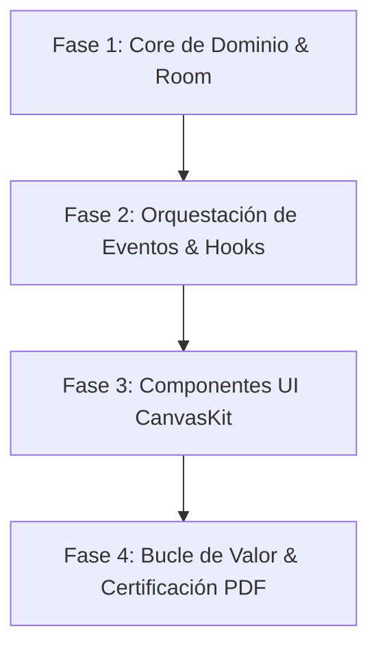

# Estrategia de Gamificación: Sistema Smart Pilot (KmSafe)

Este documento define el sistema de refuerzo conductual y retención de KiloMenos (KmSafe), diseñado específicamente para conductores de renting, leasing y flotas. Su propósito es optimizar la recurrencia (DAU/MAU), asegurar la captura de telemetría sin fricción y acelerar la conversión al tier Premium mediante valor percibido tangible y rigor financiero.

---

## 1. El Concepto: Smart Pilot Telemetry

KiloMenos evoluciona de ser una calculadora pasiva a convertirse en un **Cockpit Ejecutivo de Gestión y Rendimiento Vehicular**. El sistema premia la disciplina telemática, la consistencia en el registro y la eficiencia económica mediante **Smart Pilot Points (SPP)**.

### 💎 Economía de Puntos (Smart Pilot Points)

| Acción del Conductor | Recompensa | Objetivo de Negocio / KPI |
| :--- | :--- | :--- |
| **Auto-Tracking Confirmado** | +50 SPP | Precisión GPS, fidelización del enlace Bluetooth y adopción Premium. |
| **Registro de Odómetro Manual** | +15 SPP | Mitigación del abandono y frescura de datos en usuarios Free. |
| **Cierre Diario en "Zona Verde"** | +25 SPP | Cumplimiento del Daily Base Budget (DBB) del contrato. |
| **Registro de Combustible / Carga** | +35 SPP | Densidad de datos de estaciones, precios históricos y ahorro EV. |
| **Racha Semanal en Balance Positivo** | +120 SPP | Retención W1/M1 (Stickiness) y hábito de consulta recurrente. |
| **Categorización de Trayecto** | +20 SPP | Preparación de datos para deducción fiscal y reportes de empresa. |

---

## 2. Dinámicas de Progresión y Estatus

### Niveles de Maestría (Fleet Mastery Tiers)
Los puntos acumulados reflejan el nivel de control y salud financiera del contrato, visibles en el Dashboard y la pantalla de Perfil:
1. **Conductor en Rodaje (Nivel 1-3):** Visualización básica de métricas e inicio de historial telemático.
2. **Gestor Eficiente (Nivel 4-7):** Acceso a temas visuales de cuadro de instrumentos y comparativas avanzadas de consumo histórico.
3. **Master Pilot (Nivel 8-10):** Desbloqueo de widgets de proyección predictiva y reconocimiento de máxima eficiencia en gestión de flota.

### Rachas de Presupuesto (Budget Streaks)
- **Indicador Dinámico:** Contador sutil de constancia en el Dashboard principal (tacómetro / anillo de progreso).
- **Condición de Incremento:** Suma días consecutivos en los que el **Real Km Consumed (RKC)** se mantiene dentro del **Theoretical Km (TK)** acumulado.
- **Multiplicador de Eficiencia:** Bonificación de puntos (x1.2 a x1.5) tras superar rachas de 7 y 30 días en balance positivo.

---

## 3. Visualización de Riesgo Financiero: "Risk Sentinel"

En lugar de representaciones caricaturescas que trivializan el impacto económico, KiloMenos implementa un sistema de **alerta telemática preventiva** para el riesgo de penalización por exceso de kilometraje:

- **Activación:** Se activa dinámicamente cuando `TripProjection.isOverLimit` es `true`.
- **Niveles de Alerta:**
  - **Alerta Amarilla (Desvío leve < 5%):** Notificación técnica en el Dashboard con el coste proyectado estimado: *"Ritmo de uso elevado: +420 km proyectados (~50€ al vencimiento)"*.
  - **Alerta Ámbar / Crítica (Desvío severo > 5%):** El indicador de tacómetro en `CanvasKit` resalta el diferencial económico a fin de contrato y sugiere la velocidad de consumo diario corregida en km/día.
- **Resolución:** La alerta se neutraliza cuando el usuario recalibra sus hábitos o planifica trayectos compensatorios en el **Simulador de Proyecciones**.

---

## 4. Eficiencia Energética y Margen Financiero

Para impulsar la adopción del módulo de gastos (**Fuel & Energy Expenses**), se aplican dinámicas de optimización patrimonial:

### 🛡️ Margen de Seguridad (Financial Buffer)
- Premia el registro continuo de repostajes y odómetros mostrando el margen real de kilómetros de seguridad que protegen al conductor frente a penalizaciones contractuales.
- **Medalla de Volatilidad Óptima:** Reconocimiento mensual al repostar sistemáticamente en estaciones por debajo de la media histórica provincial.

### ⚡ Índice de Eficiencia de Electrificación (EV Score)
- Diseñado específicamente para conductores de vehículos PHEV y EV.
- Visualiza el ratio de kilómetros recorridos en modo 100% eléctrico frente a combustible fósil y el total acumulado de **"Ahorro Neto por Electrificación"**.
- Desbloquea la insignia ejecutiva de **"Flota Cero Emisiones"** en el perfil del conductor.

---

## 5. Bucle de Valor Tangible y Recompensas Reales

Para evitar la devaluación de puntos virtuales y garantizar retención a largo plazo (D90+), los SPP se integran en un sistema de recompensas útiles:

1. **Certificado de Salud del Vehículo (PDF Audit):**
   - Los usuarios de nivel avanzado pueden generar un informe formal con el histórico de kilometraje verificado por telemetría para entregar a la compañía de renting o comprador particular al finalizar el contrato.
2. **Desbloqueo de Periodos Premium:**
   - Canje de puntos por días de prueba de funcionalidades avanzadas (Auto-Tracking continuo, copias de seguridad en la nube).
3. **Acuerdos de Ecosistema (Roadmap Partner Perks):**
   - Integración futura con cupones de descuento en redes de carga rápida, talleres oficiales de neumáticos y servicios de mantenimiento.

---

## 6. Viabilidad Técnica y Salvaguardas de Dominio

### 🛠️ Arquitectura Limpia (Clean Architecture)
- **Aislamiento en `:core:domain`:** La lógica de acumulación de puntos, cálculo de rachas y niveles se implementa mediante UseCases dedicados (`CalculateSmartPointsUseCase`, `EvaluateStreakStatusUseCase`) cumpliendo la regla de cero dependencias de Android (`android.*`).
- **Persistencia Reactiva:** Estado de puntos y rachas persistido localmente en Room (`smart_pilot_stats`) y sincronizado mediante `SyncWorker`.
- **Cero Mutación de Métricas Financieras (SSOT Invariant):** Los algoritmos de gamificación operan en paralelo a `CalculateContractMetricsUseCase`. Bajo ninguna circunstancia un elemento visual o recompensa puede alterar el saldo real de kilómetros ni enmascarar penalizaciones contractuales.

### ⚠️ Gestión de Riesgos
1. **Fraude / Abuso:** Límite diario (*daily cap*) en puntos obtenidos mediante entradas manuales para evitar manipulación de datos.
2. **Sobrecarga Cognitiva:** Diseño basado en micro-interacciones (`CanvasKit` tokens) y gráficos de instrumentos limpios, evitando pop-ups o modales intrusivos durante la conducción.
3. **Respeto a la Privacidad (GDPR):** El sistema de scoring y telemetría es 100% privado en el dispositivo, sin leaderboards públicos que expongan ubicaciones, matrículas o rutas de los conductores.

---

## 7. Plan de Implementación Técnico-Estratégico (Roadmap de Fases)

Para garantizar que los insights identificados se traduzcan en una ejecución técnica ordenada y compatible con las directrices de `AGENTS.md`, se establece el siguiente borrador de implementación por fases:

### 7.1 Fases de Despliegue

#### 📦 Fase 1: Dominio Puro y Persistencia Local (The Foundation)
- **Objetivo:** Modelar la ontología del sistema sin dependencias de Android y habilitar la persistencia local reactiva.
- **Entregables por Módulo:**
  - **`:core:domain`:**
    - Entidad rica `SmartPilotProfile`: encapsula saldo de puntos (`totalSpp`), nivel actual (`MasteryTier`), racha activa (`currentStreakDays`), multiplicador y fecha del último cálculo.
    - Interfaz `SmartPilotRepository`: contrato reactivo (`fun observeProfile(): Flow<SmartPilotProfile>`, `fun awardPoints(...)`).
    - UseCases específicos ("UseCase First"):
      - `ObserveSmartPilotProfileUseCase` (Flow reactivo).
      - `AwardSmartPilotPointsUseCase` (con validación de límite diario anti-fraude).
      - `EvaluateBudgetStreakUseCase` (cálculo de racha contrastando `RealKmConsumed` vs `TheoreticalKm`).
      - `CalculateRiskSentinelUseCase` (cálculo de severidad de riesgo y coste financiero proyectado en €).
  - **`:core:infrastructure`:**
    - Entidad Room `SmartPilotEntity` en tabla `smart_pilot_stats` con clave foránea opcional a `vehicles`.
    - `SmartPilotDao` con consultas reactivas (`Flow`).
    - Implementación `SmartPilotRepositoryImpl` desacoplada de la UI.
    - Cobertura de tests unitarios: 100% en UseCases con MockK y Coroutines Test.

#### ⚙️ Fase 2: Orquestación de Eventos e Ingesta Automática (Event Hooks)
- **Objetivo:** Acoplar la ganancia de puntos a las acciones habituales del usuario de forma desacoplada y transparente.
- **Puntos de Integración:**
  - **Registro de Odómetro:** Al completar con éxito `AddOdometerRecordUseCase`, se invoca de forma subordinada `AwardSmartPilotPointsUseCase(Action.MANUAL_RECORD, +15 SPP)`.
  - **Registro de Repostaje / Carga:** Al ejecutar `RegisterFuelExpenseUseCase`, disparo de `+35 SPP`.
  - **Auto-Tracking Completado:** En el ciclo de finalización de viaje de `LocationTrackingService` (`StopTrackingTripUseCase` en `:core:tracking`), emisión de `+50 SPP` tras validar que el viaje acumuló distancia real válida (> 500m).
  - **Cierre Diario de Presupuesto:** Ejecución periódica en `SyncWorker` (o al primer inicio del día) para evaluar si el día anterior cerró en "Zona Verde" y sumar `+25 SPP` más el incremento de racha.

#### 🎨 Fase 3: Integración en UI y Tokens CanvasKit (Presentation Layer)
- **Objetivo:** Diseñar componentes sutiles y ejecutivos sin sobrecargar la pantalla principal.
- **Entregables por Módulo:**
  - **`:core:ui` (CanvasKit):**
    - `SmartPilotBadge`: Chip compacto de telemetría que muestra el nivel y rango del conductor en la cabecera.
    - `BudgetStreakIndicator`: Tacómetro / anillo minimalista con contador de días en racha positiva y micro-animación en CanvasKit.
    - `RiskSentinelBanner`: Card de advertencia preventiva con semáforo técnico (Ámbar / Rojo) que solo se renderiza si `RiskSentinel.isTriggered`.
  - **`:feature:overview`:**
    - Integración en `OverviewScreen` dentro del slot de estado de vehículo, sin interferir con la tarjeta principal de balance (`MainBalanceCard`).
  - **`:feature:profile`:**
    - Sección **"Maestría de Flota" (Fleet Mastery)**: detalle de nivel actual, desglose de puntos acumulados en el mes y catálogo de insignias técnicas conseguidas.

#### 📄 Fase 4: Bucle de Valor Tangible y Monetización (The Value Loop)
- **Objetivo:** Conectar el estatus virtual con beneficios reales para maximizar la retención D90 y la conversión a Premium.
- **Entregables:**
  - **Certificado de Salud del Vehículo (PDF Export):** UseCase `GenerateContractHealthAuditUseCase` en `:core:domain` que compila el odómetro certificado, desvío medio frente al contrato y resumen de cargas/combustible para exportar un PDF formal listo para enviar a la compañía de renting.
  - **Días de Prueba Premium:** Integración con `:core:monetization` para canjear 1.000 SPP por 7 días de Auto-Tracking ilimitado y sincronización en la nube, funcionando como palanca de conversión (*try-before-you-buy*).
  - **Ajustes de Telemetría:** Opción en `:feature:profile` (`PreferencesScreen`) para configurar la sensibilidad de las alertas del *Risk Sentinel*.

---

### 7.2 Matriz de Responsabilidad por Módulo

| Módulo | Responsabilidad Específica | Dependencias Permitidas |
| :--- | :--- | :--- |
| **`:core:domain`** | Entidades `SmartPilotProfile`, `RiskSentinel`, UseCases de puntuación, cálculo de rachas y auditoría. | Solo Kotlin puro (`pluginkit.jvm.library`). Cero `android.*`. |
| **`:core:infrastructure`** | `SmartPilotEntity`, Room DAO, persistencia local, integración en `SyncWorker`. | `:core:domain`, Room, Dagger Hilt. |
| **`:core:tracking`** | Evento de finalización de viaje automático con enlace Bluetooth validado. | `:core:domain`, Android Services. |
| **`:core:ui`** | Componentes visuales ejecutivos (`SmartPilotBadge`, `RiskSentinelBanner`) en CanvasKit. | Compose, CanvasKit tokens. |
| **`:feature:overview`** | Presentación de alertas de riesgo y estado de racha en el Dashboard. | `:core:domain`, `:core:ui`. (Cero acceso a repositorios). |
| **`:feature:profile`** | Visualización de maestría de flota, histórico de puntos y exportación de certificado PDF. | `:core:domain`, `:core:ui`, `:core:monetization`. |

---

### 7.3 Métricas de Éxito y KPIs de Seguimiento (Telemetry & Analytics)

Para evaluar el impacto de la gamificación tras su lanzamiento:
1. **Adopción de Auto-Tracking:** % de usuarios que completan la vinculación Bluetooth del vehículo (Objetivo: > 45% de la base activa).
2. **Frecuencia de Registro de Odómetro:** Incremento en la media de registros semanales por conductor (Objetivo: pasar de 1.2 a > 3.0 registros/semana).
3. **Retención D30 y D90:** Incremento proyectado de +20% en retención a 90 días frente al baseline sin gamificación.
4. **Conversión Freemium a Premium:** Tasa de conversión de usuarios que canjean un periodo de prueba mediante SPP y posteriormente adquieren la suscripción de pago (Objetivo: > 12% de conversión post-trial).

