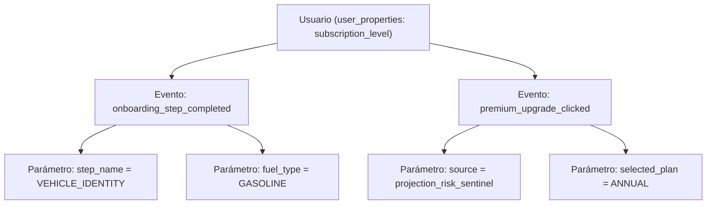
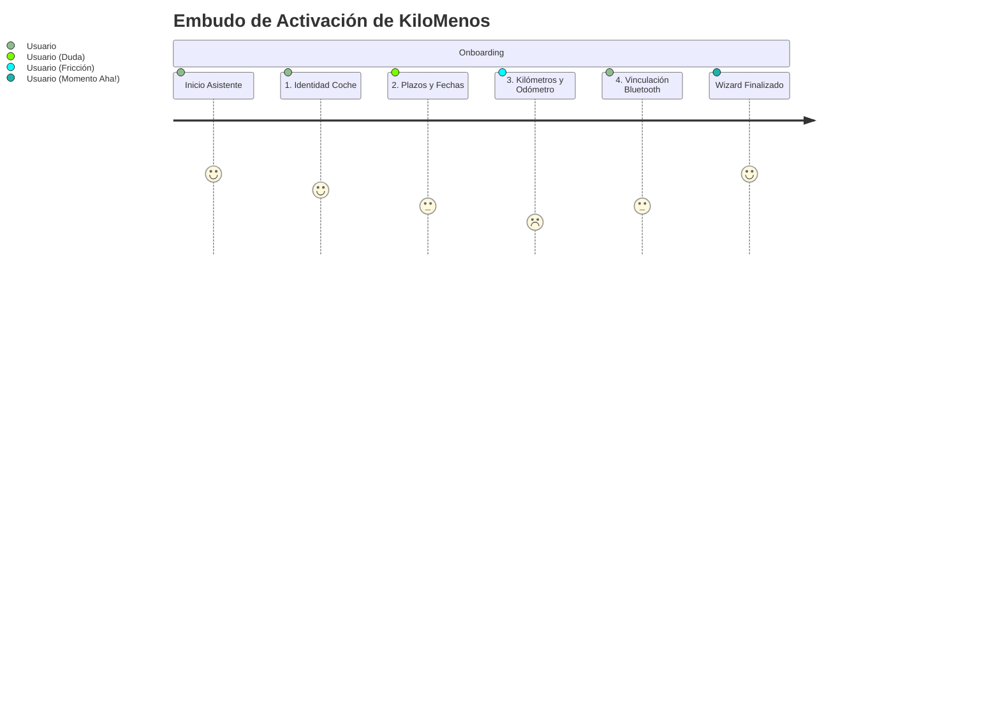

# 🧭 Guía de Google Analytics 4 (GA4) & Firebase para Growth en KiloMenos

**Rol:** Product Owner Senior (Growth, Digital Experience & Fintech)  
**Proyecto:** KiloMenos Android (KmSafe)  
**Stack de Analítica:** `:core:analytics` (`AnalyticsTracker`, `KmsafeAnalyticsEvent`)  
**Fecha:** Septiembre 2026  

---

## 1. Fundamentos & Modelo de Datos en GA4 / Firebase

A diferencia de las versiones heredadas de analítica web (Universal Analytics), **Google Analytics 4 (GA4)** y **Firebase Analytics** operan bajo un paradigma **100% centrado en Eventos y Usuarios**:

1. **Evento (`event_name`)**: Cada interacción atómica del usuario en la app (ej. `onboarding_wizard_started`, `odometer_registered`, `premium_upgrade_success`).
2. **Parámetros de Evento (`event_parameters`)**: Atributos contextuales específicos del evento que aportan significado analítico (ej. `source`, `step_name`, `plan`, `delta_km`, `inactivity_days`).
3. **Propiedades de Usuario (`user_properties`)**: Atributos persistentes vinculados a la identidad del cliente que describen su estado a lo largo del tiempo (ej. `subscription_level = PREMIUM`).



> [!CAUTION]
> **La regla crítica de GA4:** Por defecto, Firebase almacena todos los parámetros de evento en su backend crudo (BigQuery), pero **NO los expone en los informes interactivos ni en las exploraciones visuales de la consola de GA4** a menos que se creen manualmente como **Dimensiones o Métricas Personalizadas**.

---

## 2. Paso 1: Configurar las Dimensiones y Métricas Personalizadas (Consola GA4)

Para que el equipo de Producto, Growth y Marketing pueda segmentar los datos en tiempo real, debes registrar los parámetros instrumentados en el código de KiloMenos:

### Procedimiento en la Consola:
1. Accede a tu propiedad en [Google Analytics](https://analytics.google.com/).
2. En la barra de navegación inferior izquierda, haz clic en el engranaje **Administrar** (*Admin*).
3. En la sección **Visualización de datos** (*Data display*), selecciona **Definiciones personalizadas** (*Custom definitions*).
4. Haz clic en el botón azul **Crear dimensión personalizada** (*Create custom dimension*).

### Registro de Dimensiones Estratégicas:

| Nombre de la Dimensión en GA4 | Ámbito (*Scope*) | Parámetro de Evento (*Event parameter*) | Uso en Estrategia de Producto |
| :--- | :---: | :--- | :--- |
| **Origen del Disparador** | Evento | `source` | Identifica qué pantalla o botón motivó la acción (ej. `projection_risk_sentinel`, `overview`, `vehicle_list`, `deeplink`). |
| **Paso del Asistente** | Evento | `step_name` | Paso del wizard de alta (ej. `VEHICLE_IDENTITY`, `CONTRACT_TIMEFRAME`, `MILEAGE_BUDGET`, `SMART_ACTIVATION`). |
| **Plan Seleccionado** | Evento | `plan` o `selected_plan` | Plan de facturación escogido en el paywall (`MONTHLY`, `ANNUAL`). |
| **Tipo de Energía** | Evento | `fuel_type` o `energy_type` | Motorización del vehículo (`GASOLINE`, `DIESEL`, `ELECTRIC`, `PHEV`). |
| **Resultado de Facturación** | Evento | `result` | Diagnóstico de pago (`SUCCESS`, `USER_CANCELED`, `ERROR`). |
| **Código de Error Facturación** | Evento | `error_code` | Código nativo retornado por Google Play Billing en fallos. |
| **Días de Inactividad** | Evento | `inactivity_days` | Días sin registrar kilometraje al enviarse la notificación de retención. |
| **Nivel de Suscripción** | **Usuario** | `subscription_level` | Nivel de derecho del cliente (`CORE` vs `PREMIUM`). Permite segmentar cualquier métrica entre usuarios gratuitos y de pago. |

*(Nota: GA4 procesa retroactivamente los datos nuevos; las dimensiones comenzarán a mostrar valores en los informes entre 24 y 48 horas tras su registro).*

---

## 3. Paso 2: Marcar los Eventos Clave (*Key Events / Conversiones*)

Para que Google Analytics, Google Ads y Firebase identifiquen los hitos que generan valor financiero:

1. Dirígete a **Administrar** ➔ **Eventos clave** (*Key events*).
2. Haz clic en **Nuevo evento clave** (*New key event*).
3. Añade los siguientes eventos centrales de KiloMenos:
   - `premium_upgrade_success` ➔ **Macro-conversión:** Suscripción de pago confirmada y migración a la nube activada.
   - `onboarding_wizard_completed` ➔ **Activación:** Usuario que ha superado la fricción inicial y configurado su vehículo.
   - `odometer_registered` ➔ **Retención & Hábito:** Cada actualización del odómetro que alimenta el cálculo de la Zona Verde.
   - `signup_success` ➔ **Adquisición:** Registro exitoso de cuenta.

---

## 4. Paso 3: Embudo de Activación y Detección de Fricción (*Funnel Exploration*)

El wizard de configuración del vehículo es el paso donde el usuario experimenta el mayor esfuerzo cognitivo (*Time-to-Value*). Si hay campos confusos, el coste de adquisición (CAC) se destruye.



### Configuración del Embudo en GA4:
1. En el menú principal izquierdo, pulsa en **Explorar** (*Explore*).
2. Selecciona la plantilla **Exploración de embudo de conversión** (*Funnel exploration*).
3. En **Configuración de la pestaña** (*Tab settings*), pulsa el icono del lápiz en **Pasos** (*Steps*).
4. Define la secuencia exacta:
   - **Paso 1 (Inicio):** `Nombre del evento = onboarding_wizard_started`
   - **Paso 2 (Datos Vehículo):** `Nombre del evento = onboarding_step_completed` **Y** `step_name = VEHICLE_IDENTITY`
   - **Paso 3 (Contrato & Fechas):** `Nombre del evento = onboarding_step_completed` **Y** `step_name = CONTRACT_TIMEFRAME`
   - **Paso 4 (Presupuesto Km & Odómetro):** `Nombre del evento = onboarding_step_completed` **Y** `step_name = MILEAGE_BUDGET`
   - **Paso 5 (Smart Bluetooth):** `Nombre del evento = onboarding_step_completed` **Y** `step_name = SMART_ACTIVATION`
   - **Paso 6 (Finalización Exitosa):** `Nombre del evento = onboarding_wizard_completed`
5. Activa el interruptor **Hacer que el embudo sea abierto** (*Make open funnel*).

### 🔍 Diagnóstico de Growth:
- **Tasa de Caída (*Drop-off*) entre Paso 3 y Paso 4:** Si la mayor pérdida de usuarios ocurre en `MILEAGE_BUDGET`, la hipótesis conductual es que el usuario no conoce de memoria su odómetro de entrega o su límite total contratado. La solución de producto es precargar valores por defecto y ofrecer la opción *"Lo completaré más tarde"*.
- **Tiempo Transcurrido (*Elapsed Time*):** Mide el tiempo medio por paso para identificar sobre qué pantalla los usuarios dudan más.

---

## 5. Paso 4: Rendimiento de Monetización & Atribución Contextual (Paywall)

Con la implementación de la **Aversión a la Pérdida** (*Loss Aversion*), el Paywall adapta su copy según la pantalla de origen. Mediremos el ratio de conversión según el disparador:

### Configuración de la Exploración de Formato Libre (*Free-form*):
1. Crea una exploración en blanco (*Blank*).
2. **Filas:** Arrastra la dimensión `source` (Origen del disparador).
3. **Columnas:** Arrastra `Nombre del evento`.
4. **Métricas:** Arrastra `Usuarios activos`, `Recuento de eventos` y `Tasa de conversión de eventos clave`.
5. **Filtro:** Incluye únicamente los eventos del embudo de pago:
   - `premium_paywall_viewed`
   - `premium_plan_selected`
   - `premium_upgrade_clicked`
   - `billing_result_received`
   - `premium_upgrade_success`

### Interpretación de la Matriz de Negocio:

| Origen del Disparador (`source`) | Vistas Paywall | Clicks Checkout | Cancelaciones Google Play | Compras Exitosas | Tasa de Conversión (%) |
| :--- | :---: | :---: | :---: | :---: | :---: |
| `projection_risk_sentinel` *(Aversión a la Pérdida)* | 450 | 160 | 12 | **68** | **15.1%** 🚀 |
| `overview` *(Botón cabecera)* | 1.100 | 75 | 18 | **27** | **2.4%** |
| `vehicle_list` *(Límite flota Free)* | 320 | 60 | 6 | **26** | **8.1%** |
| `expenses` *(Gestión estaciones)* | 180 | 15 | 3 | **6** | **3.3%** |

### 💡 Decisiones de Producto:
- Si `projection_risk_sentinel` convierte **5 veces más** que el acceso genérico desde `overview`, la validación de negocio es clara: **la aversión a la penalización es el principal catalizador de compra**. Debemos elevar la visibilidad de los avisos preventivos en el Dashboard principal.
- Si las cancelaciones en pasarela (`result = USER_CANCELED`) se concentran en el plan Anual, debemos modificar la jerarquía visual del paywall para destacar la cuota equivalente mensual (*"Solo 2,08 €/mes"*).

---

## 6. Paso 5: Medición del Bucle de Retención (*Growth Loops & Recordatorios*)

KiloMenos utiliza un `ReminderWorker` para enviar notificaciones contextuales tras 3 o 5 días de inactividad de odómetro:

> *"¿Has conducido este fin de semana? Actualiza tu odómetro en 5 segundos y evita sorpresas de kilometraje."*

### Medición de Efectividad del Recordatorio:
1. En GA4, crea una **Exploración de cohortes** (*Cohort exploration*).
2. **Criterio de Inclusión:** Usuarios que recibieron el evento `reminder_notification_sent`.
3. **Criterio de Retorno:** Usuarios que registraron `odometer_registered` o abrieron la app (`app_screen_view`).
4. **Intervalo:** Diario (Día 0, Día 1, Día 2... Día 7).

Si el **Día +1** muestra un incremento de retención significativo en comparación con cohortes no impactadas, el bucle de retención está funcionando orgánicamente sin necesidad de invertir en paid re-engagement.

---

## 7. Paso 6: Creación de Audiencias Estratégicas para Campañas

En la consola de GA4 / Firebase (**Administrar ➔ Audiencias**), crea los siguientes segmentos para utilizarlos en notificaciones push dirigidas o campañas de Google Ads:

### Audiencia 1: "Leads de Alto Riesgo" (Loss Aversion Segment)
- **Definición:** Usuarios con `subscription_level = CORE` que han disparado `projection_financial_impact_viewed` con `is_over_limit = true`.
- **Acción:** Enviarles notificación personalizada comunicando el ahorro potencial de penalizaciones con la prueba gratuita de 7 días.

### Audiencia 2: "Usuarios Inactivos en Riesgo de Abandono" (Churn Risk)
- **Definición:** Usuarios que completaron el wizard (`onboarding_wizard_completed`) pero no han registrado un evento `odometer_registered` en los últimos 10 días.
- **Acción:** Push motivacional con deep link al registro rápido de odómetro.

### Audiencia 3: "Embajadores de Ahorro / Electrificación"
- **Definición:** Usuarios con `fuel_type = ELECTRIC` o `fuel_type = PHEV` que interactúan regularmente con `electrification_kpi_inspected`.
- **Acción:** Invitación a dejar una reseña de 5 estrellas en Google Play o programa de referidos.

---

## 8. Herramienta de Validación en Vivo: DebugView con ADB

Para verificar cualquier evento, parámetro o transición de pantalla antes de publicar una versión:

1. Conecta tu terminal Android vía USB con depuración habilitada.
2. Ejecuta en tu línea de comandos:
   ```bash
   adb shell setprop debug.firebase.analytics.app es.joshluq.kmsafe.dev
   ```
3. En la consola de Firebase, navega a **Analytics ➔ DebugView**.
4. Verás los eventos desplegarse en tiempo real con una línea de tiempo segundo a segundo. Haz clic sobre cualquier evento para inspeccionar sus parámetros (`source`, `step_name`, `plan`) y validar que la telemetría es exacta.
5. Para desactivar el modo depuración al finalizar las pruebas:
   ```bash
   adb shell setprop debug.firebase.analytics.app .none.
   ```
