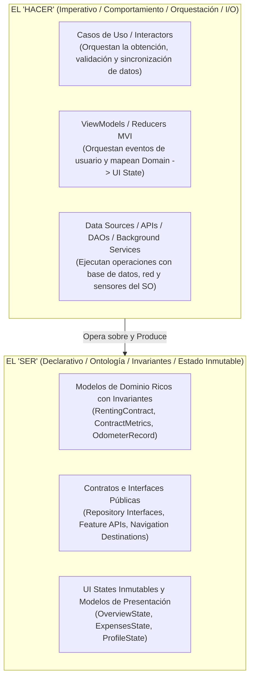

# Plan Maestro de Modularización: KmSafe 🚗

Este documento detalla la hoja de ruta técnica, el estado de ejecución y las directrices arquitectónicas para consolidar la arquitectura modular, escalable y altamente testable de **KmSafe**, fundamentada en **Clean Architecture**, **SOLID**, **Domain-Driven Design (DDD)** y el principio estratégico de **Separar el "Hacer" del "Ser"**.

---

## 🧭 Principio Rector Estratégico: Separar el "Hacer" del "Ser"

Para evitar la degradación arquitectónica hacia modelos anémicos y controladores sobredimensionados (*God ViewModels*), cada elemento del sistema debe respetar la distinción entre su **naturaleza/invariantes (Ser)** y su **ejecución/comportamiento (Hacer)**:

### Aplicación en los Tres Ejes del Proyecto:
1. **En el Dominio (Modelos Ricos vs Casos de Uso):**
   - **El Ser**: Las Entidades y *Value Objects* (`RentingContract`, `ContractMetrics`, `MileageBudget`) no son simples bolsas de datos (*anemic data classes*). Conocen y salvaguardan sus propias reglas de negocio (ej. validaciones de fechas, coherencia de odómetros y fórmulas matemáticas del balance).
   - **El Hacer**: Los Casos de Uso (`FlowUseCase`) se encargan exclusivamente de la orquestación (interactuar con repositorios, despachar corrutinas, registrar logs y coordinar la reactividad).
2. **En la Presentación (UI State vs ViewModels):**
   - **El Ser**: El `State` representa la fotografía inmutable y completa de lo que la pantalla debe renderizar.
   - **El Hacer**: El `ViewModel` gestiona el flujo de intenciones (`Events`) y actualiza el estado. **Regla Estricta (SSOT / AGENTS.md Regla 14)**: Ningún ViewModel debe realizar cálculos matemáticos de métricas de kilometraje; estos deben ser provistos ya calculados desde el Dominio.
3. **En la Modularidad (Contratos API vs Implementación IMPL):**
   - **El Ser**: Contratos públicos, interfaces y rutas de navegación exportables que definen qué ofrece cada módulo.
   - **El Hacer**: El código concreto (pantallas Jetpack Compose, ViewModels, implementaciones de repositorios, DAOs de Room y clientes Retrofit).

---

## 📊 Estado General del Plan

| Fase | Alcance | Estado |
| :--- | :--- | :---: |
| **Fase 1** | Estandarización y Version Catalog (`deps.versions.toml`, `libs.versions.toml`) | ✅ **Completado** |
| **Fase 2** | Módulo de Infraestructura Centralizada (`:core:infrastructure`) | ✅ **Completado** |
| **Fase 3** | Vertical Slicing & Dominio Central (`:core:domain`) | ✅ **Completado** |
| **Fase 4** | Modularización de Features y Satélites Core | ✅ **Completado** |
| **Fase 5** | Remediación de Dominio (Enriquecimiento del "Ser"), Testing y Desacople del Shell | ⏳ **En Progreso** (95%) |

---

## 1. Fase 1: Estandarización y Version Catalog ✅
* **Objetivo**: Centralizar la gestión de dependencias y plugins de Gradle para evitar discrepancias entre módulos.
* **Acciones completadas**:
  * Implementación de Version Catalog local (`gradle/deps.versions.toml` y `gradle/libs.versions.toml`) junto a catálogos remotos de Kits (`FoundationKit`, `AuthKit`, `CanvasKit`, `EncryptionKit`, `AnalyticsKit`).
  * Integración de `Convention Plugins` (`pluginkit.android.library`, `pluginkit.android.hilt`, `pluginkit.android.room`, `pluginkit.android.network`, `pluginkit.android.work`, etc.).

---

## 2. Fase 2: Módulo de Infraestructura Centralizada (`:core:infrastructure`) ✅
* **Objetivo**: Extraer la fontanería de persistencia, red y utilidades del sistema fuera del módulo `:app`.
* **Componentes integrados en `:core:infrastructure`**:
  * **Local Data**: `AppDatabase`, Room DAOs (`RentingContractDao`, `OdometerRecordDao`, `TripRouteDao`, `FuelExpenseDao`, `ServiceStationDao`) y Room Entities.
  * **Remote Data**: Clientes Retrofit, OkHttpClient (base y autenticado), APIs (`AuthApiService`, `RentingApiService`, `EntitlementsApiService`, `FuelApiService`, `StorageApiService`).
  * **Data Sources & Seguridad**: `PreferencesDataSource`, `UserSessionDataSource`, `TrackingDataSource`, integración con `EncryptionKit` (Tink/Encrypted DataStore).
  * **Mappers & ACL**: Mappers de entidades, DTOs de red y capa anticorrupción (ACL).
  * **Workers de Fondo**: `SyncWorker` y `SyncManager`.

---

## 3. Fase 3: Vertical Slicing & Pure Domain (`:core:domain`) ✅
* **Objetivo**: Aislar las reglas de negocio del framework Android y de dependencias de infraestructura.
* **Hitos alcanzados**:
  1. **Aislamiento de Dominio**:
     * Modelos de dominio (`RentingContract`, `OdometerRecord`, `Entitlements`, `User`, `TripRoute`, `FuelExpense`, etc.).
     * Interfaces de repositorio (`AuthRepository`, `RentingRepository`, `HistoryRepository`, `TrackingRepository`, `EntitlementsRepository`, `PreferencesRepository`, `DataManagementRepository`, `FuelExpenseRepository`, `ServiceStationRepository`, `MediaRepository`).
     * Más de 45 casos de uso estandarizados con `FlowUseCase` y `UseCase` de `FoundationKit`.
     * Biblioteca Kotlin/JVM pura (`pluginkit.jvm.library`), blindada contra APIs de Android y acelerando la ejecución de tests a nivel de milisegundos.
     * Cero dependencias directas con el SDK de Android (`android.*`).
  2. **AC-002: Desacoplamiento de `AuthKit`**:
     * Creación de `AuthSessionState` como sealed interface propia del dominio.
     * Capa Anticorrupción (ACL) en `AuthMapper.kt`.
  3. **AC-001: Implementación de Repositorios en `:core:infrastructure`**:
     * Implementaciones `*RepositoryImpl` operando como adaptadores hacia Room y Retrofit.

---

## 4. Fase 4: Modularización de Features y Satélites Core 🚀

### Módulos Implementados y en Operación:

1. **`:feature:auth` (Autenticación & Lanzamiento) ✅ COMPLETADO**:
   * **Propósito**: Gestión del ciclo de vida de la sesión, Login, Registro y Splash screen.
   * **Componentes**: `LaunchRoute`, `LoginRoute`, `SignupRoute`, `LaunchViewModel`, `LoginViewModel`, `SignupViewModel`.
   * **Configuración**: Abstraída vía `AuthConfig` para inyectar URLs legales y credenciales desde el Shell.

2. **`:feature:expenses` (Combustible y Gestión Energética) ✅ COMPLETADO**:
   * **Presentación**: MVI (`ExpensesState`, `ExpensesEvent`, `ExpensesEffect`), `ExpensesViewModel`, `ExpensesRoute`, `StationManagementRoute`, `StationDetailRoute`.
   * **Componentes UI**: Bottom sheets dinámicos de repostaje/recarga, tarjeta de volatilidad histórica y gráficos de precios.
   * **Integración**: Integrado como pestaña `EXPENSES` en `DashboardScreen`.

3. **`:feature:dashboard` (Shell de Navegación Principal) ✅ COMPLETADO**:
   * **Propósito**: Contenedor de las pestañas principales con `CanvasKitBottomBar`.
   * **Desacoplamiento**: Utiliza el patrón Slot (`navigationContent: @Composable (NavHostController) -> Unit`) para alojar las pantallas sin acoplarse directamente a sus implementaciones.

4. **`:feature:fleet` (Gestión de Flota y Contratos) ✅ COMPLETADO**:
   * **Propósito**: Configuración integral de vehículos, alta de contratos y asistentes.
   * **Componentes**: `SetupWizardRoute` (asistente de alta), `WelcomeDiscoveryScreen`, `VehicleListRoute` (listado y selector de activo), `VehicleDetailRoute` (detalle de ficha técnica) y `EditContractRoute` (edición de parámetros de renting).

5. **`:feature:profile` (Perfil de Usuario y Preferencias) ✅ COMPLETADO**:
   * **Propósito**: Gestión de datos de cuenta, preferencias de la aplicación y cierre de sesión.
   * **Componentes**: `ProfileRoute`, `PreferencesRoute`, `ProfileViewModel`, `PreferencesViewModel`.

6. **`:feature:history` (Histórico de Odómetro y Rutas) ✅ COMPLETADO**:
   * **Propósito**: Registro manual de kilometraje, listado histórico de trayectos y visualización de rutas GPS.
   * **Componentes**: `HistoryRoute`, `RecordDetailRoute`, `HistoryViewModel`, `RecordDetailViewModel`.

7. **`:core:monetization` (Publicidad & Privacidad UMP) ✅ COMPLETADO**:
   * **Propósito**: Aislamiento del SDK de Google AdMob y la gestión de consentimiento europeo (GDPR/UMP).
   * **Impacto**: Elimina dependencias de publicidad de `:core:ui` y de las features de visualización.

8. **`:core:navigation` (Definición Global de Destinos) ✅ COMPLETADO**:
   * **Propósito**: Punto común de definición tipada de destinos para Compose Navigation (`Destination.kt`).

---

9. **`:feature:overview` (Dashboard de Métricas y Balance Diario) ✅ COMPLETADO**:
   * **Propósito**: Pantalla principal de control de balance de kilometraje, tarjetas de estado, odómetro y gráficos de consumo mensual.
   * **Impacto**: Extraído de `:app` a su propio módulo independiente con cero alteraciones de UI.

---

10. **`:feature:premium` (Paywall & Monetización Nativa) ✅ COMPLETADO**:
    * **Propósito**: Paywall nativo, ofertas de suscripción e integración de compra con Google Play Billing.
    * **Impacto**: Extraído de `:app` a `:feature:premium`. Desacoplado de `:core:infrastructure` mediante el puerto de dominio `BillingService`.

---

11. **`:feature:projection` (Dashboard Tab 4: Simulación & Proyección de Km) ✅ COMPLETADO**:
    * **Propósito**: 4ª pestaña del Dashboard (`ProjectionAnalysisScreen`), simulador interactivo de ritmo, planificador de viajes y semáforo de riesgo (`ProjectionGauge`).
    * **Impacto**: Accesible universalmente (Free y Premium) desde la navegación troncal del Dashboard. Extraído a su propio módulo dedicado para mantener la simetría de las 5 pestañas.

---

12. **`:core:tracking` (Servicios de Localización & Sensores) ✅ COMPLETADO**:
    * **Propósito**: Aislamiento de los servicios de tracking GPS en primer plano (`LocationTrackingService`), receptores de transición de actividad (`ActivityTransitionReceiver`) y detección de Bluetooth del vehículo (`BluetoothConnectionReceiver`).
    * **Impacto**: Extraído de `:app` a su propio módulo `:core:tracking`, desacoplado de `MainActivity` mediante intents dinámicos del sistema y dejando a `:app` como un Shell puramente orquestador.

---

## 🗺️ Grafo de Arquitectura y Dependencias

```mermaid
graph TD
    App[":app (Shell / Manifest / Application / DI Root)"]
    Domain[":core:domain (Pure Kotlin Business Rules)"]
    Infra[":core:infrastructure (Room / Retrofit / Repositories / Workers)"]
    Nav[":core:navigation (Global Destinations)"]
    DesignSystem[":core:ui & CanvasKit (UI Design System)"]
    Monetization[":core:monetization (AdMob / UMP)"]

    FeatureAuth[":feature:auth"]
    FeatureDashboard[":feature:dashboard"]
    FeatureFleet[":feature:fleet"]
    FeatureHistory[":feature:history (Tab 2)"]
    FeatureExpenses[":feature:expenses (Tab 3)"]
    FeatureProfile[":feature:profile (Tab 5)"]
    FeatureOverview[":feature:overview (Tab 1)"]
    FeatureProjection[":feature:projection (Tab 4)"]
    FeaturePremium[":feature:premium (Paywall)"]
    CoreTracking[":core:tracking (Fase 5)"]

    App --> FeatureAuth
    App --> FeatureDashboard
    App --> FeatureFleet
    App --> FeatureHistory
    App --> FeatureExpenses
    App --> FeatureProfile
    App --> FeatureOverview
    App --> FeatureProjection
    App --> FeaturePremium
    App --> CoreTracking
    App --> Infra
    App --> Domain
    App --> Nav

    FeatureDashboard --> Nav
    FeatureDashboard --> Domain
    FeatureDashboard --> DesignSystem

    FeatureOverview --> Domain
    FeatureOverview --> DesignSystem
    FeatureOverview --> Nav

    FeatureProjection --> Domain
    FeatureProjection --> DesignSystem
    FeatureProjection --> Nav

    FeaturePremium --> Domain
    FeaturePremium --> DesignSystem
    FeaturePremium --> Nav

    FeatureFleet --> Domain
    FeatureFleet --> DesignSystem
    FeatureFleet --> Nav

    FeatureAuth --> Domain
    FeatureAuth --> DesignSystem

    FeatureExpenses --> Domain
    FeatureExpenses --> DesignSystem

    FeatureHistory --> Domain
    FeatureHistory --> DesignSystem
    FeatureHistory --> Monetization

    FeatureProfile --> Domain
    FeatureProfile --> DesignSystem
    FeatureProfile --> Nav

    FeatureOverview --> Domain
    FeatureOverview --> DesignSystem
    FeatureOverview --> Nav

    FeaturePremium --> Domain
    FeaturePremium --> DesignSystem
    FeaturePremium --> Nav

    CoreTracking --> Domain
    CoreTracking --> Infra

    Infra --> Domain
```

---

## 🛠️ Fase 5: Plan de Remediación Arquitectónica y Calidad

Para cerrar la brecha técnica identificada y cumplir al 100% con DDD, Clean Architecture y buenas prácticas, se ejecutan las siguientes reformas prioritarias:

### 1. Rescate del Dominio: Eliminar Lógica de Negocio de `OverviewViewModel` ✅ (COMPLETADO)
* **Resultado**:
  1. Se creó el Value Object de dominio `ContractMetrics` en `:core:domain:model`.
  2. Se extrajo `CalculateContractMetricsUseCase` como motor matemático puro y determinista.
  3. Se refactorizó `GetOverviewDataUseCase` para delegar el cálculo y exponer `ContractMetrics`.
  4. Se saneó `OverviewViewModel` eliminando `applyMetricsToState` y constantes temporales.
  5. Se extrajo con éxito el módulo independiente **`:feature:overview`**, desacoplándolo del Shell `:app`.

### 2. Conversión de `:core:domain` a Módulo Kotlin/JVM Puro ✅ (COMPLETADO)
* **Resultado**:
  * Migrado `core:domain/build.gradle.kts` a `pluginkit.jvm.library` + `kotlin.serialization`.
  * Eliminadas todas las tareas y dependencias de Android (`.aar`), reduciendo los tiempos de compilación y ejecución de tests unitarios en dominio a ~5 segundos (`./gradlew :core:domain:test`).
  * **Blindaje estricto del dominio**: Regla de Oro cumplida al 100% — cero dependencias del framework de Android (`android.*`) en la capa de negocio.
  * Verificada la compatibilidad limpia de integración con todos los módulos consumidores (`:core:infrastructure`, `:feature:*`, `:app`) mediante `./gradlew testDebugUnitTest`.

### 3. Suite de Pruebas Unitarias Mandatorias en Dominio ✅ (COMPLETADO AL 100%)
* **Resultado**:
  * Implementada la suite completa de unit testing en `:core:domain` con **JUnit 4**, **MockK** y **Kotlin Coroutines Test (`runTest`)**.
  * **60 UseCases** testeados individualmente cubriendo 6 fases (Vehicle/Contracts, Odometer/Projections, GPS Tracking/Geofencing, Fuel/Stations, Auth/Identity, Entitlements/Sync/Preferences).
  * 100% de cobertura de Happy paths, edge cases y error paths validados sin dependencias de Android.
  * Ejecución limpia: `./gradlew :core:domain:test` con `0` fallos.

### 4. Racionalización de la Inyección de Dependencias (Hilt) ✅ (COMPLETADO)
* **Resultado**:
  * Se extrajeron `UseCaseModule.kt` y `ValidatorModule.kt` del módulo `:app` hacia [core/infrastructure/src/main/java/es/joshluq/kmsafe/infrastructure/di/](file:///c:/Users/josh_/AndroidStudioProjects/KmSafe/core/infrastructure/src/main/java/es/joshluq/kmsafe/infrastructure/di/).
  * Se eliminaron los bindings directos de `:app`, reduciendo el acoplamiento del Shell a la capa de dominio y permitiendo que `:core:infrastructure` provea automáticamente la inyección de los 60 UseCases e interfaces de validación a través del grafo Hilt.
  * Verificado con compilación y tests al 100%: `./gradlew :core:infrastructure:assembleDebug :app:testDevDebugUnitTest` (BUILD SUCCESSFUL).

### 5. Higiene de Dependencias en Gradle ✅ (COMPLETADO)
* **Resultado**:
  * Se removió `deps.authkit` de `feature/auth/build.gradle.kts` manteniendo el consumo desacoplado a través de los casos de uso puros.
  * Todas las suites de tests unitarios compilan y pasan limpiamente.

### 6. Extracción de `:core:tracking` del Shell `:app` ✅ (COMPLETADO)
* **Resultado**:
  * Se creó el módulo satélite [core:tracking](file:///c:/Users/josh_/AndroidStudioProjects/KmSafe/core/tracking/) (`es.joshluq.kmsafe.core.tracking`).
  * Se extrajeron `LocationTrackingService`, `BluetoothConnectionReceiver` y `ActivityTransitionReceiver` fuera de `:app`.
  * Se desacoplaron de `MainActivity` utilizando intents del sistema (`packageManager.getLaunchIntentForPackage(packageName)`).
  * Se integró en `settings.gradle.kts` y `app/build.gradle.kts`, limpiando el `AndroidManifest.xml` del Shell.
  * Verificado con compilación y tests al 100%: `./gradlew :core:tracking:assembleDebug :app:testDevDebugUnitTest` (BUILD SUCCESSFUL).

### 7. Suite Completa de Tests Unitarios en ViewModels (MVI) ✅ (COMPLETADO AL 100%)
* **Resultado**:
  * Implementadas suites de tests unitarios robustas y exhaustivas para los **19 ViewModels** de la arquitectura modularizada utilizando **JUnit 4**, **MockK** y **Coroutines Test (`runTest` + `StandardTestDispatcher` / `UnconfinedTestDispatcher`)**:
    1. `:feature:auth` (3): `LaunchViewModelTest`, `LoginViewModelTest`, `SignupViewModelTest`.
    2. `:feature:dashboard` (1): `DashboardViewModelTest`.
    3. `:feature:overview` (1): `OverviewViewModelTest`.
    4. `:feature:fleet` (4): `VehicleListViewModelTest`, `VehicleDetailViewModelTest`, `SetupWizardViewModelTest`, `EditContractViewModelTest`.
    5. `:feature:history` (2): `HistoryViewModelTest`, `RecordDetailViewModelTest`.
    6. `:feature:projection` (1): `ProjectionAnalysisViewModelTest`.
    7. `:feature:expenses` (3): `ExpensesViewModelTest`, `StationManagementViewModelTest`, `StationDetailViewModelTest`.
    8. `:feature:profile` (2): `ProfileViewModelTest`, `PreferencesViewModelTest`.
    9. `:feature:premium` (1): `PremiumPaywallViewModelTest`.
    10. `:app` (1): `DataManagementViewModelTest`.
  * Cobertura de todos los estados iniciales, manejo reactivo de eventos (`sendEvent`), efectos de navegación asíncronos (`effects.collect`), flujos de error, validaciones de permisos/features y reconciliación de estado.
  * Se descartó del plan el módulo prescindible `feature:reporting`.
  * Verificación global limpia: `./gradlew testDebugUnitTest testDevDebugUnitTest` con **387 tareas exitosas y 0 fallos**.
---

## 🛡️ Salvaguardas y Anti-patrones de Desarrollo

1. **Inviolabilidad del "Ser"**: Las entidades y value objects de dominio deben concentrar sus invariantes de negocio. Prohibido volver a ubicar lógica de cálculo de kilometraje en ViewModels o componentes Composable.
2. **Aislamiento de Infraestructura**: Los módulos `:feature:*` solo dependen de `:core:domain`, `:core:ui` / CanvasKit y `:core:navigation`. **Bajo ninguna circunstancia deben depender directamente de `:core:infrastructure`**.
3. **Preservación del Shell**: El módulo `:app` debe reducirse progresivamente a:
   * `AndroidManifest.xml` y configuración de permisos del sistema.
   * Inicialización de la aplicación (`KiloMenosApplication`).
   * Configuración de entornos y secretos (`ConfigModule`, `BuildConfig`).
   * Gráfico de navegación raíz (`AppNavigation.kt`).
4. **Compilación y Validación Aislada**: Cada módulo creado o refactorizado debe validar su compilación independiente y sus tests antes de integrarse al Shell (`./gradlew :core:domain:test`, `./gradlew :feature:xxx:assembleDebug`).
