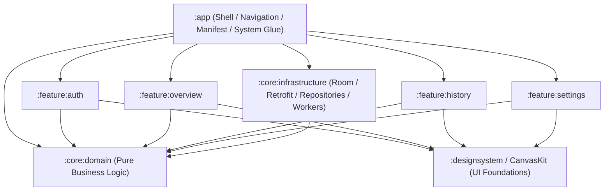

# Plan Maestro de Modularización: KmSafe 🚗

Este documento detalla la hoja de ruta técnica y el estado de ejecución para transformar el monolito en una arquitectura modular, escalable y testable, aplicando **Clean Architecture**, **SOLID** y **Domain-Driven Design (DDD)**.

---

## 📊 Estado General del Plan

| Fase 4 | Módulos de Funcionalidad (`:feature:*`) | ⏳ **En Progreso** |

---

## Fase 1: Estandarización y Version Catalog ✅
* **Objetivo**: Centralizar la gestión de dependencias y plugins de Gradle para evitar discrepancias entre módulos.
* **Acciones completadas**:
    * Implementación de Version Catalog local (`gradle/libs.versions.toml` y `gradle/deps.versions.toml`) junto a los catálogos remotos de Kits (`FoundationKit`, `AuthKit`, `CanvasKit`, `EncryptionKit`, `AnalyticsKit`).
    * Integración de `Convention Plugins` (`pluginkit.android.library`, `pluginkit.android.hilt`, `pluginkit.android.room`, `pluginkit.android.network`, `pluginkit.android.work`, etc.).

---

## Fase 2: Módulo de Infraestructura Centralizada (`:core:infrastructure`) ✅
* **Objetivo**: Extraer la "fontanería" de bajo nivel de la aplicación fuera del módulo `:app`.
* **Componentes integrados en `:core:infrastructure`**:
    * **Local Data**: `AppDatabase`, Room DAOs (`RentingContractDao`, `OdometerRecordDao`, `TripRouteDao`) y Room Entities.
    * **Remote Data**: Clientes Retrofit, OkHttpClient (base y autenticado), APIs (`AuthApiService`, `RentingApiService`, `EntitlementsApiService`, `StorageApiService`).
    * **Data Sources & Security**: `PreferencesDataSource`, `UserSessionDataSource`, `TrackingDataSource`, integración con `EncryptionKit` (Tink/DataStore).
    * **Mappers & ACL**: Mappers de entidades, DTOs de red y capa anticorrupción (ACL).

---

## Fase 3: Vertical Slicing & Pure Domain (`:core:domain` + Data Layer) ✅
* **Objetivo**: Separar estrictamente las reglas de negocio del framework y aislar las implementaciones de datos en `:core:infrastructure`.
* **Hitos alcanzados**:
    1. **Creación de `:core:domain` (Pureza Total)**:
        * Modelos de dominio (`RentingContract`, `OdometerRecord`, `Entitlements`, `User`, `TripRoute`, etc.).
        * Interfaces de repositorio (`AuthRepository`, `RentingRepository`, `HistoryRepository`, `TrackingRepository`, `EntitlementsRepository`, `PreferencesRepository`, `DataManagementRepository`, `MediaRepository`).
        * Casos de uso basados en `FlowUseCase` de `FoundationKit`.
        * **Regla estricta**: Cero dependencias de Android y de frameworks de terceros.
    2. **AC-002: Desacoplamiento de `AuthKit` en Dominio**:
        * Creación de `AuthSessionState` como sealed interface propia del dominio (`Idle`, `Active`, `TokenExpired`).
        * Capa Anticorrupción (ACL) en `AuthMapper.kt` para mapear los estados de sesión de `AuthKit` a dominio.
    3. **AC-001: Migración del Data Layer a `:core:infrastructure`**:
        * **Repositorios**: Todas las implementaciones `*RepositoryImpl` migradas a `infrastructure.repository` y `infrastructure.repository.tracking`.
        * **Inyección de Dependencias (Hilt)**: Módulos migrados (`AnalyticsModule`, `AuthModule`, `CoroutineModule`, `DataModule`, `LoggerModule`, `NetworkModule`, `RepositoryModule`).
        * **Background Workers**: `SyncWorker` y `SyncManager` migrados a `infrastructure.worker`.
        * **Refactor de Configuración**: Eliminación de acoplamiento a `BuildConfig` en repositorios (uso de `InfrastructureConfig.storageUrl`).
        * **Resolución de BroadcastReceivers**: `AutoTrackingManager` configurado para desacoplar referencias de clase hacia `:app`.

---

## 4. Fase 4: Modularización de Features y Nuevas Funcionalidades 🚀

### Módulos Creados / Planificados:
1. **`:feature:auth` (Authentication & Launch) ✅ COMPLETADO**:
   - **Propósito**: Gestión del ciclo de vida de la sesión, Login, Registro y Splash screen.
   - **Componentes**: `LaunchRoute`, `LoginRoute`, `SignupRoute`.
   - **Dependencias**: `:core:domain`, `:core:ui`, `:core:infrastructure` (temporal).

2. **`:feature:expenses` (Fuel & Energy Management) ✅ COMPLETADO**:
   - **Dominio**: Modelos de combustible/eléctrico (`FuelType`, `EnergyCategory`, `FuelExpense`, `ServiceStation`, `StationPriceVolatility`), repositorios y 5 casos de uso (`GetExpensesByVehicleUseCase`, `SaveFuelExpenseUseCase`, `DeleteFuelExpenseUseCase`, `GetStationVolatilityUseCase`, `GetElectrificationSavingsUseCase`).
   - **Infraestructura**: Room entities (`FuelExpenseEntity`, `ServiceStationEntity`), DAOs (`FuelExpenseDao`, `ServiceStationDao`), migración de esquema de base de datos `MIGRATION_12_13` (versión 13) y repositorios reactivos.
   - **Presentación**: MVI (`ExpensesState`, `ExpensesEvent`, `ExpensesEffect`), `ExpensesViewModel`, coordinator `ExpensesRoute`, `ExpensesScreen` (diseño homogéneo con las pantallas principales mediante `CanvasKitLoadingScaffold` y `CanvasKitTopBar` centrado), bottom sheet dinámico de repostaje/carga y tarjeta de volatilidad histórica de precios.
   - **Integración**: Enlazado en `:app` vía DI en [UseCaseModule.kt](file:///c:/Users/josh_/AndroidStudioProjects/KmSafe/app/src/main/java/es/joshluq/kmsafe/di/UseCaseModule.kt), registrado como pestaña principal del `BottomNavigationBar` (`DashboardTab.EXPENSES`) en [DashboardScreen.kt](file:///c:/Users/josh_/AndroidStudioProjects/KmSafe/app/src/main/java/es/joshluq/kmsafe/ui/dashboard/DashboardScreen.kt) y ruteado con [AppNavigation.kt](file:///c:/Users/josh_/AndroidStudioProjects/KmSafe/app/src/main/java/es/joshluq/kmsafe/ui/navigation/AppNavigation.kt) y [DashboardNavigation.kt](file:///c:/Users/josh_/AndroidStudioProjects/KmSafe/app/src/main/java/es/joshluq/kmsafe/ui/navigation/DashboardNavigation.kt).

2. **`:feature:reporting` (Motor de Reportes & Exportación PDF) 📅 Planificado**:
   - Generación de informes profesionales de kilometraje y consumo en PDF para empresas de renting.

3. **`:feature:dashboard` (Extracción de la pantalla principal) 📅 Planificado**:
   - Migración de las pantallas del Dashboard a su propio feature module desacoplado.

4. **`:feature:history` (Histórico de odómetro y filtros) 📅 Planificado**:
   - Módulo independiente para consulta y edición granular de registros.

---

## 📐 Matriz de Dependencias Arquitectónicas

### Reglas de Dependencia:
1. **`:core:domain`**: No depende de ningún módulo ni de bibliotecas de Android.
2. **`:core:infrastructure`**: Depende únicamente de `:core:domain` y bibliotecas de plataforma/infraestructura.
3. **`:feature:*`**: Dependen de `:core:domain` (para casos de uso y modelos) y de `:designsystem` / `CanvasKit` (para componentes visuales). **No deben depender directamente de `:core:infrastructure`**.
4. **`:app` (Shell)**: Orquesta la navegación, contiene el `AndroidManifest.xml`, la clase `Application`, la configuración de entorno (`ConfigModule` / `BuildConfig`) y los servicios/receptores del sistema Android (`LocationTrackingService`, `ReminderWorker`).
