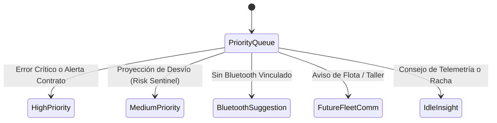

# Plan de Rediseño: Overview Aero-Cockpit & Copilot System (KmSafe)

Este documento define la especificación técnica, de diseño y de experiencia de usuario (UX/UI) para la transformación de la pantalla principal (`OverviewScreen`) bajo la propuesta **Aeroespacial/Técnica (Aero Runway & Pacing Horizon)**. Esta versión itera profundamente sobre la dualidad del modelo de negocio: **Copilot Asistido (Free)** frente a **SmartCopilot Automático (Premium)**, garantizando que el usuario gratuito disfrute de una experiencia de tracking manual de primer nivel sin fricciones, mientras se impulsa orgánicamente la conversión a la suscripción.

---

## 1. Visión de Producto y Filosofía de Diseño

La pantalla de inicio de KiloMenos debe abandonar el aspecto de formulario estático o lista contable para convertirse en un **Digital Cockpit Automotriz de Alta Precisión**. 

El conductor de renting (30-55 años, perfil profesional, autónomo o directivo) debe experimentar:
1. **Impacto Inmediato (< 2 segundos):** Conocer de un vistazo si sus kilómetros van al compás del tiempo de su contrato mediante el **Runway Pacing Bar**.
2. **Cero Polución Visual:** Desaparición del apilamiento de banners tradicionales mediante la **Cápsula Unificada de Telemetría**.
3. **Copiloto Adaptado al Tier (Free vs. Premium):**
   - **Usuario Free (Copilot Asistido):** Un control manual de viaje GPS en 1-Tap (`[ ▶ Iniciar Viaje ]`), transparente, rápido y sin bloqueos.
   - **Usuario Premium (SmartCopilot):** Detección manos libres por Bluetooth/Activity Recognition, sin necesidad de tocar la pantalla.
   - **Experiencia Compartida en Marcha:** Ambos tiers disfrutan de la **Píldora Flotante Viva** durante el trayecto y del **BottomSheet de Confirmación** al detenerse.

---

## 2. Arquitectura de Información en 4 Capas (Free vs. Premium)

La jerarquía visual respeta el estándar de [`AGENTS.md` (Sección 19)](file:///c:/Users/josh_/AndroidStudioProjects/KmSafe/AGENTS.md#L200-L245), adaptando la Capa 2 y Capa 3 según el nivel de suscripción:

```
┌────────────────────────────────────────────────────────┐
│  [ (🚗) Flota ]         [ Logo KmSafe ]        [ ⭐ PRO / ☁ ]│
├────────────────────────────────────────────────────────┤
│  * TopBar: Logo centrado simétrico. Acceso a Garaje a  │
│    la izquierda y Conversión PRO / Nube a la derecha.  │
│  * Perfil reside en el BottomBar (Tab 5).              │
├────────────────────────────────────────────────────────┤
│  📬 CÁPSULA UNIFICADA DE ESTADO / COMUNICACIONES       │
│  ┌──────────────────────────────────────────────────┐  │
│  │ ⚡ Risk Sentinel: Desvío de +850 km proyectado   ➔│  │
│  └──────────────────────────────────────────────────┘  │
│                                                        │
│  ⚡ CAPA 1: EL PULSO HERO (Aero Runway Cockpit Card)   │
│  ┌──────────────────────────────────────────────────┐  │
│  │  CUPRA FORMENTOR ➔         [ 2 Coches ▾ ] ZONA 🟢 │  │
│  │                                                  │  │
│  │  +1.450 km                 SALDO DISPONIBLE      │  │
│  │                                                  │  │
│  │  TIEMPO (42%)  ════════════════░░░░░░░░░░░░░░░░  │  │
│  │  USO KM (34%)  ════════════░░░░░░░░░░░░░░░░░░░░  │  │
│  │                  ▲ Margen Seguro: +8.00% (1.450) │  │
│  │                                                  │  │
│  │  Odómetro: 24.580 km   ·   Días restantes: 412   │  │
│  └──────────────────────────────────────────────────┘  │
│                                                        │
│  🎯 CAPA 2: RADAR DE DECISIÓN & COPILOT CONTROL        │
│  ┌────────────────────────┐ ┌────────────────────────┐ │
│  │ CUOTA PARA HOY         │ │ [FREE] COPILOT MANUAL  │ │
│  │ 68 km disponibles      │ │ [ ▶ Iniciar Viaje GPS] │ │
│  │ 🟢 Sin penalización    │ │ ⭐ Pasa a Auto con PRO │ │
│  └────────────────────────┘ └────────────────────────┘ │
│                                                        │
│  📢 ESPACIO MONETIZACIÓN (AdMob Banner)                │
│  [  Anuncio no invasivo perfectamente integrado     ]  │
│                                                        │
│  📊 CAPA 3: RITMO CONTRACTUAL (Monthly Pace Feed)      │
│  ┌──────────────────────────────────────────────────┐  │
│  │ Ritmo Mensual vs. Presupuesto Base (Zona Verde)  │  │
│  │ [ ▃ ▅ █ ▇ ▅ ]  ── Línea de Contrato (1.250 km)   │  │
│  └──────────────────────────────────────────────────┘  │
│                                                        │
│                                           ┌─────────┐  │
│                                           │ FAB [+] │  │
│                                           └─────────┘  │
└────────────────────────────────────────────────────────┘
```

---

## 3. Identidad de Marca en TopBar & Selector Contextual en Hero Cockpit

Para responder a la iniciativa estratégica de destacar la **Marca KmSafe** y maximizar el *brand awareness*, se rediseña la relación entre el TopBar institucional y el selector de vehículos del contrato:

### 3.1 Justificación de Arquitectura y UX Automotriz
- **El Desafío:** En aplicaciones automotrices y financieras, forzar el selector de vehículos junto a un logo centrado en el TopBar genera un severo truncamiento de texto cuando los nombres de vehículos de renting son largos (*"Volkswagen ID.4 Pro"*, *"Mercedes-Benz A250e"*).
- **La Solución (TopBar Simétrico + Hero Cockpit Header):**
  1. **TopBar Simétrico de Marca:** El logo `KmSafe` asume la posición central protagonista absoluta. A su izquierda se ubica un acceso rápido al Garaje/Flota `( 🚗 )`, y a su derecha la píldora de conversión `[ ⭐ Hazte PRO ]` (Free) o el estado de sincronización `[ ☁ ]` (Premium).
  2. **Selector Contextual en el Hero Cockpit:** El vehículo abandona el TopBar y se traslada a la cabecera del **Hero Card (Capa 1)**. Las métricas del Runway Bar pertenecen a *ese* coche específico; situar el nombre del vehículo (`vehicleName`) abrazando sus propios datos refuerza la coherencia cognitiva y proporciona espacio suficiente para su visualización completa sin colisionar con el logo institucional.

### 3.2 Componente: `OverviewTopBar` Simétrico
- **Izquierda (Navigation Slot):** Botón de acceso rápido a Garaje/Flota con icono `( 🚗 )` (`IconButton`), permitiendo navegar a `:feature:fleet` (`Destination.VehicleList`).
- **Centro (Title Slot):** `BrandingLogo` centrado, vectorizado y limpio (`logoSize = 32.dp`), proyectando autoridad de marca en cada apertura.
- **Derecha (Actions Slot):** Píldora de alto contraste `[ ⭐ Hazte PRO ]` en usuarios gratuitos (entrypoint a `:feature:premium`) o icono animado de sincronización reactiva `[ ☁ ]` en usuarios de pago.

### 3.3 Componente: `VehicleCockpitHeader` (Cabecera del Hero Card)
- **Identidad & Entry Point al Detalle del Vehículo:**
  La cabecera muestra el nombre del vehículo activo (`vehicleName`), acompañado de un icono de vehículo y un indicador sutil `➔` (`Icons.AutoMirrored.Filled.ArrowForwardIos`).
  - **Interacción:** Al tocar este bloque, dispara `OnVehicleDetailClicked(vehicleId)` para abrir la ficha técnica y contractual (`Destination.VehicleDetail(vehicleId)`).
- **Selector Contextual de Flota (si `availableVehicles.size > 1`):**
  A la derecha de la cabecera, junto al semáforo de ritmo, se muestra una píldora interactiva `[ 2 Coches ▾ ]` o `[ Cambiar ▾ ]` que despliega el menú (`CanvasKitDropdownMenu`) para alternar rápidamente el vehículo activo de la flota sin abandonar la pantalla principal.
- **Badge Semántico:**
  El semáforo de ritmo contractual (`ZONA VERDE` / `DESVÍO`) se ubica en la cabecera garantizando lectura instantánea del estado de salud del contrato.

---

## 4. El Gráfico Hero: "The Runway Pacing Bar" (Doble Horizonte de Precisión)

En lugar de un dial circular (*Gauge Ring*) que consume entre 200dp y 240dp de altura vertical, el **Runway Bar** optimiza el espacio reduciendo la altura a ~110dp y ofreciendo una lectura instantánea.

### 4.1 Mecánica Visual:
- **Barra Superior (Eje Tiempo):**  
  Calculada como `(Días Transcurridos / Días Totales) * 100`.  
  Color: `CanvasKitTheme.colors.textSecondary` atenuado. Marca el avance implacable del contrato.
- **Barra Inferior (Eje Kilómetros):**  
  Calculada como `(Km Consumidos Reales / Km Totales Contrato) * 100`.  
  Color:
  - `🟢 Verde Esmeralda (CanvasKitTheme.colors.success)` si Km% ≤ Tiempo% (Superávit de km).
  - `🔴 Rojo Deportivo (CanvasKitTheme.colors.error)` si Km% > Tiempo% (Consumo excesivo).
- **El Delta Luminoso (Gap Interactivo):**  
  El espacio diferencial entre ambas barras se ilumina sutilmente con una flecha/indicador que explicita:
  `▲ Margen Seguro: +1.450 km (+8%)` o `▼ Riesgo de Exceso: -320 km (-3%)`.

---

## 5. Cápsula Unificada de Estado & Comunicaciones (Fin del Apilamiento de Banners)

Actualmente, la pantalla apila hasta 3 banners independientes (`ProjectionBanner`, `BluetoothSuggestionBanner`, `ErrorBanner`), desplazando el contenido y saturando al usuario.

### 5.1 La Solución: Cápsula Dinámica Monocanal
Se introduce un contenedor interactivo de 40dp de altura, ubicado inmediatamente debajo del TopBar institucional:



### 5.2 Matriz de Prioridad de la Cápsula:
| Prioridad | Tipo de Mensaje | Ejemplo de Texto en Cápsula | Acción al Tocar |
| :---: | :--- | :--- | :--- |
| **P1** | **Riesgo Crítico de Contrato** | `⚠️ Risk Sentinel: +1.200 km proyectados al vencimiento` | Navega a `:feature:projection`. |
| **P2** | **Bluetooth No Configurado** | `󰂯 Enlaza tu coche para activar SmartCopilot automático` | Navega a edición de vehículo / Bluetooth picker. |
| **P3** | **Comunicaciones de Flota (Futuro)** | `🔔 Arval: Revisión de los 30.000 km recomendada` | Navega al futuro módulo de comunicaciones. |
| **P4** | **Insight de Conducción (Default)** | `💡 Hoy es el día con menor consumo medio de tu semana` | Abre diálogo de detalle de telemetría. |

*Nota:* Si coinciden varios estados, la cápsula muestra un indicador de paginación sutil `[ • ○ ]` y rota suavemente cada 6 segundos sin provocar saltos de interfaz (*zero layout shifts*).

---

## 6. Estrategia Publicitaria (Ubicación Óptima de AdMob)

### Diagnóstico de Negocio:
Colocar el banner de AdMob en la parte superior antes de la información principal destruye el valor percibido del usuario y aumenta el rebote en la primera sesión.

### Directriz de Ubicación:
- **Ubicación:** El banner publicitario se coloca **inmediatamente después de la Capa 2 (Radar de Decisión) y antes de la Capa 3 (Ritmo Contractual)**.
- **Justificación:**
  1. **Protección del Primer Pantallazo (*Above the Fold*):** Las capas críticas (Saldo Hero y Radar de Decisión / Copilot) quedan 100% limpias e ininterrumpidas.
  2. **Excelente Viewability:** El usuario hace scroll natural para ver el histórico mensual y pasa de forma fluida por el anuncio sin sentirlo como un obstáculo intrusivo.
  3. **Palanca Premium:** Al usuario Free se le muestra una pequeña etiqueta nativa bajo el banner: *"Eliminar anuncios y activar SmartCopilot con Premium"*.

---

## 7. Decisión de Producto: Odómetro de Alta Precisión con Botón [ + ] vs. Presets Aproximados y OCR

### 🎯 Descarte Total de Presets en Pantalla (`+25 km`, `+50 km`) y Cámara OCR:
Se ha tomado la decisión firme de **eliminar cualquier fila de presets aproximados en pantalla y descartar la lectura de odómetro por cámara**:
1. **Peligro del "Drift" (Desviación Acumulada) en Renting/Leasing:**
   - A diferencia de los gastos de combustible (donde los importes redondos como 30€ o 50€ son pagos reales), en el kilometraje de un contrato nadie hace exactamente 25 km fijos.
   - Pulsar chips estimados introduce un desfase progresivo entre la app y el salpicadero real. Al momento de la revisión técnica o devolución del vehículo, este error genera penalizaciones financieras imprevistas.
2. **Inestabilidad Crónica del OCR en Instrumentación:**
   - La lectura fotográfica de cuadros de instrumentos falla frecuentemente por reflejos en el metacrilato, tipografías digitales propietarias, luz solar directa y la propia corona del volante. El OCR genera más frustración que utilidad.
3. **Descongestión Visual Absoluta:**
   - Al no saturar la pantalla con hileras de botones de incremento, la interfaz respira, luciendo ejecutiva, sobria y orientada a la toma de decisiones.

---

### 💎 La Experiencia de Asentamiento Preciso: Botón Flotante [ + ]

En KiloMenos, el kilometraje se alimenta por **dos únicas vías especializadas y no redundantes**:
1. **Telemetría en Tiempo Real (GPS):**
   - *Free:* Botón `[ ▶ Iniciar Viaje GPS ]` en Capa 2.
   - *Premium:* Detección manos libres por Bluetooth (SmartCopilot).
2. **Asentamiento Periódico de Odómetro (Auditoría Formal del Salpicadero):**
   - Centralizado en el **Botón Flotante [ + ] (FAB)** en la esquina inferior derecha.

#### Flujo del BottomSheet de Asentamiento de Odómetro (Invocado por `[ + ]`):
Al pulsar `[ + ]`, se despliega un modal enfocado al 100% en la captura limpia, rápida y sin fricción de la cifra:
- **Ancla Histórica Sutil:** Muestra claramente el último odómetro auditado como referencia (ej. `Último registro: 24.580 km`).
- **Input Numérico Directo:** Campo numérico destacado que auto-focaliza el teclado: `Nuevo Odómetro: [ 24.720 ] km`.
- **Cero Polución Visual (Sin Cálculos Reactivos):** Se prescinde de calcular deltas o saldos dentro del modal; la pantalla de asentamiento se mantiene estrictamente limpia para ingresar el dato. El impacto en el saldo y en el Runway Bar se visualiza de forma inmediata en la pantalla principal al cerrar el modal.
- **Validación de Coherencia Instantánea:** Si el valor introducido es menor al odómetro anterior, el botón de guardado permanece inactivo previniendo errores de tipeo.
- **Selector de Fecha/Hora:** Por defecto "Ahora", editable si el conductor anota la lectura con posterioridad.
- **Acción Firme:** Botón `[ Registrar Odómetro ]` con confirmación háptica inmediata.

---

## 8. Diseño de Experiencia: SmartCopilot (Premium) vs. Copilot Asistido (Free)

El sistema de telemetría se adapta de forma inteligente al tier del usuario sin degradar la calidad visual:

```mermaid
graph TD
    subgraph Modo Free: Copilot Asistido
        F1[Tarjeta Radar en Capa 2] -->|1-Tap en [▶ Iniciar]| F2[Floating Telemetry Pill: En Curso]
        F2 -->|1-Tap en [⏹ Finalizar]| F3[BottomSheet de Confirmación de Km]
        F3 -->|Cierre| F4[Micro-upsell: Con Premium sería automático]
    end

    subgraph Modo Premium: SmartCopilot
        P1[Enlace Bluetooth del Coche] -->|Motor Encendido| P2[Floating Telemetry Pill Automática]
        P2 -->|Motor Apagado| P3[BottomSheet de Confirmación de Km]
    end
```

### 8.1 Comparativa de Flujos de Interacción

| Momento | Usuario Free (Copilot Asistido) | Usuario Premium (SmartCopilot) |
| :--- | :--- | :--- |
| **Inicio de Viaje** | **1-Tap Manual:** Pulsa el botón `[ ▶ Iniciar Viaje GPS ]` en la tarjeta de la Capa 2. | **100% Manos Libres:** Al conectar el Bluetooth del coche, se inicia solo en 2 segundos. |
| **Durante la Conducción** | **Píldora Flotante Viva:** Flota arriba o sobre el FAB mostrando: `[ 🔴 8.4 km · En curso · ⏹ ]`. | **Píldora Flotante Viva:** Muestra: `[ 🚗 SmartCopilot: 8.4 km · Zona Verde ]`. |
| **Fin de Viaje** | **1-Tap Manual:** Toca `[ ⏹ Finalizar ]` en la píldora. | **100% Automático:** Se detiene solo al apagar el motor (Bluetooth desconectado). |
| **Confirmación de Datos** | **BottomSheet de Resumen:** Visualiza km recorridos y pulsa `[ Confirmar Odómetro ]`. | **BottomSheet de Resumen:** Mismo modal, con opción de auto-guardado en segundo plano. |
| **Palanca Freemium** | Al finalizar, un tag discreto: *"¿Quieres que se grabe solo? Activa SmartCopilot con Premium"*. | Estatus de fidelización: *"Viaje certificado y respaldado en la nube"*. |

---

### 8.2 Componente: "Floating Telemetry Pill" (La Píldora Viva)

Tanto en Free como en Premium, mientras el coche está en movimiento, **la pantalla nunca se bloquea con un modal gigante**. La telemetría se condensa en un componente flotante inspirado en la *Dynamic Island*:

```
ESTADO GRABANDO (Flotando suavemente en la pantalla):
┌────────────────────────────────────────────────────────┐
│  🔴 Grabando Viaje · 14.2 km      [ ⏹ Finalizar ]     │
└────────────────────────────────────────────────────────┘
```

- **No Invasivo:** El conductor o copiloto puede seguir consultando la app (precios de gasolineras, balance, etc.).
- **Feedback Háptico:** Al iniciar o finalizar el viaje, emite una vibración corta confirmando la captura del GPS.

---

## 9. Plan de Implementación Técnica (`:feature:overview`)

### Fase 1: Adaptación de Estados en `Contract.kt`
- **`State`:**
  - `todaySafeAllowanceKm: Double`: Margen de km disponibles hoy.
  - `contractTimePercentage: Float` y `contractKmPercentage: Float`: Datos para el Runway Bar.
  - `isTrackingActive: Boolean` y `trackedDistanceMeters: Double`: Estado del viaje en curso.
  - `isPremium: Boolean`: Condiciona la presencia del botón `[ ▶ Iniciar ]` frente al estado automático.
  - `statusCapsuleItem: StatusCapsuleItem?`: Unifica avisos en la cápsula monocanal.

### Fase 2: Componentes UI en `:core:ui` / `:feature:overview`
- **`OverviewTopBar` Simétrico:** TopBar con acceso a Garaje a la izquierda, `BrandingLogo` centrado y `[ ⭐ PRO / ☁ ]` a la derecha.
- **`VehicleCockpitHeader`:** Cabecera interactiva del Hero Card con selector de vehículo, matrícula, renting y badge telemático.
- **`AeroRunwayPacingBar`:** Renderizado de las dos barras lineales sincronizadas con el delta numérico.
- **`CopilotRadarCard`:** Tarjeta de la Capa 2 con dos variantes visuales:
  - *Variante Free:* Botón de inicio manual de GPS + micro-banner de upgrade.
  - *Variante Premium:* Indicador de stand-by con animación de respiración Bluetooth.
- **`FloatingTelemetryPill`:** Píldora animada con `AnimatedVisibility` que se superpone al layout cuando `isTrackingActive == true`.

### Fase 3: Integración en `OverviewScreen.kt` y ViewModel
- Integrar el nuevo `OverviewTopBar` simétrico con logo centrado.
- Reordenar la vista principal eliminando los banners independientes superiores.
- Insertar `VehicleCockpitHeader` y `AeroRunwayPacingBar` dentro del Hero Card.
- Ubicar el `AdMobBanner` en el espacio intermedio (entre Capa 2 y Capa 3).
- Conectar los eventos `OnStartTrackingClicked` y `OnStopTrackingClicked` desde la `CopilotRadarCard` o la píldora flotante.

---

## 10. Criterios de Aceptación y Validación

1. **Paridad de Uso en Free:** Un usuario Free debe poder iniciar un viaje GPS con **un solo toque** desde la pantalla principal sin abrir menús secundarios.
2. **Branding Protagónico sin Truncamiento:** El logo `KmSafe` debe estar perfectamente centrado en el TopBar y el nombre del vehículo debe mostrarse completo en la cabecera del Hero Card sin truncarse en pantallas compactas ($\ge 360\text{dp}$).
3. **Rendimiento de Carga:** El cálculo del Runway Bar debe ejecutarse en < 16ms en el primer fotograma reactivo.
4. **Zero Layout Shifts:** La cápsula de estado no debe desplazar bruscamente el resto de la pantalla al cambiar de prioridad.
5. **Conversión Natural:** El 100% de los puntos de contacto de SmartCopilot en el tier Free deben comunicar el valor del auto-tracking sin bloquear ni degradar la experiencia de tracking manual.
