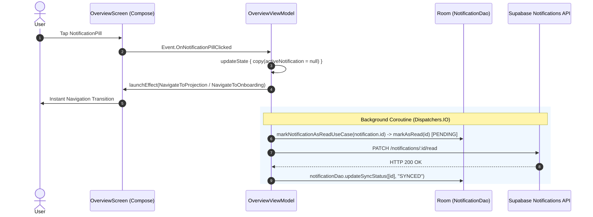

# Architectural Design: Fix: Lectura asíncrona de notificaciones, actualización de syncStatus y navegación inmediata

**Change ID**: `KILOMENOS-13`  
**Feature ID**: `FEAT-006`  
**Pattern**: Clean Architecture / Unidirectional Data Flow (MVI)  

---

## 1. Component Architecture & Flow

### 1.1 Sequence Diagram: OnNotificationPillClicked Flow



### 1.2 OverviewViewModel Active Notification Selection
```kotlin
// In OverviewViewModel.kt:
private fun observeNotifications() {
    viewModelScope.launch(dispatcherProvider.io) {
        observeNotificationsUseCase(ObserveNotificationsUseCase.Input(limit = 10))
            .distinctUntilChanged()
            .collectLatest { output ->
                val mostRelevant = output.notifications
                    .firstOrNull { it.status == NotificationStatus.UNREAD && !it.isRead }
                updateState { copy(activeNotification = mostRelevant) }
            }
    }
}
```

### 1.3 NotificationRepositoryImpl markAsRead Implementation
```kotlin
// In NotificationRepositoryImpl.kt:
override suspend fun markAsRead(notificationId: String) = withContext(Dispatchers.IO) {
    val targetId = parseLocalOrRemoteId(notificationId)
    notificationDao.markAsRead(targetId)

    if (isCanonicalUuid(targetId)) {
        runCatching {
            val response = notificationsApiService.markAsRead(targetId)
            if (response.isSuccessful) {
                notificationDao.updateSyncStatus(listOf(targetId), "SYNCED")
            }
        }
    }
}
```

---

## 2. Invariants & Negative Constraints
1. **No Network Suspension in UI Click Handlers**: Click events in `OverviewViewModel` must never suspend on network calls before emitting UI navigation effects.
2. **Never Show Read Notifications in Header Pill**: `activeNotification` in `OverviewViewModel.State` must be `null` whenever there are zero unread notifications.
3. **Database Consistency**: Succeeded HTTP PATCH operations must synchronously transition Room's `syncStatus` from `"PENDING"` to `"SYNCED"`.
