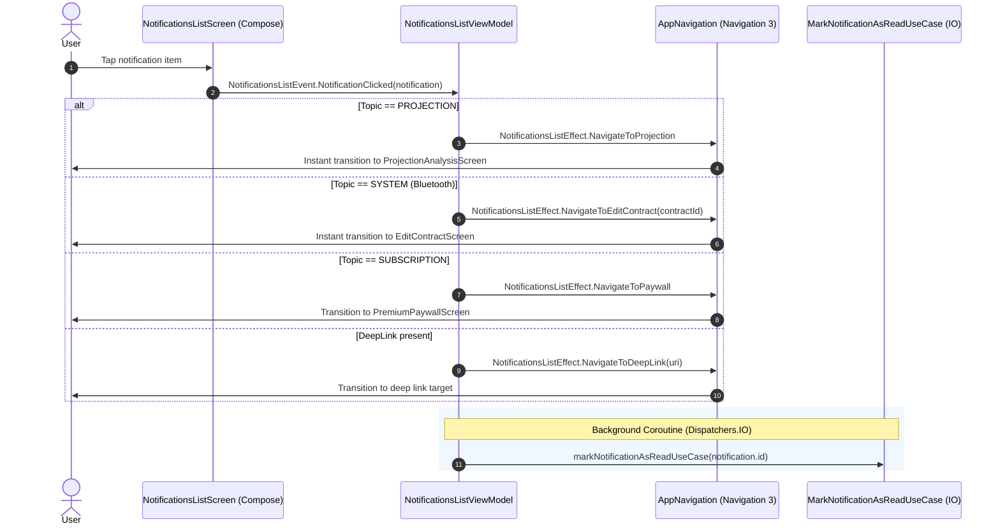

# Architectural Design: Navegación Contextual e Inmediata en Lista de Notificaciones

**Change ID**: `KILOMENOS-8`  
**Feature ID**: `FEAT-007`  
**Pattern**: Clean Architecture / Unidirectional Data Flow (MVI)  

---

## 1. Sequence Diagram: Notifications List Click Navigation



---

## 2. Component Contract Additions

### 2.1 `NotificationsListEffect`
```kotlin
sealed interface NotificationsListEffect : UiEffect {
    data object NavigateBack : NotificationsListEffect
    data class NavigateToDetail(val notificationId: String) : NotificationsListEffect
    data class NavigateToDeepLink(val deepLinkUri: String) : NotificationsListEffect
    data object NavigateToPaywall : NotificationsListEffect
    data object NavigateToProjection : NotificationsListEffect
    data class NavigateToEditContract(val vehicleId: String) : NotificationsListEffect
}
```

### 2.2 `NotificationsListViewModel.handleNotificationClick`
```kotlin
private fun handleNotificationClick(notification: Notification) {
    // 1. Immediate optimistic navigation
    when (notification.topic) {
        NotificationTopic.PROJECTION -> {
            launchEffect(NotificationsListEffect.NavigateToProjection)
        }
        NotificationTopic.SYSTEM -> {
            val contractId = notification.data?.get("contract_id") as? String ?: ""
            launchEffect(NotificationsListEffect.NavigateToEditContract(contractId))
        }
        NotificationTopic.SUBSCRIPTION -> {
            launchEffect(NotificationsListEffect.NavigateToPaywall)
        }
        else -> {
            val deepLink = notification.deepLinkUri
            if (!deepLink.isNullOrBlank()) {
                launchEffect(NotificationsListEffect.NavigateToDeepLink(deepLink))
            }
        }
    }

    // 2. Background mark-as-read
    viewModelScope.launch(Dispatchers.IO) {
        runCatching {
            markNotificationAsReadUseCase(MarkNotificationAsReadUseCase.Input(notification.id))
        }
    }
}
```

### 2.3 `NotificationsListRoute` and `AppNavigation`
`NotificationsListRoute` exposes:
- `onNavigateToProjection: () -> Unit`
- `onNavigateToEditContract: (String) -> Unit`

And in `AppNavigation.kt`:
```kotlin
Destination.NotificationsList -> NavEntry(key) {
    NotificationsListRoute(
        onNavigateBack = onBack,
        onNavigateToDetail = { notificationId ->
            onNavigate(Destination.NotificationDetail(notificationId))
        },
        onNavigateToDeepLink = { uri ->
            when {
                uri.contains("projection") -> onNavigate(Destination.ProjectionAnalysis)
                uri.contains("premium") -> onNavigate(Destination.PremiumPaywall(source = "notification"))
                else -> { /* no-op */ }
            }
        },
        onNavigateToProjection = {
            onNavigate(Destination.ProjectionAnalysis)
        },
        onNavigateToEditContract = { vehicleId ->
            onNavigate(Destination.Onboarding(vehicleId = vehicleId, isEdit = true))
        }
    )
}
```
